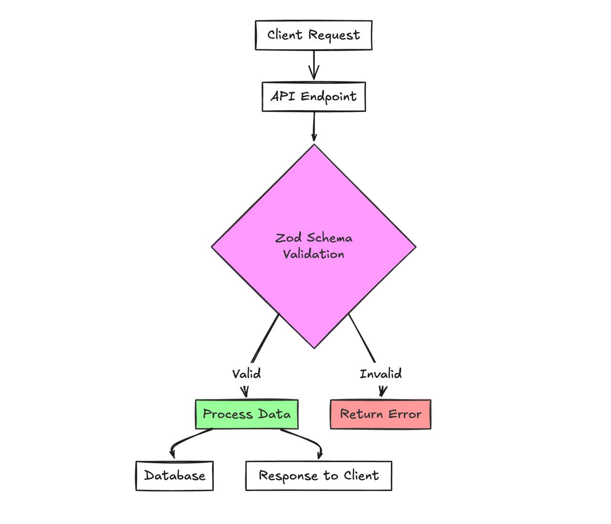
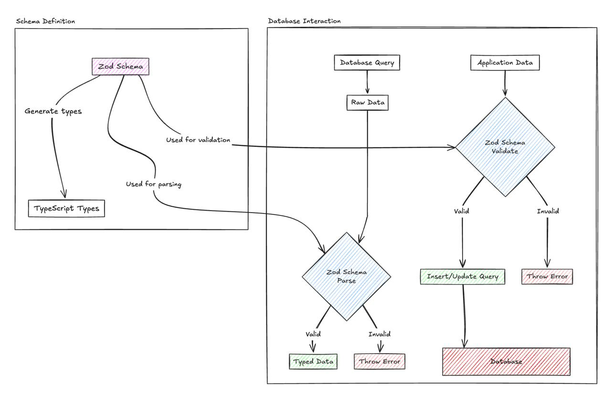

## Which is data integrity?

Data integrity refers to the accuracy, consistency, and reliability of data throughout its lifecycle. In modern applications, maintaining data integrity is crucial as data flows through different layers of the application, from API endpoints to database operations.

## Getting started with Zod

Zod is a TypeScript-first schema declaration and validation library. It allows you to define schemas that describe the shape of your data, and then use those schemas to validate data at runtime. What makes Zod stand out is its seamless integration with TypeScript: it can infer TypeScript types directly from your schemas, ensuring that your validation logic is always in sync with your type definitions.

Key benefits of using Zod include:

- **Runtime Validation**: Ensure that your data conforms to expected shapes at runtime, catching potential bugs early.
- **Type Safety**: Keep TypeScript types and runtime validation in perfect harmony, eliminating discrepancies between the two.
- **Improved Code Quality**: Write cleaner and more maintainable code by centralizing validation logic with Zod schemas.



To get started with Zod, install it via npm or Yarn:

```bash
npm install zod
# or
yarn add zod
```

Let’s look at a basic example of defining and using a schema:

```typescript
import { z } from 'zod';

// Define a schema for a user object
const userSchema = z.object({
  name: z.string(),
  age: z.number(),
});

type User = z.infer<typeof userSchema>; // { name: string; age: number; }

const validUser = { name: 'Alice', age: 30 };
const invalidUser = { name: 'Bob', age: 'thirty' };

userSchema.parse(validUser); // No error
userSchema.parse(invalidUser); // Throws ZodError
```

Here, `userSchema` is a Zod schema that expects an object with `name` (string) and `age` (number). The parse method throws a `ZodError` if the data doesn’t match the schema. Alternatively, you can use `safeParse` to get a result object instead of throwing:

```typescript
const result = userSchema.safeParse(invalidUser);
if (!result.success) {
  console.log(result.error);
}
```

## Core concepts of Zod

### Primitive types

Zod supports all primitive types, such as `z.string()`, `z.number()`, `z.boolean()`, `z.date()`, etc.

### Objects

Use `z.object({ ... })` to define object schemas. Each property can have its own schema.

### Arrays

Use `z.array()` to define arrays of a specific type, e.g., `z.array(z.string())`.

### Optional and nullable types

Mark fields as `optional` with `.optional()` or nullable with `.nullable()`:

```typescript
z.object({
  name: z.string().optional(),
  age: z.number().nullable(),
});
```

### Default values

Set default values with `.default()`:

```typescript
z.string().default("hello");
```

### Coercion

Coerce input to a specific type with `z.coerce`:

```typescript
z.coerce.string(); // Coerces input to string
z.coerce.number(); // Coerces input to number
```

### Custom error messages

Provide custom error messages for validation failures:

```typescript
z.string({ required_error: "Name is required" }).min(5, "Name must be at least 5 characters");
```

## Advanced schema validation

### Chaining validations

Add custom validation logic with `.refine()` or `.superRefine()`:

```typescript
z.string().refine(val => val.length <= 255, "String can't be more than 255 characters");
```

### Transforming data

Modify data after validation with `.transform()`:

```typescript
z.string().transform(val => val.toUpperCase());
```

### Composing schemas

Extend, merge, or pick/omit fields from existing schemas:

```typescript
const baseSchema = z.object({ name: z.string() });
const extendedSchema = baseSchema.extend({ age: z.number() });
```

### Discriminated unions

Handle different shapes of data with `z.discriminatedUnion()`:

```typescript
z.discriminatedUnion("type", [
  z.object({ type: z.literal("A"), a: z.string() }),
  z.object({ type: z.literal("B"), b: z.string() }),
]);
```

### Custom schemas

Define custom schemas with `z.custom()` for cases not covered by built-in methods.

## Integration with Typescript

Zod’s killer feature is its ability to infer TypeScript types from schemas. Use z.infer to get the type of a schema:

```typescript
const userSchema = z.object({ name: z.string(), age: z.number() });
type User = z.infer<typeof userSchema>; // { name: string; age: number; }
```

This ensures that your types and validation are always in sync. You can use these types in function signatures, API responses, and more.

## Real-world use cases

### Validating API inputs / responses

In an Express.js route, we can validate request bodies:

```typescript
const UserSchema = z.object({
  email: z.string().email(),
  password: z.string().min(8),
  age: z.number().min(18),
  role: z.enum(['admin', 'user'])
});

app.post('/register', (req, res) => {
  const result = UserSchema.safeParse(req.body);
  if (!result.success) {
    return res.status(400).json({ errors: result.error.issues });
  }
  // Proceed with valid data
});
```

We can also `parse` API response before using it.

### Validating configuration objects

Validate environment variables or configuration files:

```typescript
const envSchema = z.object({
  PORT: z.coerce.number().default(3000),
  NODE_ENV: z.enum(["development", "production"]),
});
const env = envSchema.parse(process.env);
```

### Form data validation

Use Zod with front-end form libraries (e.g., React Hook Form) to validate user input.

### Validating database query responses

When working with Firestore, you can ensure the data you retrieve matches the expected shape by defining a Zod schema and using a [Firestore converter](https://firebase.google.com/docs/reference/js/v8/firebase.firestore.FirestoreDataConverter). Here’s an example of how to set up a converter with Zod for a Firestore collection:

```typescript
import { getFirestore } from 'firebase/firestore';
import { getFirebaseApp } from './firebase'; // Your Firebase initialization
import { z } from 'zod';

// Define a converter using a Zod schema
const converter = <Z extends z.ZodTypeAny>(schema: Z, toLatest?: (data: any) => z.infer<Z>) => ({
  toFirestore: (data: z.infer<Z>) => schema.parse(data),
  fromFirestore: (snapshot: firebase.firestore.QueryDocumentSnapshot) => {
    const rawData = snapshot.data();
    // If a transformation function is provided, use it to convert the data to the latest version.
    const data = toLatest ? toLatest(rawData) : rawData;
    return schema.parse(data);
  },
});

// Example schema
const userSchema = z.object({
  name: z.string(),
  age: z.number(),
});

// Define a collection reference with the converter
const userCollectionRef = () => 
  getFirestore(getFirebaseApp())
    .collection('users')
    .withConverter(converter(userSchema));
```

Now, when you fetch data from `userCollectionRef`, it will automatically be validated against `userSchema`. If the data doesn’t match, `schema.parse` will throw a `ZodError`.



## Practices for maintaining data integrity with Zod

**Start Small**: Introduce Zod in a new module or a smaller part of your project first.

**Refactor Gradually**: Slowly replace existing validation logic with Zod schemas.

**Use `safeParse`**: Prefer safeParse over parse to handle errors gracefully.

**Single Source of Truth**: Keep schemas as the single source of truth for data shapes.

**Reusable Schemas**: Create reusable schemas for common types (e.g., email, ID).

## Conclusion & Next steps

Zod is a powerful tool for ensuring data integrity and type safety in TypeScript projects. Start by adding Zod to a small part of your project, and gradually expand its usage as you become more comfortable with it. The benefits of runtime validation and type safety are well worth the effort.

## References

- [Zod Official Documentation](https://zod.dev)
- [TypeScript Integration Guide](https://github.com/colinhacks/zod#typescript-integration)
- [Building Type-Safe APIs with Zod](https://blog.logrocket.com/schema-validation-typescript-zod/)
- [Zod Best Practices](https://github.com/colinhacks/zod#best-practices)
- [Zod Validation in React & Typescript](https://dev.to/silentvoice143/zod-validation-in-react-typescript-28k6)
