## Table of Contents

1. [Overview](#overview)

   - [Core Components](#core-components)
   - [Problems We Fixed](#problems-we-fixed)

2. [How it works](#how-it-works)

   - [Architecture Overview](#architecture-overview)
   - [Request flow](#request-flow)
   - [Data Structures and Algorithms](#data-structures-and-algorithms)
     - [Signature System](#signature-system)
     - [Flow Execution Engine](#flow-execution-engine)
     - [Optimization Algorithms](#optimization-algorithms)
   - [Type Safety and Template Processing](#type-safety-and-template-processing)

3. [Technical Challenges and Solutions](#technical-challenges-and-solutions)

   - [Challenge 1: LLM input and output are not typed](#challenge-1-llm-input-and-output-are-not-typed)
   - [Challenge 2: Workflow node also need to be typed (knows the Signature input/output)](#challenge-2-workflow-node-also-need-to-be-typed-knows-the-signature-inputoutput)
   - [Challenge 3: LLM Providers don't like each other](#challenge-3-llm-providers-dont-like-each-other)
   - [Challenge 4: DSPy Optimization in TypeScript](#challenge-4-dspy-optimization-in-typescript)

4. [Smart Tricks We Found](#smart-tricks-we-found)

   - [Trick 1: Runtime Checks That Play Nice with TypeScript](#trick-1-runtime-checks-that-play-nice-with-typescript)
   - [Trick 2: Finding Parallel Operations Automatically](#trick-2-finding-parallel-operations-automatically)

## Overview

## TL;DR

- **Template Literal Signatures**: Structured input/output, no more `"please output with JSON my life depends on it please 🙏"` shenanigans
- **Fluent Workflow Engine**: Define workflows with declarative fluent API
- **Advanced Optimization**: Make your LLM smarter by teaching it, using the teacher-student pattern

Ax brings DSPy’s signature and optimization to TypeScript. Less prompt maneuver, more context engineering.

### Core Components

- **Ax Signature (`AxSignature`)**: The most primitive unit of Ax, used in everywhere else

- **Ax Flow (`AxFlow`)**: Fluent API with nodes that can be defined using Signatures -> Declarative workflows

- **Ax Optimizer (`AxBaseOptimizer`, `AxBootstrapFewShot`, `AxMiPRO`)**: Help reduce time, cost of using smaller model when optimized

### Problems We Fixed

LLM dev in TypeScript used to suck:

- **No Type Safety**: Find out at runtime your LLM output is garbage
- **Manual Workflows**: Wire up multi-step operations by hand like a caveman
- **Bad Prompts**: Different prompt works with different model, tweaking your prompt to work correctly is even harder than asking your girl what to eat
- **Vendor Lock-in**: Switch providers? Rewrite everything. Fun.

## How it works

### Architecture Overview


### Request flow


### Data Structures and Algorithms

#### Signature System

##### AxSignature: The Core Type Definition

```typescript
class AxSignature {
  private inputFields: AxIField[]
  private outputFields: AxIField[]
  private sigHash: string
  private validatedAtHash?: string

  // Template literal parsing with field builder support
  constructor(signature: string | TemplateStringsArray | AxSignatureConfig) {
    if (typeof signature === 'string') {
      const parsed = parseSignature(signature)
      this.inputFields = parsed.inputs.map(this.parseParsedField)
      this.outputFields = parsed.outputs.map(this.parseParsedField)
    }
    this.validateSignatureConsistency()
    ;[this.sigHash, this.sigString] = this.updateHash()
  }
}
```

##### Field Builder System

```typescript
export const f = {
  string: (desc?: string): AxFieldType => ({
    type: 'string',
    description: desc,
  }),
  class: (options: readonly string[], desc?: string): AxFieldType => ({
    type: 'class',
    options,
    description: desc,
  }),
  array: <T extends AxFieldType>(
    baseType: T
  ): T & { readonly isArray: true } => ({
    ...baseType,
    isArray: true,
  }),
  optional: <T extends AxFieldType>(
    baseType: T
  ): T & { readonly isOptional: true } => ({
    ...baseType,
    isOptional: true,
  }),
  // Multi-modal types
  image: (desc?: string): AxFieldType => ({ type: 'image', description: desc }),
  file: (desc?: string): AxFieldType => ({ type: 'file', description: desc }),
  url: (desc?: string): AxFieldType => ({ type: 'url', description: desc }),
}
```

- **Time Complexity**: O(1) for field creation, O(n) for signature validation where n = number of fields
- **Space Complexity**: O(f) where f = total number of fields across all signatures
- **Validation Performance**: Cached validation using SHA-256 hashing to avoid re-validation

#### Flow Execution Engine

##### Dynamic Signature Inference Algorithm

```typescript
private inferSignatureFromFlow(): AxSignature {
  const executionPlan = this.executionPlanner.getExecutionPlan();

  const allProducedFields = new Set<string>();
  const allConsumedFields = new Set<string>();

  // Analyze execution plan for data flow
  for (const step of executionPlan.steps) {
    step.produces.forEach(field => allProducedFields.add(field));
    step.dependencies.forEach(field => allConsumedFields.add(field));
  }

  // Input fields = consumed but not produced
  const inputFields = [...allConsumedFields].filter(f => !allProducedFields.has(f));

  // Output fields = produced but not consumed (special handling for final operations)
  const lastStep = executionPlan.steps[executionPlan.steps.length - 1];
  let outputFields: string[];

  if (lastStep && (lastStep.type === 'map' || lastStep.type === 'merge')) {
    outputFields = lastStep.produces.filter(f => !f.startsWith('_'));
  } else {
    outputFields = [...allProducedFields].filter(f => {
      return !executionPlan.steps.some(step => step.dependencies.includes(f));
    });
  }

  return this.buildSignatureFromFields(inputFields, outputFields);
}
```

##### Parallel Execution Planning

```typescript
class AxFlowExecutionPlanner {
  createOptimizedExecution(batchSize: number): AxFlowStepFunction[] {
    const groups = this.identifyParallelGroups()
    const optimizedSteps: AxFlowStepFunction[] = []

    for (const group of groups) {
      if (group.steps.length === 1) {
        optimizedSteps.push(group.steps[0]!)
      } else {
        // Create parallel execution wrapper
        const parallelStep = async (state: AxFlowState, context: any) => {
          const results = await processBatches(
            group.steps,
            async (step, _index) => await step(state, context),
            batchSize
          )
          // Merge results maintaining execution order
          return results.reduce(
            (merged, result) => ({ ...merged, ...result }),
            state
          )
        }
        optimizedSteps.push(parallelStep)
      }
    }

    return optimizedSteps
  }

  private identifyParallelGroups(): AxFlowParallelGroup[] {
    const dependencies = this.analyzeDependencies()
    const groups: AxFlowParallelGroup[] = []
    const processed = new Set<number>()

    for (let i = 0; i < this.steps.length; i++) {
      if (processed.has(i)) continue

      const parallelSteps = [this.steps[i]!]
      processed.add(i)

      // Find steps that can run in parallel (no dependencies between them)
      for (let j = i + 1; j < this.steps.length; j++) {
        if (processed.has(j)) continue

        const canRunInParallel =
          !this.hasDependency(dependencies, i, j) &&
          !this.hasDependency(dependencies, j, i)

        if (canRunInParallel) {
          parallelSteps.push(this.steps[j]!)
          processed.add(j)
        }
      }

      groups.push({ steps: parallelSteps, dependencies: dependencies[i] || [] })
    }

    return groups
  }
}
```

#### Optimization Algorithms

##### MiPRO v2 Implementation

```typescript
class AxMiPRO extends AxBaseOptimizer {
  async compile(program: AxGen, metricFn: AxMetricFn): Promise<AxMiPROResult> {
    // Step 1: Bootstrap few-shot examples using teacher-student approach
    const bootstrappedDemos = await this.bootstrapFewShotExamples(program, metricFn);

    // Step 2: Generate instruction candidates with contextual awareness
    const instructions = await this.proposeInstructionCandidates(program);

    // Step 3: Bayesian optimization loop
    const { bestConfig, bestScore } = await this.runOptimization(
      program, bootstrappedDemos, labeledExamples, instructions, validationSet, metricFn
    );

    return { demos: bootstrappedDemos, bestScore, optimizedGen: this.createOptimizedProgram(bestConfig) };
  }

  private async runOptimization(...): Promise<{ bestConfig: ConfigType; bestScore: number }> {
    let bestConfig: ConfigType = { instruction: instructions[0], bootstrappedDemos: 1, labeledExamples: 1 };
    let bestScore = 0;

    for (let trial = 0; trial < this.numTrials; trial++) {
      let config: ConfigType;

      if (this.bayesianOptimization && this.configHistory.length > 2) {
        config = await this.selectConfigurationViaBayesianOptimization(instructions, bootstrappedDemos, labeledExamples);
      } else {
        config = this.randomConfiguration(instructions, bootstrappedDemos, labeledExamples);
      }

      const score = await this.evaluateConfig(program, config, validationSet, metricFn);
      this.updateSurrogateModel(config, score);

      if (score > bestScore + this.minImprovementThreshold) {
        bestScore = score;
        bestConfig = config;
      }

      // Early stopping and progress tracking
      if (this.shouldEarlyStop(trial, bestScore)) break;
    }

    return { bestConfig, bestScore };
  }
}
```

##### Bayesian Optimization with Acquisition Functions

```typescript
private calculateAcquisitionValue(config: ConfigType): number {
  const prediction = this.predictPerformance(config);
  const { mean, variance } = prediction;
  const std = Math.sqrt(variance);
  const bestScore = Math.max(...this.configHistory.map(entry => entry.score));

  switch (this.acquisitionFunction) {
    case 'expected_improvement': {
      const improvement = mean - bestScore;
      if (std === 0) return Math.max(0, improvement);

      const z = improvement / std;
      const phi = 0.5 * (1 + this.erf(z / Math.sqrt(2))); // CDF
      const pdfValue = Math.exp(-0.5 * z * z) / Math.sqrt(2 * Math.PI); // PDF

      return improvement * phi + std * pdfValue;
    }

    case 'upper_confidence_bound': {
      return mean + this.explorationWeight * std;
    }

    case 'probability_improvement': {
      const improvement = mean - bestScore;
      if (std === 0) return improvement > 0 ? 1 : 0;

      const z = improvement / std;
      return 0.5 * (1 + this.erf(z / Math.sqrt(2)));
    }
  }
}
```

##### Bootstrap Few Shot Execution Flow

The teacher-student pattern that makes your prompts actually good:


**Key Insight**: Teacher model quality examples → Student learns patterns → Better few-shot demos for production

##### MiPRO v2 Execution Flow

Bayesian optimization that makes your prompts scientifically better:

```mermaid
flowchart TD
    Start([Start MiPRO v2]) --> Bootstrap[Phase 1: Bootstrap Few-Shot<br/>Generate high-quality demos]
    Bootstrap --> Instructions[Phase 2: Generate Instructions<br/>Create instruction candidates]
    Instructions --> Config[Phase 3: Bayesian Optimization<br/>Search configuration space]
    
    Config --> Trial{Trial Loop<br/>i < numTrials}
    Trial --> History{History size<br/>> 2 examples?}
    
    History -->|Yes| Bayes[Bayesian Selection<br/>Use surrogate model]
    History -->|No| Random[Random Selection<br/>Explore space]
    
    Bayes --> Acquisition[Calculate Acquisition Function<br/>EI, UCB, or PI]
    Acquisition --> SelectConfig[Select next configuration<br/>instruction + demo counts]
    Random --> SelectConfig
    
    SelectConfig --> Evaluate[Evaluate Configuration<br/>Run on validation set]
    Evaluate --> Score[Calculate performance score<br/>using metric function]
    Score --> Update[Update Surrogate Model<br/>config → score mapping]
    
    Update --> Best{Score > best + threshold?}
    Best -->|Yes| SaveBest[Update best configuration<br/>and best score]
    Best -->|No| CheckEarly{Early stopping?<br/>no improvement detected}
    SaveBest --> CheckEarly
    
    CheckEarly -->|Continue| Trial
    CheckEarly -->|Stop| Optimize[Create Optimized Program<br/>with best configuration]
    
    Optimize --> Return[Return: demos, score,<br/>optimized program]
    
    subgraph "Acquisition Functions"
        EI[Expected Improvement<br/>improvement × probability]
        UCB[Upper Confidence Bound<br/>mean + exploration × std]
        PI[Probability of Improvement<br/>P score greater than best]
    end
    
    Acquisition -.-> EI
    Acquisition -.-> UCB
    Acquisition -.-> PI
    
    style Bootstrap fill:#e1f5fe
    style Instructions fill:#fff3e0
    style Config fill:#f3e5f5
    style SaveBest fill:#e8f5e8
    style Return fill:#e8f5e8
```



**The Magic**: Each trial teaches the algorithm which configurations work → Converges to optimal prompt settings faster than manual tuning

##### Combined Optimization Pipeline

How Bootstrap feeds into MiPRO for maximum effectiveness:


### Type Safety and Template Processing

The template literal system gives you compile-time type checking through TypeScript magic:

```typescript
// Type-level template literal processing
export function ax<IN extends AxGenIn, OUT extends AxGenerateResult<AxGenOut>>(
  strings: TemplateStringsArray,
  ...values: readonly AxSignatureTemplateValue[]
): AxGen<IN, OUT> {
  let result = ''

  for (let i = 0; i < strings.length; i++) {
    result += strings[i] ?? ''

    if (i < values.length) {
      const val = values[i]

      if (isAxFieldType(val)) {
        // Handle field markers (? for optional, ! for internal)
        const fieldNameMatch = result.match(/(\w+)\s*:\s*$/)
        if (fieldNameMatch && (val.isOptional || val.isInternal)) {
          let modifiedFieldName = fieldNameMatch[1]!
          if (val.isOptional) modifiedFieldName += '?'
          if (val.isInternal) modifiedFieldName += '!'
          result = result.replace(/(\w+)(\s*:\s*)$/, `${modifiedFieldName}$2`)
        }

        result += convertFieldTypeToString(val)
      }
    }
  }

  return new AxGen<IN, OUT>(result)
}
```

## Technical Challenges and Solutions

### Challenge 1: LLM input and output are not typed

**Why It's Annoying**:

- TypeScript checks templates at compile time, but LLMs need runtime validation too
- Field builders gotta work smoothly with template parsing
- Type info can't get lost in the shuffle
- Need to handle complex stuff (arrays, optional fields, classes) in templates

**The Solution**: Dual-Phase Processing with Type Preservation

```typescript
// Phase 1: Template literal processing with field builder integration
export function ax<IN extends AxGenIn, OUT extends AxGenerateResult<AxGenOut>>(
  strings: TemplateStringsArray,
  ...values: readonly AxSignatureTemplateValue[]
): AxGen<IN, OUT> {
  let result = ''

  for (let i = 0; i < strings.length; i++) {
    result += strings[i] ?? ''

    if (i < values.length) {
      const val = values[i]

      // Smart field marker handling for optional/internal fields
      if (isAxFieldType(val)) {
        const fieldNameMatch = result.match(/(\w+)\s*:\s*$/)
        if (fieldNameMatch && (val.isOptional || val.isInternal)) {
          const fieldName = fieldNameMatch[1]!
          let modifiedFieldName = fieldName
          if (val.isOptional) modifiedFieldName += '?'
          if (val.isInternal) modifiedFieldName += '!'
          result = result.replace(/(\w+)(\s*:\s*)$/, `${modifiedFieldName}$2`)
        }
        result += convertFieldTypeToString(val)
      }
    }
  }

  return new AxGen<IN, OUT>(result)
}

// Phase 2: Runtime validation with cached results
class AxSignature {
  private validatedAtHash?: string

  public validate(): boolean {
    if (this.validatedAtHash === this.sigHash) {
      return true // Use cached validation
    }

    this.inputFields.forEach((field) => validateField(field, 'input'))
    this.outputFields.forEach((field) => validateField(field, 'output'))
    this.validateSignatureConsistency()

    this.validatedAtHash = this.sigHash // Cache successful validation
    return true
  }
}
```

**Result**: Perfect integration of compile-time type checking with runtime validation, enabling both developer productivity and runtime safety.

### Challenge 2: Workflow node also need to be typed (knows the Signature input/output)

**Why It's a Pain**:

- Workflows can branch, loop, and merge however they want
- State changes every step, collecting more fields
- Final signature depends on analyzing the whole execution path
- Type info can't get corrupted along the way

**How We Solved It**: Analyze execution plans and track type changes

```typescript
private inferSignatureFromFlow(): AxSignature {
  const executionPlan = this.executionPlanner.getExecutionPlan();

  if (this.nodeGenerators.size === 0 && executionPlan.steps.length === 0) {
    return this.createDefaultSignature();
  }

  // Analyze data flow through execution plan
  const allProducedFields = new Set<string>();
  const allConsumedFields = new Set<string>();

  for (const step of executionPlan.steps) {
    step.produces.forEach(field => allProducedFields.add(field));
    step.dependencies.forEach(field => allConsumedFields.add(field));
  }

  // Input fields = consumed but not produced by any step
  const inputFieldNames = new Set<string>();
  for (const consumed of allConsumedFields) {
    if (!allProducedFields.has(consumed)) {
      inputFieldNames.add(consumed);
    }
  }

  // Special handling for final map/merge operations
  const outputFieldNames = new Set<string>();
  const lastStep = executionPlan.steps[executionPlan.steps.length - 1];

  if (lastStep && (lastStep.type === 'map' || lastStep.type === 'merge')) {
    // Use fields produced by final transformation
    lastStep.produces.forEach(field => {
      if (!field.startsWith('_')) { // Skip internal fields
        outputFieldNames.add(field);
      }
    });

    // Special case: conditional merges that produce _mergedResult
    if (lastStep.type === 'merge' && lastStep.produces.includes('_mergedResult')) {
      // Include all node result fields as potential outputs
      for (const step of executionPlan.steps) {
        if (step.type === 'execute' && step.produces.length > 0) {
          step.produces.forEach(field => outputFieldNames.add(field));
        }
      }
    }
  } else {
    // Standard logic: find leaf fields (produced but not consumed)
    for (const produced of allProducedFields) {
      let isConsumed = false;
      for (const step of executionPlan.steps) {
        if (step.dependencies.includes(produced)) {
          isConsumed = true;
          break;
        }
      }
      if (!isConsumed) {
        outputFieldNames.add(produced);
      }
    }
  }

  return this.buildSignatureFromAnalysis(inputFieldNames, outputFieldNames);
}
```

**The Trick**: Treat the workflow like a data flow graph, then use graph analysis to figure out the right signature automatically.

**The Key Trick**: Copy state immutably plus dependency analysis ensures safe parallel execution without race conditions.

### Challenge 3: LLM Providers don't like each other

**Provider Differences**:

- Different ways to authenticate (API keys, OAuth, custom headers)
- Different request/response formats
- Different features (image support, function calling, streaming)
- Different error handling and retry approaches
- Different rate limits and pricing

**How We Solved It**: Layered abstraction that detects what each provider can do

```typescript
// Base abstraction layer
export abstract class AxBaseAI implements AxAIService {
  abstract getName(): string
  abstract getModelInfo(): AxModelInfo
  abstract getCapabilities(): AxModelCapabilities

  // Unified chat interface
  async chat(req: AxChatRequest): Promise<AxChatResponse> {
    // Pre-processing: validate request against capabilities
    this.validateRequest(req)

    // Provider-specific implementation
    const response = await this.chatImplementation(req)

    // Post-processing: normalize response format
    return this.normalizeResponse(response)
  }

  protected abstract chatImplementation(
    req: AxChatRequest
  ): Promise<AxChatResponse>
}

// Provider-specific implementations
export class AxAIOpenAI extends AxBaseAI {
  getCapabilities(): AxModelCapabilities {
    return {
      functions: true,
      streaming: true,
      vision: this.modelId.includes('vision'),
      maxTokens: this.getMaxTokensForModel(this.modelId),
    }
  }

  protected async chatImplementation(
    req: AxChatRequest
  ): Promise<AxChatResponse> {
    const openaiRequest = this.convertToOpenAIFormat(req)
    const response = await this.openaiClient.chat.completions.create(
      openaiRequest
    )
    return this.convertFromOpenAIFormat(response)
  }
}

// Capability-aware routing
export class AxAIRouter {
  selectProvider(requirements: AxCapabilityRequirements): AxAIService {
    for (const provider of this.providers) {
      const capabilities = provider.getCapabilities()
      if (this.satisfiesRequirements(capabilities, requirements)) {
        return provider
      }
    }
    throw new Error('No provider satisfies requirements')
  }
}
```

**Cool Feature**: Automatic fallback chain that keeps capabilities ensures requests always reach a provider that can handle them.

### Challenge 4: DSPy Optimization in TypeScript

**The Problem**: Building complex optimization algorithms like MiPRO v2 in TypeScript while keeping the math correct from the original Python version.

**Math Stuff That'll Melt Your Brain**:

- Bayesian optimization with Gaussian processes
- Multiple ways to pick next parameters (EI, UCB, PI)
- Teacher-student optimization patterns
- Multi-goal optimization with Pareto frontiers
- Advanced sampling strategies

**How We Solved It**: Pure TypeScript version with optional Python backend

**WARNING**: Math zone detected, big brains alert

```typescript
// Native TypeScript Bayesian optimization
class AxMiPRO extends AxBaseOptimizer {
  private surrogateModel = new Map<string, { mean: number; variance: number }>()

  private calculateAcquisitionValue(config: ConfigType): number {
    const prediction = this.predictPerformance(config)
    const { mean, variance } = prediction
    const std = Math.sqrt(variance)
    const bestScore = Math.max(
      ...this.configHistory.map((entry) => entry.score)
    )

    switch (this.acquisitionFunction) {
      case 'expected_improvement': {
        const improvement = mean - bestScore
        if (std === 0) return Math.max(0, improvement)

        const z = improvement / std
        const phi = 0.5 * (1 + this.erf(z / Math.sqrt(2))) // CDF
        const pdfValue = Math.exp(-0.5 * z * z) / Math.sqrt(2 * Math.PI) // PDF

        return improvement * phi + std * pdfValue
      }
      // ... other acquisition functions
    }
  }

  // Error function approximation for statistical calculations
  private erf(x: number): number {
    // Abramowitz and Stegun approximation
    const a1 = 0.254829592,
      a2 = -0.284496736,
      a3 = 1.421413741
    const a4 = -1.453152027,
      a5 = 1.061405429,
      p = 0.3275911

    const sign = x >= 0 ? 1 : -1
    const absX = Math.abs(x)
    const t = 1.0 / (1.0 + p * absX)
    const y =
      1.0 -
      ((((a5 * t + a4) * t + a3) * t + a2) * t + a1) *
        t *
        Math.exp(-absX * absX)

    return sign * y
  }

  // Optional Python backend integration
  private async compilePython(
    program: AxGen,
    metricFn: AxMetricFn
  ): Promise<AxMiPROResult> {
    if (!this.pythonClient) throw new Error('Python client not initialized')

    const optimizationRequest = {
      study_name: `mipro_${Date.now()}`,
      parameters: [
        { name: 'temperature', type: 'float', low: 0.1, high: 2.0 },
        {
          name: 'bootstrappedDemos',
          type: 'int',
          low: 0,
          high: this.maxBootstrappedDemos,
        },
      ],
      objective: { name: 'score', direction: 'maximize' },
      n_trials: this.numTrials,
      sampler: 'TPESampler',
    }

    const job = await this.pythonClient.createOptimizationJob(
      optimizationRequest
    )
    // ... handle optimization loop with Python backend
  }
}
```

**Best of Both**: Pure TypeScript works in browsers, optional Python backend for advanced math stuff.

## Smart Tricks We Found

Ax doesn't have many tricks to begin with, its selling point is with the signature pattern and collection of optimizers. The biggest trick of Ax/DSPy is how it managed to stay so low-key for so many years that no one has mentioned it in mainstream media (blog posts, tutorials, etc...) until context engineering become the new trend

### Trick 1: Runtime Checks That Play Nice with TypeScript

**The Problem**: Making sure field names are descriptive at runtime without breaking TypeScript's compile-time checking.

**How We Did It**: Multiple layers of validation with ~~tons of @ts-ignores~~ compile-time hints.

```typescript
function validateField(field: AxField, context: 'input' | 'output'): void {
  if (!field.name || field.name.length === 0) {
    throw new AxSignatureValidationError(
      'Field name cannot be blank',
      field.name
    )
  }

  // Runtime validation for field name descriptiveness
  if (axGlobals.signatureStrict) {
    const reservedNames = [
      'text',
      'object',
      'data',
      'value',
      'result',
      'response',
      'request',
      'item',
    ]

    if (reservedNames.includes(field.name.toLowerCase())) {
      const suggestions =
        context === 'input'
          ? ['userInput', 'questionText', 'documentContent', 'messageText']
          : ['responseText', 'analysisResult', 'categoryType', 'summaryText']

      throw new AxSignatureValidationError(
        `Field name '${field.name}' is too generic`,
        field.name,
        `Use a more descriptive name. Examples: ${suggestions.join(', ')}`
      )
    }
  }

  // Case validation
  if (!isValidCase(field.name)) {
    throw new AxSignatureValidationError(
      `Invalid field name '${field.name}' - must be camelCase or snake_case`,
      field.name,
      'Use camelCase (e.g., "userInput") or snake_case (e.g., "user_input")'
    )
  }
}

// Type-level enforcement through branded types
type DescriptiveFieldName = string & { __brand: 'descriptive' }

function createField(name: DescriptiveFieldName, type: AxFieldType): AxField {
  return { name, type } // Compile-time guarantee of descriptive name
}
```

**The Cool Part**: Mix runtime validation with TypeScript's branded types to get both type safety and runtime checks.

### Trick 2: Finding Parallel Operations Automatically

**The Problem**: Finding operations that can run in parallel without making developers mark them explicitly.

**How We Did It**: Control flow analysis with execution graph optimization.

```typescript
class AxFlowExecutionPlanner {
  setInitialFields(fields: string[]): void {
    this.availableFields = new Set(fields)
  }

  createOptimizedExecution(batchSize: number): AxFlowStepFunction[] {
    const executionGraph = this.buildExecutionGraph()
    const optimizedGroups = this.optimizeExecution(executionGraph)

    return optimizedGroups.map((group) => {
      if (group.length === 1) {
        return group[0]!.step
      }

      // Create batched parallel execution
      return async (state: AxFlowState, context: any) => {
        console.log(`Executing ${group.length} operations in parallel`)

        const results = await processBatches(
          group,
          async (stepInfo, _index) => {
            const stepResult = await stepInfo.step(state, context)
            return { [stepInfo.id]: stepResult }
          },
          batchSize
        )

        // Merge all parallel results
        return results.reduce(
          (merged, result) => ({ ...merged, ...result }),
          state
        )
      }
    })
  }

  private buildExecutionGraph(): ExecutionNode[] {
    const nodes: ExecutionNode[] = []

    for (let i = 0; i < this.steps.length; i++) {
      const step = this.steps[i]!
      const node: ExecutionNode = {
        id: i,
        step: step.step,
        dependencies: step.dependencies,
        produces: step.produces,
        canExecuteAfter: new Set<number>(),
        mustExecuteBefore: new Set<number>(),
      }

      // Find dependencies on previous steps
      for (let j = 0; j < i; j++) {
        const prevStep = this.steps[j]!
        const hasDataDependency = step.dependencies.some((dep) =>
          prevStep.produces.includes(dep)
        )

        if (hasDataDependency) {
          node.canExecuteAfter.add(j)
          nodes[j]?.mustExecuteBefore.add(i)
        }
      }

      nodes.push(node)
    }

    return nodes
  }

  private optimizeExecution(graph: ExecutionNode[]): ExecutionNode[][] {
    const groups: ExecutionNode[][] = []
    const scheduled = new Set<number>()

    while (scheduled.size < graph.length) {
      const readyNodes = graph.filter(
        (node) =>
          !scheduled.has(node.id) &&
          [...node.canExecuteAfter].every((dep) => scheduled.has(dep))
      )

      if (readyNodes.length === 0) {
        throw new Error('Circular dependency detected in execution graph')
      }

      groups.push(readyNodes)
      readyNodes.forEach((node) => scheduled.add(node.id))
    }

    return groups
  }
}
```

**Just Works**: Complex workflows automatically get parallel execution without any setup.
](url)