## Overview

Cline is an AI coding assistant implemented as a VS Code extension that demonstrates an **amalgamation of state-of-the-art techniques** for human-AI collaborative programming. The system architecture combines several technical approaches that address common challenges in autonomous coding tools: streaming UX, XML-based tool calling, generative UI, and safety mechanisms.


**Core technical approaches:**

The system integrates techniques from multiple domains:

- **XML Tool Calling**: Response parsing mechanism that enables models without native JSON tool support to participate in agent workflows
- **Generative Streaming UI**: Real-time visualization of tool execution including diffs, browser interactions, and command outputs
- **Git Shadow Versioning**: Rollback system that enables autonomous operation without affecting user Git history
- **Multi-Provider API Abstraction**: Interface supporting 33+ providers with graceful degradation
- **Context Window Intelligence**: Truncation algorithms that preserve semantic meaning across varying model capabilities (64K-200K+ tokens)
- **Human-in-the-Loop Safety**: Risk assessment with granular approval mechanisms

**Key architectural components:**

- **Hybrid Backend/Frontend**: Node.js extension + React webview with gRPC communication
- **Multi-Provider API Support**: 33+ AI providers via unified factory pattern
- **Stream Processing**: Real-time AI response handling with tool execution coordination
- **Context Management**: Conversation truncation that preserves critical context
- **Git Shadow Versioning**: Autonomous operation with rollback capabilities
- **Dual-Mode Operation**: Separate Plan and Act modes with optimized configurations

## What Cline does

Cline functions as an AI coding assistant that handles software development workflows through autonomous operations with human oversight mechanisms.

### Core capabilities

**File Operations**: Creates, reads, edits files using XML-style tool calling with diff-based modifications and human approval workflows.

**Terminal Integration**: Executes commands through VS Code's shell integration API with approval gates and output monitoring.

**Browser Automation**: Launches browsers, captures screenshots, and enables interactive debugging for testing workflows.

**MCP Extensibility**: Dynamically creates and installs custom MCP servers through natural language, with AI-assisted scaffolding and automatic configuration management.

**Multi-Provider AI Support**: Direct API integration with 33+ providers including Anthropic Claude (recommended: 3.7 Sonnet), OpenAI, Google Gemini, AWS Bedrock, Azure, local models via LM Studio/Ollama, and any OpenAI-compatible API.

**Memory Bank System**: Structured context management using hierarchical markdown files that maintain project understanding across sessions.

## System architecture

### Architecture overview

#### Level 1: System context


#### Level 2: Container architecture


#### Level 3: Core components


### Task execution flow

The core task execution follows a sophisticated streaming pattern that coordinates AI responses with tool execution while maintaining safety and context management:


## Core implementation patterns

### Tool definition system

Cline uses XML-style tool calling with structured parameter passing:

```xml
<!-- Core tool definitions -->
<execute_command>
  <command>npm test</command>
  <requires_approval>true</requires_approval>
</execute_command>

<read_file>
  <path>src/components/Button.tsx</path>
</read_file>

<replace_in_file>
  <path>src/utils/helpers.ts</path>
  <diff>
    --- old content
    +++ new content
  </diff>
</replace_in_file>

<use_mcp_tool>
  <server_name>custom_search</server_name>
  <tool_name>web_search</tool_name>
  <arguments>{"query": "React best practices"}</arguments>
</use_mcp_tool>
```

**Dynamic Tool Creation via MCP:**

```typescript
// MCP server management
interface MCPIntegration {
  marketplace: 'Integrated MCP server marketplace';
  customServers: 'AI-assisted server development with scaffolding';
  configuration: '~/Documents/Cline/MCP directory';
  naturalLanguage: 'Create tools through conversation ("add a tool that searches the web")';
}
```

### API provider factory pattern

Cline supports 33+ AI providers through a unified factory pattern with provider-specific optimizations:

```typescript
// Multi-provider API factory
class ApiHandlerFactory {
  static create(
    provider: string,
    config: ApiConfig,
    mode: 'plan' | 'act',
  ): ApiHandler {
    const modeConfig = mode === 'plan' ? config.planMode : config.actMode;

    switch (provider) {
      case 'anthropic':
        return new AnthropicHandler({ ...config, ...modeConfig });
      case 'openai':
        return new OpenAiHandler({ ...config, ...modeConfig });
      case 'qwen':
        return new QwenHandler({
          ...config,
          ...modeConfig,
          contextBuffer: 0.85,
        });
      case 'bedrock':
        return new BedrockHandler({ ...config, ...modeConfig });
      //... other providers
      default:
        return new ClineProviderHandler(config);
    }
  }
}
```

### Stream processing architecture

Cline implements sophisticated streaming for real-time AI interaction with race condition prevention:

```typescript
// Stream processing with race condition prevention
class StreamProcessor {
  private presentationLock = false;
  private pendingUpdates = false;

  async processStream(stream: AsyncGenerator<StreamChunk>) {
    for await (const chunk of stream) {
      switch (chunk.type) {
        case 'usage':
          this.trackTokenUsage(chunk);
          break;
        case 'reasoning':
          await this.streamReasoning(chunk.reasoning);
          break;
        case 'text':
          this.contentBlocks.push(...this.parseContent(chunk.text));
          await this.presentContent();
          break;
        case 'tool_call':
          await this.handleToolCall(chunk);
          break;
      }
      if (this.shouldAbort()) break;
    }
  }

  private async presentContent() {
    if (this.presentationLock) {
      this.pendingUpdates = true;
      return;
    }
    this.presentationLock = true;
    try {
      await this.renderContentBlocks();
      if (this.pendingUpdates) {
        this.pendingUpdates = false;
        await this.presentContent();
      }
    } finally {
      this.presentationLock = false;
    }
  }
}
```


## Data structures and algorithms

### State management architecture

Cline's state management follows a hierarchical architecture with the Controller as the central orchestrator managing multiple storage layers and coordinating state between components


```typescript
// State management interfaces
interface ClineState {
  version: string;
  installId: string;
  tasks: Record<string, TaskState>;
  conversations: Record<string, ConversationHistory>;
  apiConfiguration: ApiConfiguration;
  settings: ClineSettings;
  contextWindow: ContextWindowState;
  tokenUsage: TokenUsageStats;
  fileContext: FileContextState;
  workspaceTracking: WorkspaceState;
}

interface StateStorage {
  global: VSCodeGlobalState; // Cross-workspace settings
  workspace: VSCodeWorkspaceState; // Project-specific data
  secrets: VSCodeSecretStorage; // API keys
  files: FileSystemStorage; // Conversation backups
}
```

### Intelligent context management algorithm

Context management is critical for handling long conversations that exceed AI model token limits. Cline implements a sophisticated multi-stage optimization system that dynamically adapts to different token pressure scenarios while preserving the most critical conversational context.

**The Challenge**: AI models have finite context windows (ranging from 64K tokens for smaller models to 200K+ for larger ones), but development conversations can easily exceed these limits through:

- Large file contents being read and discussed
- Extensive conversation history across multiple development sessions
- Tool execution results and code changes accumulating over time
- Memory bank updates and project context information

**The Solution**: Context optimization strategy that intelligently prioritizes content based on relevance, recency, and criticality:

**Critical Context Preservation Rules**:

- **System prompts**: Always preserved (defines AI behavior and capabilities)
- **Memory bank content**: High priority (maintains project understanding)
- **Recent tool results**: Critical for current task context
- **User instructions**: Never truncated (maintains user intent)
- **Error messages**: High priority (debugging context)
- **File modifications**: Recent changes preserved over historical ones

```typescript
// Context window management with intelligent truncation
class ContextWindowManager {
  async optimizeContext(
    messages: Message[],
    api: ApiHandler,
    maxTokens: number,
  ) {
    // Stage 1: Remove redundant content
    const optimized = this.removeDuplicates(this.removeObsolete(messages));
    const currentTokens = await this.calculateTokens(optimized, api);

    if (currentTokens <= maxTokens)
      return { messages: optimized, truncated: false };

    // Stage 2: Intelligent truncation preserving critical context
    const strategy = this.selectStrategy(currentTokens / maxTokens);
    const truncated = this.applyTruncation(optimized, strategy);

    return { messages: truncated, truncated: true, strategy };
  }

  private selectStrategy(pressure: number): TruncationStrategy {
    if (pressure > 2.0) return { type: 'aggressive', keepRatio: 0.25 };
    if (pressure > 1.5) return { type: 'moderate', keepRatio: 0.5 };
    return { type: 'conservative', keepRatio: 0.75 };
  }
}
```

### File context tracking system

The file context tracker intelligently manages which files are included in the AI's context through a sophisticated scoring algorithm that adapts to developer behavior patterns and project needs. This system ensures that the most relevant files are always available to the AI while staying within token budget constraints.

**The Challenge**: Development projects can contain thousands of files, but AI context windows can only accommodate a limited subset. The system must dynamically determine which files are most relevant to the current development task without losing important project context.

**Key Factors in File Selection**:

- **Recency**: Files are tracked with `cline_read_date`, `cline_edit_date`, and `user_edit_date` timestamps
- **Frequency**: Files frequently referenced in conversations get boosted scores
- **Modification Status**: Recently modified files are prioritized through the `recentlyModifiedFiles` set
- **File Type Awareness**: The system tracks different operation types (`read_tool`, `user_edited`, `cline_edited`, `file_mentioned`)

```mermaid
flowchart TD
    subgraph "File Context Intelligence System"
        FileWatchers[👁️ VS Code File Watchers<br/>Monitor all workspace files<br/>Track user modifications]

        ActivityTracker[📊 Activity Tracker<br/>Last access times<br/>Modification frequency<br/>User edit patterns]

        ScoringEngine[🧮 Scoring Engine<br/>Multi-factor importance calculation]

        subgraph "Scoring Factors"
            Recency[⏰ Recency Score<br/>Recent access = higher score<br/>Decay over time]

            Frequency[📈 Frequency Score<br/>Often referenced files<br/>Capped at reasonable maximum]

            FileType[📄 File Type Bonus<br/>Code files: +20 points<br/>Config files: +30 points<br/>Test files: +10 points]

            UserActivity[✏️ User Activity Bonus<br/>Currently editing: +40 points<br/>Recently modified: +25 points]
        end

        ContextBudget[💰 Context Budget Manager<br/>50,000 token allocation<br/>Dynamic reallocation based on need]

        OptimizationEngine[⚡ Optimization Engine<br/>Score/size ratio calculation<br/>Greedy selection algorithm<br/>Budget constraint satisfaction]

        ContextSelection[✅ Final Context Selection<br/>Optimized file list<br/>Within token budget<br/>Maximum relevance]
    end

    FileWatchers --> ActivityTracker
    ActivityTracker --> ScoringEngine

    ScoringEngine --> Recency
    ScoringEngine --> Frequency
    ScoringEngine --> FileType
    ScoringEngine --> UserActivity

    Recency --> OptimizationEngine
    Frequency --> OptimizationEngine
    FileType --> OptimizationEngine
    UserActivity --> OptimizationEngine

    ContextBudget --> OptimizationEngine
    OptimizationEngine --> ContextSelection

    style ScoringEngine fill:#e1f5fe,stroke:#01579b,stroke-width:2px
    style OptimizationEngine fill:#f3e5f5,stroke:#4a148c,stroke-width:2px
    style ContextSelection fill:#e8f5e8,stroke:#1b5e20,stroke-width:2px
```



**Intelligent Selection Algorithm**:

1. **Scoring Phase**: Each file receives a composite score based on multiple factors
2. **Efficiency Calculation**: Score-to-size ratio determines value per token
3. **Greedy Selection**: Files selected in descending order of efficiency until budget exhausted
4. **Dynamic Rebalancing**: Budget adjusts based on conversation needs and file importance

**Adaptive Behavior**:

- **Learning from User Patterns**: Files frequently accessed together get co-located in context
- **Project Phase Awareness**: Different files prioritized during different development phases
- **Task Context Awareness**: Files relevant to current conversation topic receive priority boosts
- **Error Context**: When errors occur, related files automatically get higher priority

**Performance Optimizations**:

- **Incremental Updates**: Only recalculate scores for changed files
- **Caching**: File size estimates and scores cached to avoid repeated calculations
- **Lazy Loading**: File content loaded only when selected for context inclusion
- **Batch Updates**: Multiple file changes processed together to avoid thrashing

```typescript
// File context tracking with intelligent scoring
class FileContextTracker {
  private watchers = new Map<string, VSCodeFileWatcher>();
  private recentlyModified = new Set<string>();
  private contextBudget = 50000; // tokens

  async scoreFileImportance(filePath: string): Promise<number> {
    let score = 0;

    // Recency, frequency, type, and modification bonuses
    const lastModified = this.lastAccessTime.get(filePath) || 0;
    score += Math.max(0, 100 - (Date.now() - lastModified) / (1000 * 60 * 60)); // Recency
    score += Math.min(50, (this.accessFrequency.get(filePath) || 0) * 5); // Frequency

    if (filePath.match(/\.(ts|js)$/)) score += 20; // Code files
    if (filePath.includes('test')) score += 10; // Test files
    if (filePath === 'package.json') score += 30; // Config files
    if (this.recentlyModified.has(filePath)) score += 40; // User edits

    return score;
  }

  async optimizeContextInclusion(): Promise<string[]> {
    const candidates = Array.from(this.watchers.keys());
    const scored = await Promise.all(
      candidates.map(async (file) => ({
        file,
        score: await this.scoreFileImportance(file),
        size: await this.estimateTokenSize(file),
      })),
    );

    // Sort by score/size ratio and fit within budget
    scored.sort((a, b) => b.score / b.size - a.score / a.size);

    const included: string[] = [];
    let usedBudget = 0;
    for (const { file, size } of scored) {
      if (usedBudget + size <= this.contextBudget) {
        included.push(file);
        usedBudget += size;
      }
    }
    return included;
  }
}
```

## Technical challenges and innovations

### 1. Context window management

**Challenge**: Long conversations and large codebases exceed AI model token limits, causing API failures and loss of conversational context. Different models have varying context windows (64K for DeepSeek, 200K for Claude), making it difficult to maintain consistent behavior across providers.

**Innovation**: Intelligent multi-stage context optimization that preserves critical information while staying within limits:

- Remove redundant content (duplicate file reads, obsolete information)
- Apply adaptive truncation strategies (25%, 50%, or 75% retention based on pressure)
- Preserve critical context (system prompts, original tasks, recent tool results)
- Provider-aware buffers with different safety margins (27K-40K token buffers)

### 2. Safe autonomous operation with Git shadow versioning

**Challenge**: Enabling AI to perform autonomous coding actions while preventing system damage, maintaining user control, and providing reliable rollback capabilities. Users need confidence that they can safely allow AI to modify their codebase.

**Innovation**: Git shadow versioning system that creates invisible rollback points:

```typescript
// Git shadow versioning for safe rollbacks
class ShadowGitManager {
  private shadowNamespace = 'refs/cline/shadow';

  async createShadowCommit(
    changes: FileChange[],
    taskId: string,
  ): Promise<string> {
    const shadowRef = `${this.shadowNamespace}/${taskId}`;
    const commitHash = await this.git.commit(changes, {
      ref: shadowRef,
      message: `Cline checkpoint: ${new Date().toISOString()}`,
      author: { name: 'Cline Assistant', email: 'cline@ai-assistant.dev' },
    });

    await this.storeCheckpointMetadata(commitHash, {
      taskId,
      changes,
      userBranch: await this.git.getCurrentBranch(),
    });
    return commitHash;
  }

  async rollbackToCheckpoint(checkpointHash: string): Promise<void> {
    const metadata = await this.getCheckpointMetadata(checkpointHash);
    await this.git.checkoutFiles(checkpointHash, { force: true });
    // Clean up created files without affecting user's Git history
  }
}
```

### 3. Real-time streaming with tool execution

**Challenge**: Coordinating streaming AI responses with tool execution requests while maintaining UI responsiveness. Race conditions can occur when multiple tool calls happen simultaneously, and users need real-time feedback during long-running operations.

**Innovation**: Sophisticated streaming architecture with presentation locking and incremental diff streaming:

```typescript
// File diff streaming with VSCode integration
class VscodeDiffViewProvider extends DiffViewProvider {
  private activeDiffEditor?: vscode.TextEditor;
  private fadedOverlayController?: DecorationController;
  private activeLineController?: DecorationController;

  override async openDiffEditor(): Promise<void> {
    const uri = vscode.Uri.file(this.absolutePath);
    const fileName = path.basename(uri.fsPath);
    const fileExists = this.editType === 'modify';

    // Create virtual document for original content using custom URI scheme
    this.activeDiffEditor = await new Promise<vscode.TextEditor>(
      (resolve, reject) => {
        const disposable = vscode.window.onDidChangeActiveTextEditor(
          (editor) => {
            if (
              editor &&
              arePathsEqual(editor.document.uri.fsPath, uri.fsPath)
            ) {
              disposable.dispose();
              resolve(editor);
            }
          },
        );

        // Execute diff command with virtual URI for original content
        vscode.commands.executeCommand(
          'vscode.diff',
          vscode.Uri.parse(`${DIFF_VIEW_URI_SCHEME}:${fileName}`).with({
            query: Buffer.from(this.originalContent ?? '').toString('base64'),
          }),
          uri,
          `${fileName}: ${
            fileExists ? "Original ↔ Cline's Changes" : 'New File'
          } (Editable)`,
          { preserveFocus: true },
        );
      },
    );

    // Set up real-time visual feedback controllers
    this.fadedOverlayController = new DecorationController(
      'fadedOverlay',
      this.activeDiffEditor,
    );
    this.activeLineController = new DecorationController(
      'activeLine',
      this.activeDiffEditor,
    );
    this.fadedOverlayController.addLines(
      0,
      this.activeDiffEditor.document.lineCount,
    );
  }

  // Stream incremental updates with visual feedback
  override async replaceText(
    content: string,
    rangeToReplace: { startLine: number; endLine: number },
    currentLine: number | undefined,
  ): Promise<void> {
    const document = this.activeDiffEditor?.document;
    const edit = new vscode.WorkspaceEdit();
    const range = new vscode.Range(
      rangeToReplace.startLine,
      0,
      rangeToReplace.endLine,
      0,
    );
    edit.replace(document.uri, range, content);
    await vscode.workspace.applyEdit(edit);

    // Update visual indicators for streaming progress
    if (currentLine !== undefined) {
      this.activeLineController?.setActiveLine(currentLine);
      this.fadedOverlayController?.updateOverlayAfterLine(
        currentLine,
        document.lineCount,
      );
    }
  }
}
```

The system integrates with VS Code's native diff viewer through `extension.ts` a custom text document content provider that serves virtual documents for the "before" state, while streaming updates are applied to the actual file in real-time.

The streaming JSON replacement system for advanced models handles incremental updates through `ToolExecutor.ts` callbacks that update the diff view as content arrives, enabling users to see file changes being applied character by character during AI generation.

This architecture prevents race conditions through `DiffViewProvider.ts` presentation locking mechanisms and provides immediate visual feedback through decoration controllers that highlight the currently streaming content sections.

### 4. XML tool calling innovation

**Challenge**: Most AI models (especially Google Gemini, Alibaba Qwen, and local models) lack native JSON tool calling support, limiting their participation in the agent ecosystem. Traditional approaches require separate training for structured output, creating barriers for model adoption.

**Innovation**: XML-based tool calling that democratizes agent capabilities across all models:

```typescript
// XML tool calling parser that works with any model
class XmlToolCallParser {
  parseToolCalls(response: string): ToolCall[] {
    const toolCallRegex =
      /<tool_call>\s*<invoke name="([^"]+)">\s*(.*?)\s*<\/invoke>\s*<\/tool_call>/gs;
    const calls: ToolCall[] = [];

    let match;
    while ((match = toolCallRegex.exec(response)) !== null) {
      const [, toolName, parametersXml] = match;
      const parameters = this.parseXmlParameters(parametersXml);
      calls.push({ name: toolName, parameters });
    }
    return calls;
  }

  private parseXmlParameters(xml: string): Record<string, any> {
    const paramRegex = /<parameter name="([^"]+)">(.*?)<\/parameter>/gs;
    const params: Record<string, any> = {};

    let match;
    while ((match = paramRegex.exec(xml)) !== null) {
      params[match[1]] = match[2].trim();
    }
    return params;
  }
}
```

This approach enables:

- **Universal Model Support**: Any model that can generate text can participate in agent workflows
- **Training-Free Integration**: No additional fine-tuning required for tool calling capabilities
- **Adoption by Major Engineering Teams**: Google and Alibaba engineers use Cline specifically for this XML tool calling capability
- **Graceful Degradation**: Falls back seamlessly when native JSON tool calling isn't available

### 5. Generative streaming UI

**Challenge**: Traditional AI interfaces provide static responses, losing the dynamic nature of tool execution. Users need real-time feedback for long-running operations like file editing, command execution, and browser automation.

**Innovation**: XML tool calling serves as semantic labels for streaming generative UI components:

```typescript
// Generative UI streaming with XML-driven components
class GenerativeUIStreamer {
  async streamToolExecution(toolCall: ToolCall): Promise<void> {
    const componentLabel = `<tool_execution tool="${toolCall.name}" status="running">`;
    await this.ui.streamComponent(componentLabel);

    switch (toolCall.name) {
      case 'edit_file':
        await this.streamFileDiff(toolCall.parameters);
        break;
      case 'execute_command':
        await this.streamTerminalOutput(toolCall.parameters);
        break;
      case 'browser_action':
        await this.streamBrowserInteraction(toolCall.parameters);
        break;
    }

    await this.ui.streamComponent(
      `<tool_execution tool="${toolCall.name}" status="completed">`,
    );
  }

  private async streamFileDiff(params: any): Promise<void> {
    // Stream diff visualization as it's being generated
    const diffStream = this.generateDiff(params.file_path, params.new_content);
    for await (const chunk of diffStream) {
      await this.ui.updateComponent('file-diff', chunk);
    }
  }
}
```

This approach differs from CLI tools or simple chat interfaces by providing:

- **Real-time Tool Visualization**: See file diffs being generated line by line
- **Interactive Browser Sessions**: Watch Cline navigate web pages with visual feedback
- **Streaming Command Output**: Terminal interactions appear as they execute
- **Progressive Disclosure**: Complex operations break down into understandable steps

### 6. Multi-provider API integration

**Challenge**: Supporting 33+ AI providers with different APIs, authentication methods, capabilities, and quirks. Each provider has unique token counting, error handling, streaming formats, and feature support.

**Innovation**: Unified API handler factory with provider-specific optimizations and graceful feature degradation:

- Factory pattern with single interface for all providers
- Mode-aware configuration (Plan vs Act mode model selection)
- Provider-specific handling for tokenization, context buffers, and error recovery
- Feature detection with graceful degradation when capabilities aren't supported
- Unified streaming interface despite different provider implementations

### 7. Dual-mode architecture

**Challenge**: Balancing comprehensive analysis with efficient execution. Different types of work require different AI behaviors, models, and tool sets.

**Innovation**: Separate Plan and Act modes with optimized configurations and seamless mode switching:

```typescript
// Dual-mode architecture with mode-specific behavior
interface ModeConfig {
  plan: {
    models: ['claude-opus', 'gpt-4'];
    tools: ['read', 'search'];
    focus: 'analysis';
  };
  act: {
    models: ['claude-sonnet', 'gpt-4-turbo'];
    tools: ['write', 'edit', 'bash'];
    focus: 'execution';
  };
}

class ModeManager {
  async switchMode(newMode: 'plan' | 'act'): Promise<void> {
    await this.createModeTransitionCheckpoint();
    this.currentMode = newMode;
    await this.updateSystemConfiguration();
    await this.notifyModeChange(newMode);
  }

  getOptimalModel(mode: 'plan' | 'act', complexity: number): string {
    const models = ModeConfig[mode].models;
    return complexity > 0.7 ? models[0] : models[1]; // Capability-based selection
  }
}
```

The system provides distinct behavioral modes through system prompt differentiation, where Plan mode focuses on information gathering and strategy development using the `plan_mode_respond` tool, while Act mode provides access to all execution tools except planning-specific ones.

### 8. Intelligent file context management

**Challenge**: Determining which files to include in AI context from large codebases while staying within token limits. Need to balance relevance, recency, and importance while adapting to user behavior patterns.

**Innovation**: Multi-factor file scoring system with dynamic context budgeting:

- Combine recency, access frequency, file type, and user modifications into importance scores
- Dynamic context budgeting that allocates tokens based on file importance
- Real-time file monitoring that distinguishes between user and AI modifications
- Adaptive learning that adjusts scores based on user interaction patterns
- Context-aware inclusion that prioritizes files relevant to current task

### 9. Client-side architecture and security design

**Challenge**: Ensuring data privacy and security while maintaining full functionality in an AI coding assistant. Users need confidence that their code and proprietary information remain secure while enabling powerful AI capabilities.

**Innovation**: Complete client-side processing with zero server-side components:

**Core Architecture Components:**

1. **Extension Entry** (`src/extension.ts`): Main extension entry point
2. **WebviewProvider** (`src/core/webview/index.ts`): Manages webview lifecycle and communication
3. **Controller** (`src/core/controller/index.ts`): Handles state and task management
4. **Task** (`src/core/task/index.ts`): Executes API requests and tool operations
5. **React Frontend** (`webview-ui/src/App.tsx`): React-based webview interface

**Direct API Architecture**: User input → React Webview → Controller → Task Manager → Direct Provider API → Tool Execution → Human Approval → Memory Bank Update → UI Response

**Security Design**: All processing occurs client-side with direct cloud provider API connections. No code is sent to central servers, ensuring complete data privacy.

### 10. Multi-layered storage and state management

**Challenge**: Efficiently managing different types of data (user preferences, conversation history, API credentials, project context) while working within VS Code's extension storage constraints and ensuring data persistence across sessions.

**Innovation**: Multi-layered storage architecture designed for VS Code extension requirements:

```typescript
// Multi-layered storage system
interface ClineStorage {
  global: {
    location: 'VS Code globalState';
    contains: 'user_preferences, api_keys';
  };
  workspace: {
    location: 'VS Code workspaceState';
    contains: 'task_history, active_sessions';
  };
  secrets: { location: 'VS Code secretStorage'; contains: 'api_credentials' };
  files: {
    location: 'workspace_files';
    contains: 'configuration, memory_bank';
  };
}
```

**Configuration Management:**

- **`.clinerules`**: Project-specific configuration stored in repository
- **`.clineignore`**: Specifies files/directories Cline should not access
- **`cline_mcp_settings.json`**: Central storage for MCP server configurations
- **`~/Documents/Cline/MCP`**: Directory for custom MCP servers

**Memory Bank Integration**: Structured context management using hierarchical markdown files that maintain project understanding across development sessions.

```
projectbrief.md (foundation) →
├── productContext.md (project purpose)
├── systemPatterns.md (architecture)
├── techContext.md (technologies)
└── activeContext.md (current focus) → progress.md (status)
```

## UI/UX patterns and design innovation

### Streaming user interface and real-time feedback

**Challenge**: Providing immediate visual feedback during AI response generation and tool execution while preventing race conditions and maintaining UI responsiveness.

**Innovation**: Generative streaming UI that dynamically creates interface components based on AI actions:

```mermaid
sequenceDiagram
    participant User
    participant UI as "React Webview"
    participant SP as "Stream Processor"
    participant Lock as "Presentation Lock"
    participant Tools as "Tool Executor"

    User->>UI: Initiates request
    UI->>SP: Start streaming process

    loop Streaming Response
        SP->>SP: Process chunk (reasoning/text/tool_call)

        alt Reasoning Chunk
            SP->>UI: 💭 Stream reasoning display
            UI->>User: Show AI thought process
        else Text Chunk
            SP->>Lock: Request presentation
            alt Lock Available
                Lock->>UI: 📝 Stream text content
                UI->>User: Character-by-character display
            else Lock Busy
                Lock->>Lock: Queue pending updates
            end
        else Tool Call Chunk
            SP->>Tools: Execute tool operation
            Tools->>UI: 📊 Stream tool execution UI
            UI->>User: Real-time progress feedback
        end
    end
```



**Key UX Patterns**:

- **Character-by-character streaming**: Real-time AI response display with typing effect
- **Progressive disclosure**: Complex operations broken into understandable steps
- **Tool execution visualization**: See file diffs, command outputs, browser actions as they happen
- **Reasoning display**: Show AI thought process transparently

### Dual-mode interface and behavioral adaptation

**Challenge**: Optimizing user interface and interaction patterns for different types of development work (analysis vs. implementation) while maintaining workflow continuity.

**Innovation**: Mode-specific UI adaptation that fundamentally changes interface behavior:

```typescript
// Mode-specific interface configuration
interface ModeUIConfig {
  plan: {
    tools: ['read_file', 'list_files', 'search_files'];
    behavior: 'analysis_focused';
    approvals: 'minimal';
    visualization: 'read_only';
  };
  act: {
    tools: ['write_file', 'edit_file', 'execute_command', 'browser_action'];
    behavior: 'execution_focused';
    approvals: 'comprehensive';
    visualization: 'diff_streaming';
  };
}

class ModeManager {
  async switchMode(newMode: 'plan' | 'act'): Promise<void> {
    await this.createModeTransitionCheckpoint();
    await this.updateUIConfiguration(newMode);
    await this.notifyModeChange(newMode);
  }
}
```

**Plan Mode UI Features**:

- Read-only interface emphasis
- Information gathering tools prominent
- Strategy development workspace
- Safe exploration without modification risk

**Act Mode UI Features**:

- Execution tools prominently displayed
- Real-time diff streaming
- Comprehensive approval dialogs
- Git checkpoint creation indicators

### Human-in-the-loop approval workflow design

**Challenge**: Creating approval interfaces that maintain user control without disrupting development flow, balancing safety with efficiency.

**Innovation**: Context-aware approval system with graduated risk assessment:

```mermaid
flowchart TD
    subgraph "Approval Workflow UX"
        Action[🤖 AI Requests Action]

        RiskAssess{🎯 Risk Assessment}

        LowRisk[File read, search]
        MedRisk[File modification]
        HighRisk[Terminal commands, deletions]

        AutoApprove[✅ Auto-approve<br/>Background execution]
        QuickApprove[⚡ Quick Approval<br/>Single-click confirmation]
        DetailedApproval[📋 Detailed Approval<br/>Full context + diff preview]

        UserDecision{👤 User Decision}

        Approved[✅ Execute Action]
        Rejected[❌ Cancel Action]
        Modified[✏️ Modify & Approve]
    end

    Action --> RiskAssess
    RiskAssess -->|Low| LowRisk
    RiskAssess -->|Medium| MedRisk
    RiskAssess -->|High| HighRisk

    LowRisk --> AutoApprove
    MedRisk --> QuickApprove
    HighRisk --> DetailedApproval

    QuickApprove --> UserDecision
    DetailedApproval --> UserDecision

    UserDecision -->|Accept| Approved
    UserDecision -->|Reject| Rejected
    UserDecision -->|Edit| Modified

    style RiskAssess fill:#e1f5fe40,stroke:#01579b40,stroke-width:2px
    style UserDecision fill:#f3e5f540,stroke:#4a148c40,stroke-width:2px
```



**Approval UX Features**:

- **Visual confirmation dialogs**: Clear action descriptions with context
- **Auto-approval settings**: User-configurable trust levels
- **Diff preview integration**: See exact changes before approval
- **Batch approval**: Handle multiple related actions efficiently
- **Cancel/interrupt**: Stop operations mid-execution safely

### Native VS Code integration and accessibility

**Challenge**: Creating an interface that feels native to VS Code while supporting accessibility standards and maintaining consistency with the editor's design language.

**Innovation**: Deep VS Code integration with comprehensive accessibility support:

**Native Integration Features**:

- **Microsoft Webview UI Toolkit**: Automatic theme integration (light/dark mode)
- **VS Code Command Integration**: Accessible via Command Palette
- **Keyboard Navigation**: Full keyboard accessibility following VS Code patterns
- **Panel Management**: Flexible positioning (tabs, side panels, floating)

**Accessibility Implementation**:

```typescript
// Accessibility-focused component structure
interface AccessibleUIComponent {
  ariaLabel: string;
  keyboardNavigation: boolean;
  screenReaderSupport: boolean;
  focusManagement: 'automatic' | 'manual';
  semanticMarkup: boolean;
}

class AccessibilityManager {
  ensureKeyboardNavigation(): void {
    // Tab order management
    // Focus trap for modals
    // Escape key handling
  }

  provideFeedback(action: string, result: 'success' | 'error'): void {
    // Screen reader announcements
    // Visual feedback
    // Status updates
  }
}
```

**Visual Design Consistency**:

- Automatic color theme adaptation
- VS Code icon and typography usage
- Consistent spacing and layout patterns
- Native scrolling and interaction behaviors

### Advanced visualization and diff streaming

**Challenge**: Presenting complex code changes and file modifications in an intuitive, real-time manner while maintaining context and readability.

**Innovation**: Streaming diff visualization with incremental updates and visual animations:

```typescript
class VscodeDiffViewProvider extends DiffViewProvider {
  private activeDiffEditor?: vscode.TextEditor;
  private fadedOverlayController?: DecorationController;
  private activeLineController?: DecorationController;

  override async openDiffEditor(): Promise<void> {
    // Create virtual document for original content
    const uri = vscode.Uri.file(this.absolutePath);

    this.activeDiffEditor = await vscode.commands.executeCommand(
      'vscode.diff',
      vscode.Uri.parse(`${DIFF_VIEW_URI_SCHEME}:${fileName}`),
      uri,
      `${fileName}: Original ↔ Cline's Changes (Editable)`,
    );

    // Set up real-time visual feedback controllers
    this.fadedOverlayController = new DecorationController(
      'fadedOverlay',
      this.activeDiffEditor,
    );
    this.activeLineController = new DecorationController(
      'activeLine',
      this.activeDiffEditor,
    );
  }

  override async replaceText(
    content: string,
    rangeToReplace: any,
    currentLine: number,
  ): Promise<void> {
    // Apply incremental updates with visual feedback
    const edit = new vscode.WorkspaceEdit();
    edit.replace(document.uri, range, content);
    await vscode.workspace.applyEdit(edit);

    // Update visual indicators for streaming progress
    if (currentLine !== undefined) {
      this.activeLineController?.setActiveLine(currentLine);
      this.fadedOverlayController?.updateOverlayAfterLine(
        currentLine,
        document.lineCount,
      );
    }
  }
}
```

**Visual Features**:

- **Semi-transparent overlay**: Covers unprocessed content
- **Active line highlighting**: Shows current processing location
- **Real-time diff application**: Changes appear as they're generated
- **VS Code diff viewer integration**: Native diff presentation
- **Streaming progress indicators**: Visual feedback for long operations

**Architectural impact**: These UI/UX innovations combine to create a development interface that integrates human and AI programming workflows. The system operates beyond simple command execution, engaging in software development processes while maintaining safety mechanisms and user control through sophisticated visual feedback and interaction patterns.

**Workspace Snapshots:**
Cline creates workspace snapshots for rollback functionality:

```typescript
// Workspace snapshot system
interface WorkspaceSnapshot {
  id: string;
  timestamp: string;
  taskId: string;
  fileStates: Map<string, FileState>;
  memoryBankState: MemoryBankSnapshot;
  diffSummary: {
    filesChanged: number;
    linesAdded: number;
    linesRemoved: number;
  };
}

// Memory bank file purposes
interface MemoryBankFiles {
  projectbrief: 'Foundation document shaping all other files';
  productContext: 'Project existence rationale and functionality';
  activeContext: 'Current work focus and recent changes';
  systemPatterns: 'System architecture and technical decisions';
  techContext: 'Technologies, frameworks, and development setup';
  progress: 'Project status, completed work, and known issues';
}
```

### Token and cost tracking

**Challenge**: Providing transparency and control over AI API costs while maintaining seamless user experience. Users need visibility into token usage patterns and cost implications of their development workflows.

**Innovation**: Comprehensive cost tracking with real-time monitoring and budget management:

```typescript
// Token tracking with budget management
interface TokenTracker {
  currentSession: {
    inputTokens: number;
    outputTokens: number;
    totalCost: number;
  };
  providerStats: Map<string, { totalCost: number; requestCount: number }>;
  budgetControl: {
    dailyLimit: number;
    currentSpend: number;
    warningThresholds: [0.8, 0.9];
  };
  optimization: { enableCaching: boolean; preferCheaperModels: boolean };
}
```

### Mode-specific system prompts and behavioral differentiation

**Challenge**: Optimizing AI behavior for different types of development work. Analysis and planning require different approaches than implementation and execution, but traditional AI assistants use the same behavioral patterns for all tasks.

**Innovation**: Sophisticated, mode-specific system prompts that fundamentally change AI behavior:

```typescript
// Mode-specific system prompts
const SYSTEM_PROMPTS = {
  plan: `You are Cline in PLAN mode. Focus on analysis and planning:
1. Analyze user requests and project context
2. Ask clarifying questions when needed
3. Break down tasks into actionable steps
4. Identify challenges and dependencies
5. Create detailed plans for user approval

Tools: read_file, list_files, search_files
Approach: Understand first, then plan thoroughly.`,

  act: `You are Cline in ACT mode. Focus on implementation:
1. Execute approved plans step by step
2. Make concrete file changes and run commands
3. Test and validate changes
4. Create checkpoints before major changes
5. Request approval for destructive operations

Tools: write_file, edit_file, execute_command, browser_action
Principle: Safety first, then execution.`,

  shared: `Core principles: Be methodical, explain reasoning, follow best practices,
ask for clarification, prioritize quality, respect existing patterns.`,
};
```

**Behavioral Differentiation**: Plan mode focuses on information gathering and strategy development using the `plan_mode_respond` tool, while Act mode provides access to all execution tools except planning-specific ones.

### State storage implementation and persistence

**Challenge**: Reliably persisting complex application state across VS Code sessions while working within extension storage limitations and ensuring data integrity.

**Innovation**: VS Code's native storage APIs with JSON serialization optimization:

```typescript
// VSCode state management with JSON serialization
class VSCodeStateManager {
  constructor(private context: vscode.ExtensionContext) {}

  async setGlobalState<T>(key: string, value: T): Promise<void> {
    await this.context.globalState.update(`cline.${key}`, value);
  }

  getGlobalState<T>(key: string): T | undefined {
    return this.context.globalState.get(`cline.${key}`);
  }

  async setWorkspaceState<T>(key: string, value: T): Promise<void> {
    await this.context.workspaceState.update(`cline.${key}`, value);
  }

  getWorkspaceState<T>(key: string): T | undefined {
    return this.context.workspaceState.get(`cline.${key}`);
  }

  async storeSecret(key: string, value: string): Promise<void> {
    await this.context.secrets.store(`cline.${key}`, value);
  }

  async saveCompleteState(state: ClineState): Promise<void> {
    await Promise.all([
      this.setGlobalState('settings', state.settings),
      this.setGlobalState('tokenUsage', state.tokenUsage),
      this.setWorkspaceState('tasks', state.tasks),
      this.setWorkspaceState('conversations', state.conversations),
    ]);
  }
}
```

## Architectural improvements

Based on analysis of the current implementation, here are key areas for architectural enhancement:

### 1. Simplified event-driven architecture

- **Current**: Complex Controller → Task → Stream architecture with multiple layers
- **Better**: Direct event-driven architecture with clear separation of concerns
- **Benefits**: Reduced complexity, improved debugging, easier testing

### 2. Unified state management

- **Current**: Dual-layer state (VSCode storage + React context) with complex synchronization
- **Better**: Single source of truth with reactive updates (Redux/Zustand pattern)
- **Benefits**: Eliminates race conditions, simpler state flow, better debugging

### 3. Plugin-based tool system

- **Current**: Monolithic tool definitions with hardcoded schemas
- **Better**: Dynamic plugin architecture with runtime registration
- **Benefits**: Better extensibility, easier testing, community contributions

### 4. Vector-based context management

- **Current**: Token-based truncation with optimization phases
- **Better**: Semantic embeddings with importance scoring
- **Benefits**: Preserves semantic context better, more predictable behavior

### 5. Risk-based safety system

- **Current**: Binary approval gates with auto-approval settings
- **Better**: Graduated risk assessment with granular permissions
- **Benefits**: More nuanced control, better user experience, adaptive safety

```typescript
// Improved architecture patterns
interface ImprovedToolSystem {
  plugins: Map<string, ToolPlugin>;
  registerTool(plugin: ToolPlugin): void;
  executeTool(name: string, params: unknown): Promise<ToolResult>;
  getRiskLevel(name: string, params: unknown): RiskLevel;
}

interface SemanticContextManager {
  embeddings: Map<string, number[]>;
  scoreImportance(message: Message): number;
  preserveSemanticClusters(messages: Message[]): Message[];
}

interface GranularSafetySystem {
  riskAssessment: (action: Action) => RiskScore;
  permissionMatrix: Map<RiskLevel, PermissionSet>;
  requestPermission(action: Action): Promise<PermissionResult>;
}
```

This architecture provides a comprehensive foundation for an AI coding assistant that balances autonomy with safety, performance with reliability, and flexibility with maintainability.
