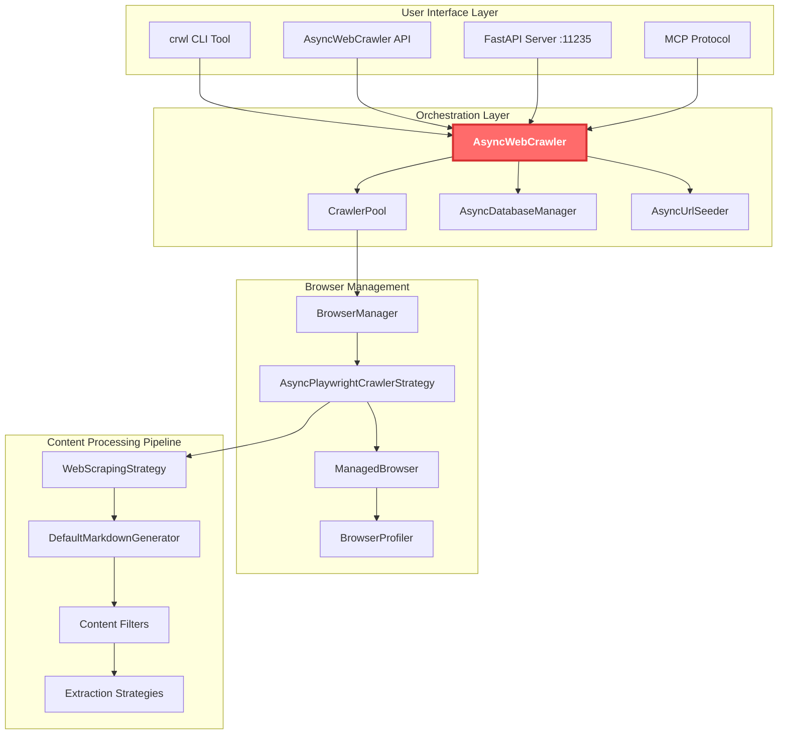
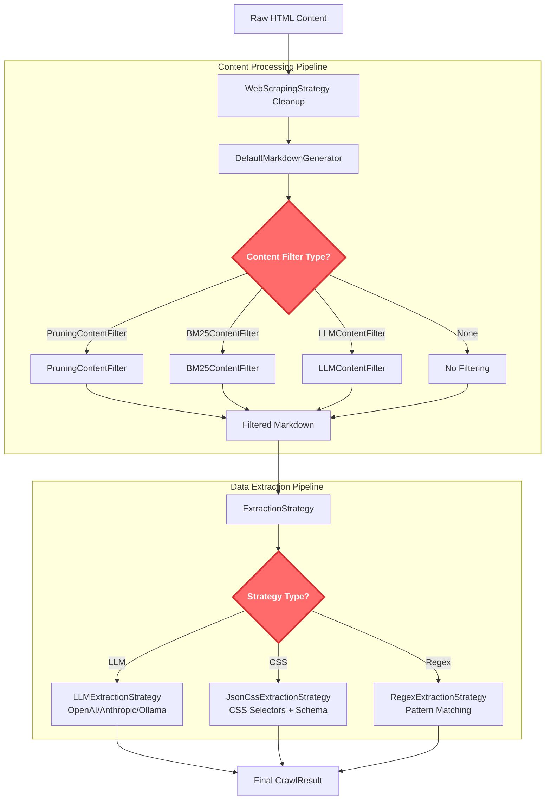

## What Crawl4AI does

Crawl4AI is a specialized web crawler designed specifically for AI applications. Unlike traditional scrapers that merely extract HTML, it intelligently processes web content to create clean, structured data that language models can effectively utilize.

The framework delivers 6x faster performance while producing higher quality results by employing algorithms that identify meaningful content regardless of HTML structure. The output is clean Markdown and structured JSON optimized for AI consumption.

For **RAG systems**, it delivers source-tracked content with noise (menus, ads) removed. **AI agents** receive consistently formatted data following predefined schemas. **Training datasets** benefit from filtered, high-quality content, and **real-time applications** can process multiple pages concurrently without performance issues.

Crawl4AI's key advantages include independence from external APIs (avoiding rate limits and extra costs), AI-first design philosophy, flexible extraction methods (CSS, XPath, regex, or LLMs), and robust handling of anti-bot measures, session management, and IP rotation.

## How it works under the hood

### Core architecture

Crawl4AI implements a layered architecture with clear separation between orchestration, browser management, and content processing:



### Execution flow

The `AsyncWebCrawler.arun()` method orchestrates the entire crawling process:

1. **Cache check**: Query `AsyncDatabaseManager` for existing results
2. **Browser acquisition**: Get pre-warmed browser instance from `BrowserManager`
3. **Page navigation**: Use `AsyncPlaywrightCrawlerStrategy` for actual crawling
4. **Content processing**: Apply `WebScrapingStrategy` for HTML cleaning
5. **Markdown generation**: Transform content through `DefaultMarkdownGenerator`
6. **Strategy execution**: Run configured `ExtractionStrategy` for structured data
7. **Result assembly**: Package everything into `CrawlResult` object
8. **Cache storage**: Persist results for future use

### Browser management strategy

Crawl4AI uses sophisticated browser pooling to handle concurrent requests efficiently:

```python
# Browser pool with pre-warmed instances
class BrowserManager:
    def __init__(self):
        self.browser_pool = {}  # Pre-warmed browsers
        self.session_contexts = {}  # Persistent sessions

    async def get_browser_page(self, config: BrowserConfig):
        # Return existing or create new browser instance
        # Handles session persistence, proxy rotation, anti-detection
```

**Key Features:**

- **Pre-warmed instances**: Browsers ready before requests arrive
- **Session persistence**: Maintain state across multiple crawls
- **Anti-detection**: Randomized fingerprints, user agents, viewport sizes
- **Profile management**: Persistent user data directories for complex workflows

## Data structures and algorithms

### Core data structures

**CrawlResult - The primary output object**

```python
@dataclass
class CrawlResult:
    # Basic info
    url: str                    # Final URL after redirects
    success: bool              # Crawl success status
    status_code: int           # HTTP status code

    # Content variants
    html: str                  # Raw HTML content
    cleaned_html: str          # Sanitized HTML
    markdown: MarkdownGenerationResult  # Multiple markdown variants

    # Extracted data
    extracted_content: str     # JSON structured data from strategies
    media: Dict               # Images, videos, tables with metadata
    links: Dict               # Internal/external links with scores

    # Generated assets
    screenshot: str           # Base64 encoded screenshot
    pdf: bytes               # PDF representation
    network_logs: List       # HTTP request/response logs
```

**Configuration objects hierarchy**

```python
# Browser-level configuration
BrowserConfig:
    headless: bool = True
    user_data_dir: str = None
    chrome_channel: str = "chrome"
    browser_type: str = "chromium"

# Per-crawl configuration
CrawlerRunConfig:
    cache_mode: CacheMode = CacheMode.ENABLED
    extraction_strategy: ExtractionStrategy = NoExtractionStrategy()
    session_id: str = None
    word_count_threshold: int = 10
    content_filter: ContentFilter = None
```

### Algorithms

The content processing algorithms work together in a specific sequence to transform raw HTML into clean, AI-ready content:



**1. PruningContentFilter - The Smart content cleaner**

The `PruningContentFilter` is Crawl4AI's main content cleaning workhorse. It runs right after the basic HTML cleanup but before the final markdown gets generated. Its job is to throw out the junk (like navigation menus, ads, and footer links) while keeping the actual content you care about.

**What makes this different from other tools like Boilerpipe:**

- **Smarter link handling**: Instead of just counting links versus text, Crawl4AI actually looks at what kind of links they are and where they appear. A navigation menu gets treated differently than a citation in an article.

- **Works with multiple crawlers**: When you're running several browser instances at the same time, each filter keeps its own state so they don't interfere with each other.

- **Self-adjusting thresholds**: This is the clever bit - the filter adapts to different types of pages:
  - `"fixed"` mode: Every piece of content needs to hit the same score to survive
  - `"dynamic"` mode: The scoring adjusts based on what type of page it's looking at, so it doesn't accidentally remove good content from sparse pages or leave junk on cluttered ones

Everything happens in memory while processing, and the results get cached so you don't have to reprocess the same URL later.

```python
class PruningContentFilter:
    def __init__(self, threshold: float = 0.48, threshold_type: str = "dynamic"):
        self.threshold = threshold
        self.threshold_type = threshold_type  # "fixed" or "dynamic"

    def filter_content(self, content: str) -> str:
        # Parse DOM and calculate node scores
        # Apply link density heuristics
        # Use dynamic thresholding for adaptive filtering
        # Return pruned content with high information density
```

**2. BM25 content filtering**

The BM25 filter kicks in during content processing, right after the HTML gets cleaned up but before it becomes final markdown. When you give it a search query, Crawl4AI uses this to keep only the content that actually matches what you're looking for, which makes the output much more focused.

**How it works:** The filter breaks content into chunks and scores how well each chunk matches your query terms using the [BM25 algorithm](https://www.geeksforgeeks.org/nlp/what-is-bm25-best-matching-25-algorithm/) (a variation of TF-IDF that's better for short documents). It then throws out anything that doesn't score high enough.

```python
class BM25ContentFilter:
    def __init__(self, user_query: str, bm25_threshold: float = 1.0):
        self.query_terms = user_query.lower().split()
        self.threshold = bm25_threshold

    def filter_content(self, content: str) -> str:
        # Calculate BM25 scores for content chunks
        # Filter chunks below threshold
        # Return high-relevance content only
```

This runs when you set up the `content_filter` parameter in your crawler config. It happens after the basic HTML cleanup but before the final markdown gets generated. The filter breaks content into chunks and scores how well each chunk matches your query terms, then throws out anything that doesn't score high enough.

**3. Strategy pattern for extraction**

Crawl4AI uses the Strategy pattern to support multiple extraction methods. This allows you to choose the best approach for each website - whether that's AI-powered extraction for complex pages, CSS selectors for structured sites, or regex patterns for predictable content.

**Available strategies:**

- **LLM-based**: Uses AI models for intelligent, flexible extraction
- **CSS-based**: Fast extraction using CSS selectors with JSON schema mapping
- **Regex-based**: Pattern matching for predictable, structured content

```python
class ExtractionStrategy(ABC):
    @abstractmethod
    async def extract(self, url: str, html: str) -> str:
        pass

# Concrete implementations
class LLMExtractionStrategy(ExtractionStrategy):
    # Uses OpenAI/Anthropic/Ollama for intelligent extraction

class JsonCssExtractionStrategy(ExtractionStrategy):
    # Uses CSS selectors with JSON schema mapping

class RegexExtractionStrategy(ExtractionStrategy):
    # Pattern-based extraction for structured content
```

**4. Priority queue for deep crawling**

For deep crawling scenarios where you need to explore multiple pages from a starting URL, Crawl4AI uses a priority queue to intelligently decide which pages to crawl next. This ensures the most relevant or important pages are processed first.

**How it works:** URLs are scored based on factors like link relevance, page importance, and content quality. The crawler then processes the highest-scoring URLs first, making deep crawling much more efficient than simple breadth-first or depth-first approaches.

```python
class BestFirstCrawlStrategy:
    def __init__(self):
        self.url_queue = PriorityQueue()  # (score, url) tuples
        self.visited = set()

    async def crawl(self, start_url: str, max_pages: int):
        while not self.url_queue.empty() and len(self.visited) < max_pages:
            score, url = await self.url_queue.get()
            # Process highest-scoring URLs first
```

**5. Adaptive learning - Getting smarter over time**

The learning system kicks in after each successful crawl to figure out what worked well and what didn't. It tracks how good the extraction was and adjusts its approach for similar websites in the future. All this learning gets saved to a local SQLite database, so the crawler gets better at handling specific sites over time.

**Learning process:** The system analyzes extraction quality, updates pattern weights, and persists learned strategies. This happens in the background after each crawl, with updates batched every 10 successful extractions to maintain performance during heavy crawling.

```python
class AdaptiveConfig:
    def __init__(self):
        self.pattern_history = {}  # URL patterns → extraction success
        self.persistence_manager = SQLitePatternStore()

    def learn_from_result(self, url: str, extraction_quality: float):
        # Update pattern weights based on extraction success
        # Persist learned patterns for future sessions
        # Improve future extraction strategies
```

## Technical challenges and solutions

### Challenge 1: Browser anti-detection

**Problem**: Modern websites use sophisticated bot detection including fingerprinting, behavioral analysis, and CAPTCHA systems.

**Solution**: Multi-layered anti-detection strategy

Crawl4AI implements several layers of anti-detection to bypass modern bot detection systems. This includes randomized browser fingerprints, behavioral simulation, and proxy rotation to make requests appear more human-like.

**Anti-detection techniques:**

- **Fingerprint randomization**: Rotating user agents, viewport sizes, locales, and timezones
- **Behavioral simulation**: Human-like scrolling, mouse movements, and timing delays
- **Proxy rotation**: Distributing requests across multiple IP addresses
- **Session persistence**: Maintaining cookies and state like real users

```python
# Randomized browser fingerprints
browser_config = BrowserConfig(
    user_agent_mode="random",  # Rotate user agents
    viewport_width=random.randint(1024, 1920),
    viewport_height=random.randint(768, 1080),
    locale=random.choice(["en-US", "en-GB", "de-DE"]),
    timezone_id=random.choice(["America/New_York", "Europe/London"])
)

# Stealth techniques
magic=True  # Enable stealth mode
proxy_config=ProxyConfig(rotation_enabled=True)
```

### Challenge 2: Large-scale concurrent crawling

**Problem**: Memory exhaustion and resource contention when crawling thousands of URLs concurrently.

**Solution**: Memory-adaptive dispatching with intelligent resource management

To handle large-scale concurrent crawling without overwhelming system resources, Crawl4AI implements intelligent resource management that monitors system memory and adjusts crawling behavior accordingly.

**Resource management features:**

- **Memory monitoring**: Dynamically adjusts concurrency based on available system memory
- **Semaphore-based rate limiting**: Controls the number of concurrent browser instances
- **Browser pooling**: Reuses browser instances across requests to reduce overhead
- **Graceful degradation**: Reduces concurrency under memory pressure

```python
class MemoryAdaptiveDispatcher:
    def __init__(self, memory_threshold: float = 0.8):
        self.memory_threshold = memory_threshold
        self.active_crawlers = 0

    async def dispatch_crawl(self, url: str):
        current_memory = psutil.virtual_memory().percent / 100
        if current_memory > self.memory_threshold:
            await self.wait_for_memory_relief()

        # Proceed with crawl only when memory is available
```

### Challenge 3: Content quality for LLMs

**Problem**: Raw web content contains navigation menus, ads, footers, and other noise that degrades LLM performance.

**Solution**: Multiple content filtering strategies

Crawl4AI provides three main content filter types that can be used individually or in combination to transform raw web content into clean, AI-ready text:

**Available content filters:**

- **PruningContentFilter**: Heuristic-based filtering using text density, link density, and tag importance
- **BM25ContentFilter**: Query-based relevance filtering using BM25 ranking algorithm
- **LLMContentFilter**: AI-powered intelligent content filtering and formatting

```python
# Heuristic-based filtering (most common)
content_filter = PruningContentFilter(threshold=0.48, threshold_type="dynamic")

# Query-based filtering for targeted content
content_filter = BM25ContentFilter(user_query="product information", bm25_threshold=1.0)

# AI-powered filtering for intelligent selection
content_filter = LLMContentFilter(instruction="Keep only product details and specifications")

# Configure crawler with chosen filter
config = CrawlerRunConfig(content_filter=content_filter)
result = await crawler.arun(url, config=config)
```

### Challenge 4: Dynamic content handling

**Problem**: JavaScript-heavy websites with infinite scroll, lazy loading, and dynamic content generation.

**Solution**: Advanced browser automation with virtual scrolling

For JavaScript-heavy websites with infinite scroll, lazy loading, and dynamic content, Crawl4AI uses advanced browser automation techniques to ensure all content is captured.

**Dynamic content strategies:**

- **Virtual scrolling**: Automatically detects and handles infinite scroll pages
- **JavaScript execution**: Runs custom JS code to trigger dynamic content loading
- **Wait strategies**: Intelligently waits for content to load before proceeding
- **Content change detection**: Monitors DOM changes to ensure completeness

```python
# Virtual scroll configuration for infinite content
virtual_scroll_config = VirtualScrollConfig(
    wait_time=2.0,  # Wait between scroll actions
    check_scroll_position=True,  # Detect scroll position changes
    max_scroll_attempts=10,  # Limit scroll attempts
    scroll_delay=1.0  # Delay between scrolls
)

# Execute JavaScript for dynamic content
js_code = [
    "window.scrollTo(0, document.body.scrollHeight);",
    "await new Promise(resolve => setTimeout(resolve, 2000));",
    "return document.querySelectorAll('.dynamic-content').length;"
]
```

## Clever tricks and tips

### Performance optimizations

**1. Browser pool pre-warming**

```python
# Pre-warm browser instances during application startup
async def setup_browser_pool():
    browser_manager = BrowserManager()
    # Create 5 ready-to-use browser instances
    for i in range(5):
        await browser_manager.create_browser_instance()
```

**2. Intelligent caching strategy**

```python
# Cache modes for different use cases
cache_config = {
    "development": CacheMode.BYPASS,      # Always fresh content
    "production": CacheMode.ENABLED,      # Use cache when available
    "research": CacheMode.READ_ONLY,      # Never update cache
    "batch_processing": CacheMode.WRITE_ONLY  # Always cache results
}
```

**3. Chunk-based processing for large content**

```python
# Process large documents in chunks to avoid memory issues
def process_large_content(content: str, chunk_size: int = 10000):
    chunks = [content[i:i+chunk_size] for i in range(0, len(content), chunk_size)]
    processed_chunks = [process_chunk(chunk) for chunk in chunks]
    return "".join(processed_chunks)
```

### AI-Specific features

**1. Schema-based extraction with Pydantic**

```python
from pydantic import BaseModel

class ProductInfo(BaseModel):
    name: str
    price: float
    description: str
    availability: bool

# LLM extracts data conforming to schema
extraction_strategy = LLMExtractionStrategy(
    schema=ProductInfo.schema(),
    instruction="Extract product information from the page"
)
```

**2. Multiple markdown variants**

```python
# Different markdown formats for different use cases
result = await crawler.arun(url)
raw_content = result.markdown.raw_markdown          # Unfiltered
clean_content = result.markdown.fit_markdown        # Filtered for quality
cited_content = result.markdown.markdown_with_citations  # With source links
references = result.markdown.references_markdown    # Citation list
```

**3. Network traffic analysis**

```python
# Capture network requests for debugging and analysis
config = CrawlerRunConfig(
    capture_network=True,
    capture_console=True
)

result = await crawler.arun(url, config=config)
# Access network logs for API discovery, performance analysis
network_requests = result.network_logs
console_messages = result.console_messages
```

## Considerations

**Performance trade-offs:**

- **LLM strategies** provide highest accuracy but cost $0.001-0.01 per page
- **CSS/XPath strategies** are free and fast (~50ms) but require structured HTML
- **Browser pooling** improves performance but increases memory usage
- **Caching** reduces API calls but may serve stale content

**Reliability concerns:**

- **Anti-detection bypassing** may violate website terms of service
- **Large-scale crawling** can overwhelm target servers without rate limiting
- **Session persistence** requires careful cleanup to avoid memory leaks
- **Browser automation** depends on Playwright which may break with browser updates

**Cost optimization:**

- Use **hybrid strategies**: Generate schemas once with LLM, reuse with CSS extraction
- Implement **smart caching** to avoid re-crawling unchanged content
- Configure **memory thresholds** to prevent system resource exhaustion
- Apply **content filtering** before expensive LLM processing

---

#### References

- [Crawl4AI GitHub Repository](https://github.com/unclecode/crawl4ai)
- [Crawl4AI Official Documentation](https://docs.crawl4ai.com/)
- [DeepWiki Crawl4AI Analysis](https://deepwiki.com/unclecode/crawl4ai)
