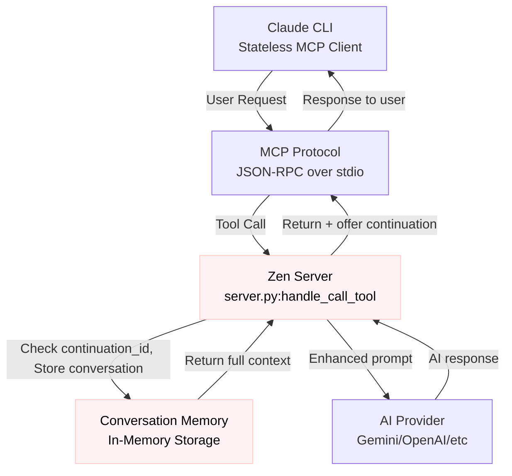
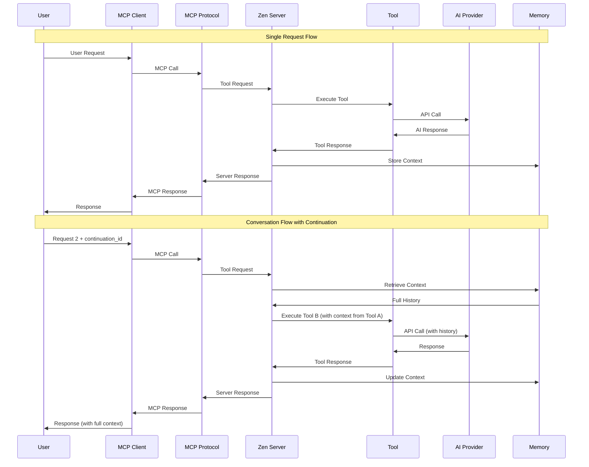

## Overview

The Zen MCP Server is a sophisticated Model Context Protocol (MCP) server that enables multi-AI orchestration, conversation memory, and advanced workflow management.

### Solved problems

Traditional MCP tools call are stateless - each request is independent, with no memory. For complex tasks, this creates significant friction:

- **Context loss**: Need to re-explain the same codebase across multiple interactions
- **Tool isolation**: Different AI tools can't build upon each other's work
- **Manual state magements**: Developers must manually manage state between AI interactions
- **Inefficient workflows**: Repetitive context setting for systematic analysis tasks

### Key technical advances

1. **Stateless-to-stateful bridge**: Converts MCP's inherently stateless protocol into persistent conversation threads
2. **Cross-tool continuation**: Seamless handoffs between different tools while preserving full context
3. **Dual prioritization strategy**: Sophisticated file and conversation prioritization with token-aware budgeting
4. **Multi-provider architecture**: Unified interface supporting multiple AI providers (Gemini, OpenAI, OpenRouter, Custom APIs)
5. **Workflow-enforced tools**: Advanced tools that enforce systematic investigation patterns

### Tool categories and responsibilities

**Simple tools (4 tools)**:

- `chat`: General conversation and collaborative thinking
- `challenge`: Critical analysis to prevent reflexive agreement
- `listmodels`: Display available AI models by provider
- `version`: Server version and configuration information

**Workflow tools (11 tools)**:

- `thinkdeep`: Multi-stage workflow for complex problem analysis
- `debug`: Systematic self-investigation for root cause analysis
- `analyze`: Comprehensive code analysis with expert validation
- `codereview`: Step-by-step code review with security focus
- `consensus`: Multi-model consensus with stance-based analysis
- `planner`: Interactive sequential planning with branching
- `secaudit`: Comprehensive security audit workflow
- `testgen`: Test generation with edge case coverage
- `refactor`: Refactoring analysis with code smell detection
- `precommit`: Pre-commit validation workflow
- `docgen`: Documentation generation workflow

**Special Tools (2 tools)**:

- `tracer`: Code tracing workflow for execution flow analysis
- `challenge`: Hybrid tool preventing reflexive agreement

**Multi-provider AI Access**:

- **Direct APIs**: Gemini, OpenAI, X.AI GROK
- **Aggregated APIs**: OpenRouter (50+ models)
- **Local models**: Ollama, vLLM, LM Studio
- **Unified APIs**: DIAL platform
- **Auto selection**: Intelligent model routing based on task requirements

### Usecases

**Scenario 1 - Cross-tool investigation**:

```
1. Claude: "Analyze this codebase for security issues"
   → analyze tool creates thread_id, examines architecture
2. Claude: "Now do a detailed security audit" + continuation_id=thread_id
   → secaudit tool sees FULL analyze context + files, performs deep security review
3. Claude: "Debug the SQL injection issues found" + continuation_id=thread_id
   → debug tool sees BOTH analyze + secaudit findings, debugs specific vulnerabilities
```

**Scenario 2 - Multi-model consensus**:

```
Claude: "Should we migrate from Express to Fastify?"
→ consensus tool calls:
  - O3 (arguing FOR migration)
  - Gemini (arguing AGAINST migration)
  - O3-mini (neutral analysis)
→ Returns synthesized recommendation with evidence from all perspectives
```

**Scenario 3 - Context revival after reset**:

```
1. Long conversation with Claude analyzing complex system
2. Claude's context gets reset (hits token limit)
3. User: "Continue our discussion" + continuation_id
4. New Claude instance gets FULL conversation history
5. Seamless continuation as if context never reset
```

## How it works

### Architecture overview



### Request flow



### Data structures and algorithms

#### Core data models

##### Thread context

```python
class ThreadContext(BaseModel):
    thread_id: str                    # UUID for conversation tracking
    parent_thread_id: Optional[str]   # Conversation chains support
    created_at: str                   # ISO timestamp
    last_updated_at: str              # Auto-updated on each turn
    tool_name: str                    # Tool that created thread
    turns: list[ConversationTurn]     # All conversation exchanges
    initial_context: dict[str, Any]   # Original request parameters
```

#### Conversation turn

```python
class ConversationTurn(BaseModel):
    role: str                         # "user" (Claude) or "assistant" (AI)
    content: str                      # The actual message/response
    timestamp: str                    # When this turn was created
    files: Optional[list[str]]        # Files referenced in THIS turn
    images: Optional[list[str]]       # Images referenced in THIS turn
    tool_name: Optional[str]          # Which tool generated this
    model_provider: Optional[str]     # "google", "openai", "openrouter"
    model_name: Optional[str]         # "gemini-2.5-flash", "o3-mini"
    model_metadata: Optional[dict]    # Token usage, thinking mode, etc.
```

#### Model context

```python
class ModelContext:
    model_name: str
    provider: ModelProvider
    capabilities: ModelCapabilities

    def calculate_token_allocation(self) -> TokenAllocation:
        # Dynamic allocation based on model capacity
        if total_tokens < 300_000:
            # O3 models: Conservative 60/40 split
            content_ratio, response_ratio = 0.6, 0.4
        else:
            # Gemini models: Generous 80/20 split
            content_ratio, response_ratio = 0.8, 0.2

        # Sub-allocate content budget
        file_tokens = int(content_tokens * 0.4)      # 40% for files
        history_tokens = int(content_tokens * 0.4)   # 40% for history
        # 20% remains for tool-specific prompts
```

### Key algorithms

#### 1. File deduplication algorithm

**Problem**: In multi-turn conversations, the same files get requested repeatedly. Without deduplication, a 50KB file could be embedded in every turn, quickly exhausting token budgets and degrading performance.

**Why this matters**: A typical 5-turn conversation might request the same 3 files repeatedly, resulting in 15 file embeddings instead of 3 unique ones. This wastes 80% of the file token budget.

**Solution**: The filter_new_files algorithm tracks which files have been embedded in previous conversation turns and only embeds truly new files. Previously embedded files remain accessible through conversation history.

```python
def filter_new_files(self, requested_files: list[str], continuation_id: Optional[str]) -> list[str]:
    """Prevents duplicate file embeddings using conversation history"""

    if not continuation_id:
        return requested_files  # New conversation, all files are new

    # Get files already embedded in conversation
    embedded_files = set(self.get_conversation_embedded_files(continuation_id))

    # Return only files that haven't been embedded yet
    new_files = [f for f in requested_files if f not in embedded_files]

    logger.debug(f"Filtered {len(requested_files) - len(new_files)} duplicate files")
    return new_files
```

- **Time complexity**: O(n) where n = number of conversation turns
- **Space complexity**: O(f) where f = unique files across conversation
- **Cache behavior**: Files cached in conversation memory, not re-read from disk

#### 2. Token budget allocation algorithm

**Problem**: Different AI models have vastly different context windows (O3: 200K tokens, Gemini: 1M tokens). A one-size-fits-all allocation strategy either underutilizes large models or overwhelms small ones.

**Why this matters**: Poor token allocation leads to either truncated conversations (losing important context) or inefficient usage (leaving 800K tokens unused on Gemini models).

**Solution**: The calculate_token_allocation algorithm dynamically adjusts allocation ratios based on model capacity. Smaller models prioritize conversation history over files, while larger models can afford generous file embedding.

```python
def calculate_token_allocation(self, reserved_for_response: Optional[int] = None) -> TokenAllocation:
    """Model-specific token budgeting for optimal context utilization"""

    total_tokens = self.capabilities.context_window

    # Dynamic allocation based on model capacity
    if total_tokens < 300_000:
        content_ratio, response_ratio = 0.6, 0.4  # Conservative for smaller models
        file_ratio, history_ratio = 0.3, 0.5      # Prioritize conversation history
    else:
        content_ratio, response_ratio = 0.8, 0.2  # Generous for large models
        file_ratio, history_ratio = 0.4, 0.4      # Balanced allocation

    return TokenAllocation(
        total_tokens=total_tokens,
        content_tokens=int(total_tokens * content_ratio),
        response_tokens=int(total_tokens * response_ratio),
        file_tokens=int(content_tokens * file_ratio),
        history_tokens=int(content_tokens * history_ratio),
    )

def build_conversation_history(context: ThreadContext, token_budget: int) -> str:
    total_tokens = 0
    included_turns = []

    # Process turns newest-to-oldest for budget allocation
    for idx in range(len(context.turns) - 1, -1, -1):
        turn = context.turns[idx]
        turn_tokens = estimate_tokens(turn.content)

        if total_tokens + turn_tokens > token_budget:
            break  # Exclude older turns first

        included_turns.append((idx, turn.content))
        total_tokens += turn_tokens

    # Reverse for chronological presentation
    included_turns.reverse()

    # Build final conversation string
    conversation_parts = []
    for idx, content in included_turns:
        conversation_parts.append(f"Turn {idx + 1}: {content}")

    if len(included_turns) < len(context.turns):
        conversation_parts.insert(0, f"[Showing most recent {len(included_turns)} of {len(context.turns)} turns]")

    return "\n\n".join(conversation_parts)
```

**Adaptive behavior**:

- **O3 models** (200K context): Conservative split, prioritize history over files
- **Gemini models** (1M context): Generous split, balanced file/history allocation

#### 3. Provider resolution algorithm

**Problem**: Multiple AI providers offer overlapping models with different performance characteristics. Users shouldn't need to know which provider hosts which model.

**Why this matters**: Direct APIs (Google, OpenAI) offer better performance and cost than aggregated APIs (OpenRouter), but don't support all models. A poor routing strategy could send all requests to the slowest provider.

**Solution**: The get_provider_for_model algorithm routes through a performance-optimized priority order: Direct APIs first, then unified APIs, then catch-all providers. First match wins.

```python
def get_provider_for_model(cls, model_name: str) -> Optional[ModelProvider]:
    """Route model requests through provider priority order"""

    PROVIDER_PRIORITY_ORDER = [
        ProviderType.GOOGLE,      # Direct APIs first (performance + cost)
        ProviderType.OPENAI,
        ProviderType.XAI,
        ProviderType.DIAL,        # Unified APIs second
        ProviderType.CUSTOM,      # Local models third
        ProviderType.OPENROUTER,  # Catch-all last
    ]

    for provider_type in PROVIDER_PRIORITY_ORDER:
        provider = cls.get_provider(provider_type)
        if provider and provider.validate_model_name(model_name):
            return provider  # First match wins

    return None  # No provider supports this model
```

- **Direct APIs**: Lowest latency, best cost efficiency
- **Aggregated APIs**: Broader model selection, higher latency
- **Local APIs**: Privacy + control, limited model selection

#### 4. Dual prioritization strategy

**Problem**: For optimal token usage, we want newest content first (recent context is most relevant). But for LLM understanding, we want chronological order (natural conversation flow).

**Why this matters**: When token budgets are tight, we must choose which content to exclude. Excluding the most recent context would break conversation coherence, but presenting content out-of-order confuses LLMs.

**Solution**: Two-phase approach that prioritizes newest content but presents chronologically.

```python
def get_prioritized_files(context: ThreadContext) -> list[str]:
    # Phase 1: Collection (Newest-First Priority)
    seen_files = set()
    prioritized_files = []

    # Walk backwards through turns (newest to oldest)
    for i in range(len(context.turns) - 1, -1, -1):
        turn = context.turns[i]
        for file_path in turn.files or []:
            if file_path not in seen_files:
                prioritized_files.append(file_path)  # Newest reference wins
                seen_files.add(file_path)

    # Phase 2: Presentation (Chronological Order)
    prioritized_files.reverse()  # Now oldest-first for LLM understanding
    return prioritized_files
```

### Storage and memory management

**Data structure**: Hash map with expiration tracking

```python
class InMemoryStorage:
    def __init__(self):
        self._store = {}      # thread_id -> ThreadContext JSON
        self._expiry = {}     # thread_id -> expiration timestamp
        self._lock = threading.Lock()  # Thread safety

    def store(self, thread_id: str, context: ThreadContext):
        with self._lock:
            self._store[thread_id] = context.model_dump_json()
            self._expiry[thread_id] = time.time() + (3 * 3600)  # 3 hours TTL

    def get(self, thread_id: str) -> Optional[ThreadContext]:
        with self._lock:
            if thread_id not in self._store:
                return None

            # Check expiration
            if time.time() > self._expiry[thread_id]:
                del self._store[thread_id]
                del self._expiry[thread_id]
                return None

            return ThreadContext.model_validate_json(self._store[thread_id])
```

**Operations**:

- **Create**: O(1) with JSON serialization overhead
- **Read**: O(1) with JSON deserialization overhead
- **Update**: O(1) replacement of entire context
- **Delete**: O(1) explicit deletion, automatic via TTL cleanup

**Key characteristics**:

- **TTL**: 3 hours (configurable via `CONVERSATION_TIMEOUT_HOURS`)
- **Turn Limit**: 20 turns max (configurable via `MAX_CONVERSATION_TURNS`)
- **Thread Safety**: All operations protected by threading.Lock()
- **Automatic Cleanup**: Expired threads removed on access

#### Conversation chains

```python
# Parent-child thread relationships enable conversation spanning
thread_1 = create_thread("analyze", initial_request)
thread_2 = create_thread("codereview", follow_up, parent_thread_id=thread_1)

# build_conversation_history() traverses entire chain
def build_conversation_history(context: ThreadContext):
    if context.parent_thread_id:
        parent_context = get_thread(context.parent_thread_id)
        parent_history = build_conversation_history(parent_context)
        return f"{parent_history}\n{current_history}"
```

## Technical challenges and solutions

### Challenge 1: Stateless protocol + stateful conversations

**The problem**: MCP is inherently stateless. Each tool call is independent with no knowledge of previous interactions. But real AI collaboration requires memory.

**The solution: In-memory process-persistent storage**

```python
# server.py: Single persistent process handles all requests
# utils/conversation_memory.py: Thread-safe in-memory storage

def create_thread(tool_name: str, initial_request: dict) -> str:
    thread_id = str(uuid.uuid4())  # Cryptographically secure IDs

    context = ThreadContext(
        thread_id=thread_id,
        tool_name=tool_name,
        turns=[],  # Empty initially
        initial_context=filtered_request
    )

    # Store with 3-hour TTL
    storage.setex(f"thread:{thread_id}", CONVERSATION_TIMEOUT_SECONDS, context.json())
    return thread_id
```

**Why this works**:

- **Performance**: O(1) thread lookup, no I/O overhead
- **Simplicity**: No external dependencies, pure Python
- **Security**: UUID-based keys prevent injection attacks
- **Auto-cleanup**: TTL prevents memory leaks

**Trade-offs**:

- ❌ **Process restart** loses conversations (acceptable for development tool)
- ❌ **Single process** (not distributed), but MCP is single-process anyway
- ✅ **Perfect for MCP use case**: Desktop integration, development workflows

### Challenge 2: file content deduplication

**The problem**: In multi-turn conversations, the same files get requested repeatedly. Embedding the same 50KB file in every turn wastes tokens and degrades performance.

**The solution: Conversation-aware file filtering**

```python
def filter_new_files(self, requested_files: list[str], continuation_id: Optional[str]) -> list[str]:
    if not continuation_id:
        return requested_files  # New conversation, all files are new

    embedded_files = set(self.get_conversation_embedded_files(continuation_id))
    new_files = [f for f in requested_files if f not in embedded_files]

    logger.debug(f"Filtered {len(requested_files) - len(new_files)} duplicate files")
    return new_files
```

**The Magic**: Tools can request `["file1.py", "file2.py", "file3.py"]` but only new files are actually embedded. Previously embedded files are accessible through conversation history.

**Example**:

```
Turn 1: analyze tool requests ["auth.py", "user.py"] → Both embedded (2 files)
Turn 2: codereview tool requests ["auth.py", "user.py", "test.py"] → Only test.py embedded (1 file)
Turn 3: debug tool requests ["auth.py", "bug.py"] → Only bug.py embedded (1 file)

Total: 4 unique files embedded across 3 turns instead of 7 total files
```

### Challenge 3: Cross-tool context sharing

**The problem**: How do you hand off context from `analyze` tool to `codereview` tool to `debug` tool seamlessly?

**The MCP reality**: Each tool call is completely independent. No shared state, no knowledge of previous tools.

**The solution: Context injection via conversation reconstruction**

```python
async def reconstruct_thread_context(arguments: dict[str, Any]) -> dict[str, Any]:
    """Transform stateless MCP request into stateful continuation"""

    # 1. Load full conversation thread
    context = get_thread(continuation_id)

    # 2. Build comprehensive history with dual prioritization
    conversation_history, tokens_used = build_conversation_history(
        context,
        model_context=model_context,
        read_files_func=read_files
    )

    # 3. Inject into current tool's prompt
    user_prompt = arguments.get("prompt", "")
    enhanced_prompt = f"{conversation_history}\n\n{user_prompt}"
    arguments["prompt"] = enhanced_prompt

    # 4. Pass remaining token budget to tool
    token_allocation = model_context.calculate_token_allocation()
    remaining_tokens = token_allocation.content_tokens - tokens_used
    arguments["_remaining_tokens"] = remaining_tokens

    return arguments
```

**What the tool sees**:

````
=== CONVERSATION HISTORY (CONTINUATION) ===
Thread: abc-123-def
Tool: analyze
Turn 2/20

=== FILES REFERENCED IN THIS CONVERSATION ===
The following files have been shared and analyzed:

```12:45:auth/user.py
class UserManager:
    def authenticate(self, username, password):
        # SECURITY ISSUE: Plain text password comparison
        return self.users.get(username) == password
```

=== END REFERENCED FILES ===

Previous conversation turns:

--- Turn 1 (Claude) ---
Files used: auth/user.py, auth/session.py
Analyze this authentication system for security vulnerabilities.

--- Turn 2 (Gemini using analyze via google/gemini-2.5-flash) ---
I found several critical security issues:

1. Plain text password storage and comparison
2. No session timeout mechanism
3. Missing CSRF protection
   [... full analysis ...]

=== END CONVERSATION HISTORY ===

CURRENT REQUEST: Now do a comprehensive security audit focusing on the issues found.

````

**Result**: The `secaudit` tool has complete context from the `analyze` tool without any manual re-explanation.

### Challenge 4: Token budget management across models

**The problem**: Different AI models have vastly different context windows:
- **O3**: 200K tokens
- **Gemini 2.5**: 1M tokens
- **Custom models**: 8K-128K tokens

How do you allocate tokens efficiently across conversation history, file content, and response space?

**The solution: Adaptive token allocation strategy**

```python
def calculate_token_allocation(self) -> TokenAllocation:
    total_tokens = self.capabilities.context_window

    # Dynamic allocation based on model capacity
    if total_tokens < 300_000:
        # Smaller models: Conservative allocation
        content_ratio = 0.6    # 60% for content
        response_ratio = 0.4   # 40% for response
        file_ratio = 0.3       # 30% of content for files
        history_ratio = 0.5    # 50% of content for conversation
    else:
        # Larger models: Generous allocation
        content_ratio = 0.8    # 80% for content
        response_ratio = 0.2   # 20% for response
        file_ratio = 0.4       # 40% of content for files
        history_ratio = 0.4    # 40% of content for conversation

    return TokenAllocation(
        total_tokens=total_tokens,
        content_tokens=int(total_tokens * content_ratio),
        response_tokens=int(total_tokens * response_ratio),
        file_tokens=int(content_tokens * file_ratio),
        history_tokens=int(content_tokens * history_ratio),
    )
```

**Examples**:

**O3 Model (200K tokens)**:

- Content: 120K tokens (60%)
- Response: 80K tokens (40%)
- Files: 36K tokens (30% of content)
- History: 60K tokens (50% of content)
- Tool prompts: 24K tokens (remaining)

**Gemini 2.5 Pro (1M tokens)**:

- Content: 800K tokens (80%)
- Response: 200K tokens (20%)
- Files: 320K tokens (40% of content)
- History: 320K tokens (40% of content)
- Tool prompts: 160K tokens (remaining)

**Adaptive behavior**: Smaller models prioritize conversation history over files. Larger models can afford generous file embedding.

### Challenge 5: Workflow tool step enforcement

**The problem**: How do you ensure users actually investigate between workflow steps instead of just calling the tool repeatedly without doing any work?

**The solution: Forced pause with required actions**

```python
def get_step_guidance_message(self, request) -> str:
    next_step = request.step_number + 1

    return (
        f"MANDATORY: DO NOT call the {self.get_name()} tool again immediately. "
        f"You MUST first work using appropriate tools. "
        f"REQUIRED ACTIONS before calling {self.get_name()} step {next_step}:"
        f"\n{self._get_required_actions(request)}"
    )

def _get_required_actions(self, request) -> str:
    """Tool-specific actions based on current progress"""
    if request.confidence == "low":
        return (
            "- Search for code related to the reported issue\n"
            "- Examine relevant files and understand implementation\n"
            "- Trace method calls and data flow through system"
        )
    elif request.confidence == "high":
        return (
            "- Examine exact code sections where you believe issue occurs\n"
            "- Verify your hypothesis with code analysis\n"
            "- Confirm root cause before proceeding"
        )
```

**Enforcement mechanism**: The tool responds with required actions but does NOT continue automatically. This forces Claude to actually do the investigation work before the next step.

**Example flow**:

```
1. User calls debug tool step 1 → Tool returns investigation guidance
2. Claude MUST use codebase_search, read_file, grep_search tools
3. Only after investigation can Claude call debug tool step 2
4. Step 2 has NEW evidence from actual code examination
5. Process repeats until confidence = "certain"
```

**Why this works**:

- ✅ **Enforces thoroughness**: No shortcuts allowed
- ✅ **Builds evidence**: Each step requires new findings
- ✅ **Natural workflow**: Mimics real debugging process
- ✅ **Quality control**: Tools track confidence progression

### Challenge 6: Multi-provider model routing

**The problem**: Supporting 6+ different AI providers (Google, OpenAI, OpenRouter, XAI, DIAL, Custom) with different APIs, model names, capabilities, and failure modes.

**Why it's hard**:

- Each provider has different authentication, endpoints, and request formats
- Model names aren't standardized (gpt-4o vs gemini-2.5-pro vs claude-sonnet-4)
- Capabilities vary wildly (context windows, image support, temperature constraints)
- Failures need different retry strategies

**The solution**: Priority-based provider registry with graceful fallbacks

```python
# Provider priority order optimizes for performance and cost
PROVIDER_PRIORITY_ORDER = [
    ProviderType.GOOGLE,      # Direct APIs first (fastest, cheapest)
    ProviderType.OPENAI,
    ProviderType.XAI,
    ProviderType.DIAL,        # Unified APIs next
    ProviderType.CUSTOM,      # Local models (privacy but lower availability)
    ProviderType.OPENROUTER,  # Catch-all last (higher latency, cost)
]

def get_provider_for_model(model_name: str) -> Optional[ModelProvider]:
    """Route model to first available provider that supports it"""
    for provider_type in PROVIDER_PRIORITY_ORDER:
        provider = get_provider(provider_type)

        # Skip if provider not configured or available
        if not provider or not provider.is_available():
            continue

        # Check if provider supports this model
        if provider.validate_model_name(model_name):
            return provider

    return None  # No provider found

# Each provider handles its own model validation and aliases
class GeminiProvider(ModelProvider):
    MODEL_ALIASES = {
        "flash": "gemini-2.5-flash",
        "pro": "gemini-2.5-pro",
        "flash2": "gemini-2.0-flash"
    }

    def validate_model_name(self, model_name: str) -> bool:
        canonical_name = self.MODEL_ALIASES.get(model_name.lower(), model_name)
        return canonical_name in self.SUPPORTED_MODELS

class OpenRouterProvider(ModelProvider):
    def validate_model_name(self, model_name: str) -> bool:
        return True  # OpenRouter accepts any model, validates at API level
```

**Robustness**: This architecture gracefully handles provider outages, API key issues, and model availability changes without user-visible failures.

### Challenge 7: Auto vs manual model selection

**The problem**: Users want both simplicity (just work!) and control (use the right model for the job). How do you provide both without confusing UX?

**Why it's hard**:

- Different tasks need different models (reasoning vs speed vs cost)
- Available models depend on configured API keys
- Users have varying levels of AI model expertise
- Tool schemas must adapt to available models

**The solution**: Effective auto mode with intelligent defaults by using 4-Layer Architecture

The automatic model selection system operates through four sophisticated layers:

#### Layer 1: Configuration detection (`config.py`)

```python
# Auto mode activation patterns
DEFAULT_MODEL = "auto"                    # Explicit auto mode
DEFAULT_MODEL = "unavailable-model"       # Fallback to auto mode
```

**Auto mode logic**:

```python
def is_effective_auto_mode(self) -> bool:
    # Case 1: Explicit auto mode
    if DEFAULT_MODEL.lower() == "auto":
        return True
    # Case 2: Model not available (fallback to auto)
    provider = ModelProviderRegistry.get_provider_for_model(DEFAULT_MODEL)
    return not bool(provider)
```

#### Layer 2: Tool category requirements

**Tool category distribution**:

- **EXTENDED_REASONING**:
  - Tools: `thinkdeep`, `debug`, `analyze`, `codereview`, `secaudit`, `testgen`, `refactor`, `docgen`, `precommit`, `planner`, `tracer`, `consensus`
  - Selection priority: `o3` → `grok-3` → `gemini-2.5-pro` → `openrouter thinking models`
- **FAST_RESPONSE**:
  - Tools: `chat`, `challenge`, `listmodels`, `version`
  - Selection priority: `o4-mini` → `o3-mini` → `grok-3-fast` → `gemini-2.5-flash`
- **BALANCED**: Default fallback category for new tools
  - Selection priority: `o4-mini` → `o3-mini` → `grok-3` → `gemini-2.5-flash`

#### Layer 3: Provider priority routing

**Provider priority order**:

```python
PROVIDER_PRIORITY_ORDER = [
    ProviderType.GOOGLE,      # Direct Gemini access (highest priority)
    ProviderType.OPENAI,      # Direct OpenAI access
    ProviderType.XAI,         # Direct X.AI GROK access
    ProviderType.DIAL,        # DIAL unified API access
    ProviderType.CUSTOM,      # Local/self-hosted models
    ProviderType.OPENROUTER,  # Catch-all for cloud models (lowest priority)
]
```

**Model resolution algorithm**:

```python
def get_provider_for_model(model_name: str) -> Optional[ModelProvider]:
    for provider_type in PROVIDER_PRIORITY_ORDER:
        provider = get_provider(provider_type)
        if provider and provider.validate_model_name(model_name):
            return provider  # First match wins
    return None
```

#### Layer 4: Early resolution (`server.py:639`)

**Request Processing Flow**:

```python
# Early model resolution prevents runtime failures
if model_name.lower() == "auto":
    tool_category = tool.get_model_category()
    resolved_model = ModelProviderRegistry.get_preferred_fallback_model(tool_category)
    arguments["model"] = resolved_model

# Model validation and context creation
provider = ModelProviderRegistry.get_provider_for_model(model_name)
model_context = ModelContext(model_name, provider, capabilities)
arguments["_model_context"] = model_context
```

### Model restriction

**Environment-based restrictions**:

```bash
OPENAI_ALLOWED_MODELS="o3-mini,o4-mini"
GOOGLE_ALLOWED_MODELS="flash,pro"
OPENROUTER_ALLOWED_MODELS="opus,sonnet"
```

**Multi-level enforcement**:

1. **Provider level**: Applied during model validation
2. **Schema generation**: Restricted models excluded from enums
3. **Alias-aware**: Checks both canonical names and aliases
4. **Graceful gallback**: Intelligent alternative selection

## Clever tricks and tips we discovered

### Trick 1: The "newest-first" file strategy

**The challenge**: In multi-turn conversations, the same file often appears multiple times. Which version should we use?

**The solution**: Walk backwards through conversation turns so newer file references take precedence:

```python
def get_conversation_file_list(context: ThreadContext) -> list[str]:
    seen_files = set()
    file_list = []

    # Walk BACKWARDS (newest to oldest turns)
    for i in range(len(context.turns) - 1, -1, -1):
        turn = context.turns[i]
        if turn.files:
            for file_path in turn.files:
                if file_path not in seen_files:
                    seen_files.add(file_path)
                    file_list.append(file_path)  # Newest wins!

    return file_list
```

**Result**: Tools always see the most recent version of files, preventing outdated content from contaminating analysis.

### Trick 2: The dual prioritization strategy

**The challenge**: For optimal token usage, we want newest content first. But for LLM understanding, we want chronological order.

**The solution**: Collect newest-first, present chronologically:

```python
def build_conversation_history(context: ThreadContext) -> tuple[str, int]:
    turn_entries = []
    total_tokens = 0

    # PHASE 1: Collection (newest-first for token budget)
    for idx in range(len(all_turns) - 1, -1, -1):  # BACKWARDS
        turn = all_turns[idx]
        if total_tokens + turn_tokens > budget:
            break  # Exclude OLDER turns first
        turn_entries.append((idx, turn_content))

    # PHASE 2: Presentation (chronological for LLM)
    turn_entries.reverse()  # Now oldest-first
    return format_turns_chronologically(turn_entries)
```

**Result**: Optimal token allocation AND natural conversation flow.

### Trick 3: Early model resolution

**The challenge**: Model resolution is expensive and error-prone when done repeatedly.

**The solution**: Resolve "auto" mode and validate models once at the MCP boundary:

```python
@server.call_tool()
async def handle_call_tool(name: str, arguments: dict[str, Any]):
    # BEFORE tool execution, resolve "auto" to specific model
    if model_name.lower() == "auto":
        resolved_model = ModelProviderRegistry.get_preferred_fallback_model(tool_category)
        arguments["model"] = resolved_model

    # Validate model availability ONCE
    provider = ModelProviderRegistry.get_provider_for_model(model_name)
    if not provider:
        return early_error_response(f"Model {model_name} not available")

    return await tool.execute(arguments)
```

**Result**: Single point of failure, consistent resolution, clear error messages.

### Trick 4: Model-specific token allocation

**The challenge**: O3 has 200K tokens, Gemini has 1M tokens. How do you allocate efficiently?

**The solution**: Adaptive allocation based on model capacity:

```python
def calculate_token_allocation(self) -> TokenAllocation:
    if total_tokens < 300_000:
        # Smaller models: Conservative, prioritize history
        content_ratio, response_ratio = 0.6, 0.4
        file_ratio, history_ratio = 0.3, 0.5
    else:
        # Larger models: Generous, balanced allocation
        content_ratio, response_ratio = 0.8, 0.2
        file_ratio, history_ratio = 0.4, 0.4
```

**Examples**: O3 gets 36K for files, 60K for history. Gemini gets 320K for files, 320K for history.

### Trick 5: Provider priority cascade

**The challenge**: Not all AI providers are equal in performance and cost.

**The solution**: Route through a performance-optimized priority order:

```python
PROVIDER_PRIORITY_ORDER = [
    ProviderType.GOOGLE,      # Direct APIs: Fast, cheap
    ProviderType.OPENAI,      
    ProviderType.XAI,         
    ProviderType.DIAL,        # Unified APIs: More latency
    ProviderType.CUSTOM,      # Local: Privacy, limited
    ProviderType.OPENROUTER,  # Catch-all: Highest latency
]
```

**Result**: Best performance provider is always chosen first, with automatic fallback.

### Trick 6: The "continuation offer" pattern

**The challenge**: How do you make cross-tool collaboration feel natural?

**The solution**: Every tool response includes a continuation offer:

```python
def generate_continuation_offer(self, thread_id: str) -> str:
    return (
        f"💡 **Continue this conversation**: Copy this continuation ID:\n\n"
        f"`continuation_id={thread_id}`\n\n"
        f"Example: \"Now review for security\" with continuation_id={thread_id}"
    )
```

**User Flow**: analyze → continuation offer → secaudit gets FULL context → seamless handoff.

### Trick 7: Confidence-driven workflow termination

**The challenge**: When should workflow tools stop investigating?

**The solution**: Progressive confidence tracking with expert validation:

```python
def should_continue_investigation(self, request) -> bool:
    if request.confidence == "certain":
        return False  # Trigger expert analysis
    return True       # Continue investigation

# Confidence progression: exploring → low → medium → high → certain → expert validation
```

**Result**: Tools naturally evolve from exploration to certainty with quality control.

### Trick 8: MCP optimization

**The challenge**: MCP protocol has transport limits, but internal processing doesn't.

**The solution**: Separate transport constraints from internal capabilities:

```python
# MCP Transport: Limited to ~960K characters
def validate_mcp_request_size(prompt: str) -> bool:
    return len(prompt) <= MCP_PROMPT_SIZE_LIMIT

# Internal Processing: No limits, can handle 1M+ tokens
async def call_external_model(enhanced_prompt: str) -> str:
    # Full context: conversation + files + system prompts
    return await model_context.provider.generate(enhanced_prompt)
```

**Result**: Rich internal context without transport constraints affecting user experience.

## What we would do differently

**1. Memory persistence**: 
- **Current**: In-memory storage, lost on restart
- **Better**: Redis/SQLite persistence with conversation export/import

**2. File change detection**:
- **Current**: File content may change between conversation turns
- **Better**: File hashing to detect changes, automatic re-embedding
