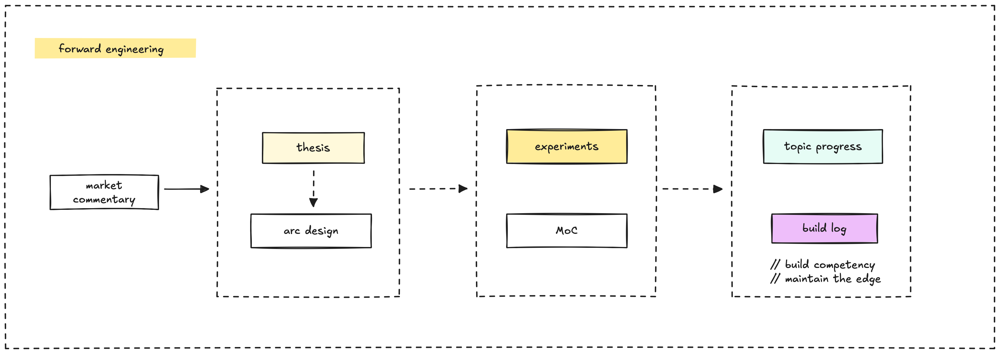
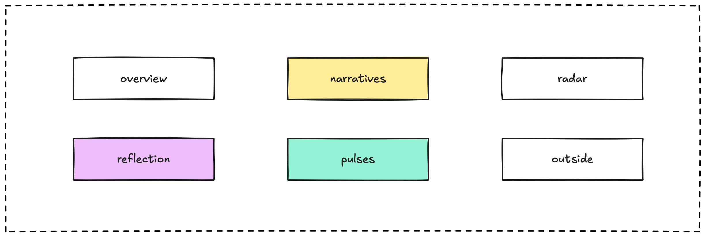
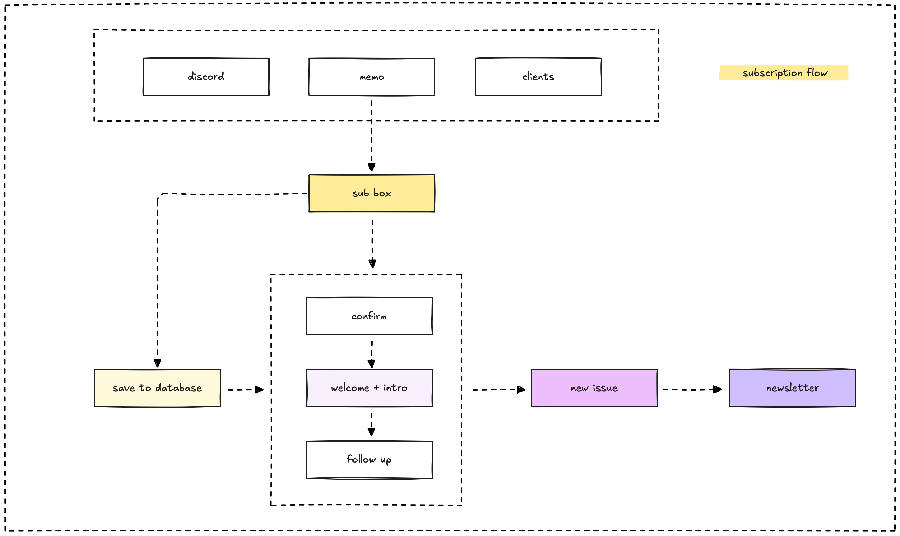

We put together the forward engineering newsletter every month to share what the Dwarves uncover through tech research, experiments, and market trends.

Our aim is to keep the team sharp, always learning, and ready to create well-crafted software that drives innovation. We gather insights from the tech landscape and share them with our woodland community. This guide walks you through our process, from collecting ideas to sending out the final issue.

### Gathering insights for the newsletter

We dive into the tech world like explorers mapping a new trail. The team reads up on tech news, runs experiments, and chats on platforms like Discord to spot what’s trending.

Here’s how it flows: we start with market commentary, build a thesis on where tech is heading, and then focus on specific topics. Some topics turn into progress updates, showing what we’re learning, while others become build logs, where we document our experiments to sharpen our skills and stay ahead. The diagram breaks this down, showing how we turn raw observations into insights.

### Structuring the newsletter content

Our newsletter follows a clear structure to share our insights in a way that’s easy to follow and engaging. We organize it into sections that flow naturally, guiding readers through our tech journey like a well-crafted piece of software.

Each part builds on the last, starting with a snapshot of what’s new at Dwarves, diving into trends and opportunities, evaluating tech, and ending with our broader thoughts. Here’s a closer look at each section to help you write with focus and clarity.

#### Columns in detail

> **OVERVIEW** / NARRATIVE / PULSE / RADAR / OUTSIDE / REFLECTION

Here’s a breakdown of each section to guide your writing.

The **overview** sets the tone with a quick snapshot of what’s happening at Dwarves, covering our current research, hiring updates, or recent deliverables. Keep it brief but engaging, so readers know what to expect.

**Tech narratives** focus on the big trends in the dev and tech community, exploring how they shape the way we build software. This is where we dig into what’s driving change and what it means for our work as craftspeople. For instance, in our [May 2025 issue](/updates/forward/2025-05), we explored how AI is changing software development, a trend we see growing stronger.

**Pulses** spotlight new movements in the tech or biz scene that could lead to opportunities. We look for early signals of change and discuss how they might influence our approach or create new possibilities.

**Radar** shares our findings from trialing new tech or tools, placing them on our tech radar (adopt, trial, assess, hold). This section focuses on what we’ve learned through hands-on experiments and where these tools fit in our workflow.

**Outside interest / misc** lets us share links to external topics that catch our eye. It’s an optional section, but a good spot to point readers to resources that add value to our insights.

**Reflection** ties everything together with our overarching thoughts or a bold prediction. This is where we step back, reflect on the issue’s themes, and freely share what we think, looking ahead to what’s next.

Don't forget to always add a final wrap up, **honour the issue contribution** gives a nod to the team or community members who made the issue happen. It’s a simple way to recognize the Dwarves who contributed their time and ideas.

### Designing the subscription process

We make it easy for our community to join the journey by streamlining the subscription process. Readers can sign up through Discord, memo, or client channels, entering their details into a sub box.

Here’s the flow: we save their info to a database, send a confirmation, follow with a welcome intro, and then check in with a follow-up to keep them engaged. Once subscribed, they receive each new issue as a newsletter email. The diagram maps this out, showing how we bring new readers into our woodland crew.

### Choosing the output formats

We distribute the newsletter in three formats to reach everyone in our community.

- First, we post it as an online **web memo** on our platform for easy access.
- Then, we send it via **email** to subscribers, following the subscription flow.
- Finally, we create a **PDF version** using Pandoc, ideal for archiving or sharing offline.

This approach ensures our insights reach the Dwarves and beyond, whether they’re reading online or offline.

### Writing tips for a great issue

To make the newsletter stand out, write like you’re chatting with a friend who knows tech. Keep your writing clear and engaging, drawing readers into the journey. Use the insights we’ve gathered to add depth and credibility to your points. Look ahead with bold ideas, thinking about what’s next, like how a new tool might change our workflow.

Engage our community by inviting feedback on Discord, keeping the conversation going. Above all, let our values of craftsmanship and innovation shine through, so every issue feels like a piece of well-crafted software, built with care for the Dwarves.
