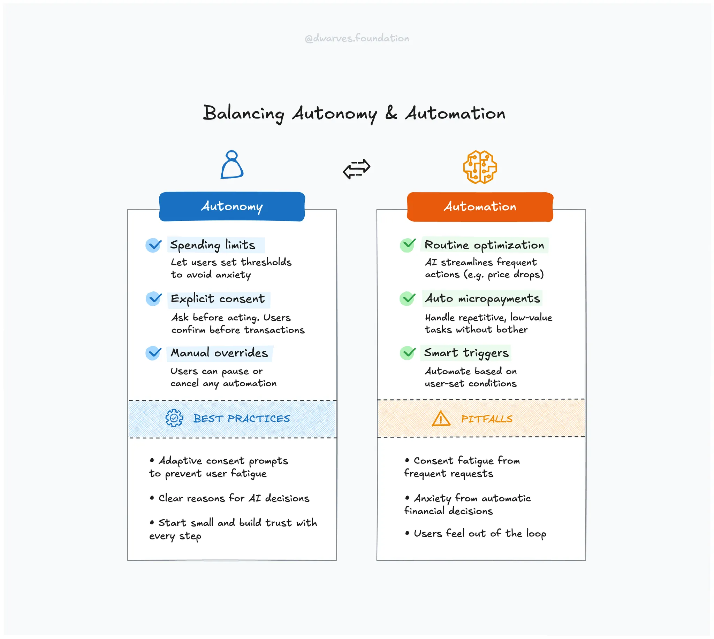

## What's the deal with agentic AI?

Agentic AI can automate tasks, save time, and simplify interactions. But what happens when machines act without asking?

Agentic AI systems, like Visa’s Intelligent Commerce, Google Pay’s AI Mode, and Coinbase’s x402, independently perform tasks on users' behalf. They streamline processes but raise important UX questions around user control.

Here’s how to integrate agentic AI without compromising user autonomy.

## Benefits worth leveraging

These are use cases where agentic AI clearly helps. Think convenience, access, and scaling repetitive work.

### Automate simple, repetitive tasks

Let AI take over low-stakes, routine tasks to reduce friction.

[Google Pay](https://techcrunch.com/2025/05/20/google-adds-ai-powered-shopping-features-for-discovery-and-easy-check-out/) automatically tracks product prices and makes small purchases when prices drop, reducing user effort in managing regular transactions.

### Improve accessibility

AI can simplify digital experiences for users facing cognitive, visual, or process-related barriers.

[Visa’s Intelligent Commerce](https://corporate.visa.com/en/products/intelligent-commerce.html) uses AI to securely automate purchases within preset spending limits, helping users overwhelmed by traditional checkout complexities.

### Efficient microtransactions

Good for systems that need to handle lots of tiny transactions with minimal friction.

[Coinbase’s x402 protoco](https://www.coinbase.com/developer-platform/discover/launches/x402)l enables AI agents to handle internet micropayments automatically, ideal for content subscriptions and small service fees.

## Key UX risks and practical solutions

When done wrong, agentic AI erodes trust, frustrates users, and takes away control. Here’s how to avoid that.

### Maintain user autonomy

Don’t design out the user. People still want a say, especially with money.

**Actionable tip:** Insert explicit consent checkpoints for critical transactions.

**Insight:** Clear decision points reinforce autonomy. When users understand when and why a decision is being made, and feel like they had a part in it, they are more likely to trust the system. This aligns with the psychological principle of autonomy outlined by the [Nielsen Norman Group](https://www.nngroup.com/articles/autonomy-relatedness-competence/).

### Prevent financial anxiety

Unexpected charges or unclear automation can make users feel unsafe.

**Actionable tip:** Allow users to set explicit spending limits easily.

**Insight:** In a recent survey, 66% of U.S. shoppers said they would not allow AI to make purchases for them, even if it saved money. This distrust isn’t about laziness. It’s rooted in concern that AI might prioritize business goals over user interests. Clear boundaries and manual approvals help mitigate that [Source](https://www.pymnts.com/personal-finance/2025/financial-anxiety-spurs-demand-for-consumer-budgeting-apps/).

### Reduce consent fatigue

Over-notifying is as bad as under-notifying. Striking the right balance matters.

**Actionable tip:** Employ adaptive consent, prompting users strategically.

**Example:** [SecurePrivacy](https://secureprivacy.ai/blog/adaptive-consent-frequency-using-ai-to-combat-consent-fatigue)’s adaptive consent model uses AI to show consent prompts only when users are most receptive, effectively balancing compliance with user experience.

## Proven frameworks for user-centric AI

These patterns help teams preserve autonomy while delivering intelligent systems.

### Advocate for user control

Design AI that users can manage directly, not platforms.

**Example:** Auto-GPT and BabyAGI are open-source AI platforms that let users directly control and monitor their AI, enhancing transparency and reducing manipulation risks [Explore Auto-GPT](https://github.com/Significant-Gravitas/AutoGPT), [Explore BabyAGI](https://github.com/yoheinakajima/babyagi).

**Career insight:** Expertise in open-source tools boosts your ability to advocate for responsible UX.

### Establish trusted autonomy

Bake in structure and oversight. Systems should always have fallback control.

**Example:** Visa’s Intelligent Commerce explicitly sets automated spending limits and requires human approval for transactions beyond certain thresholds, ensuring clear oversight and user trust [Read more](https://venturebeat.com/ai/visa-launches-intelligent-commerce-platform-letting-ai-agents-swipe-your-card-safely-it-says/).

### Adopt progressive disclosure

Let users ease into automation. Start small, and grow trust.

**Example:** Google Pay incrementally introduces automated features, allowing users to comfortably transition to greater levels of autonomy while always retaining manual override options [Read more](https://techcrunch.com/2025/05/20/google-adds-ai-powered-shopping-features-for-discovery-and-easy-check-out/).

## Actionable UX takeaways

- Automate only low-risk, repetitive tasks where consequences are minimal and expectations are clear.
- Explain how and why the AI made a decision in simple terms users can easily understand.
- Use smart prompts that appear only when users are likely to engage, not every time something changes.

## Bottom line

Agentic AI isn’t the problem. Poor implementation is. The way forward is to combine intelligent automation with user oversight. Build AI systems that enhance decision-making rather than bypass it. Help users stay in control, understand what’s happening, and make corrections when needed. That’s how you keep trust intact while delivering smart experiences.