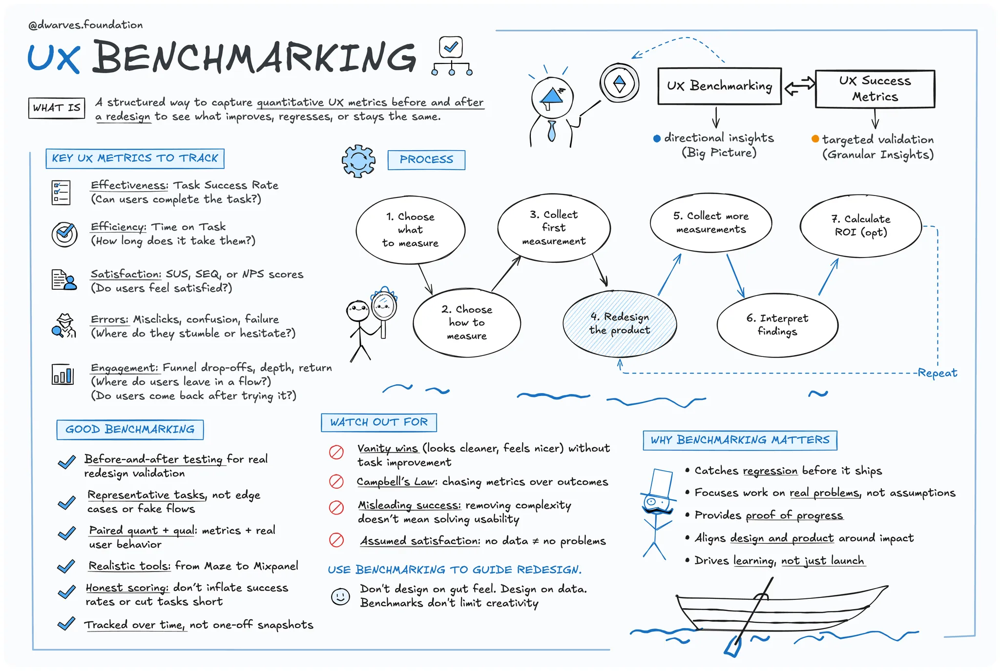

Redesigns often promise better usability, cleaner visuals, and a fresh take on the product. But without benchmarking the existing experience first, you’re flying blind. You might launch something that *feels* better, only to learn later that task completion rates dropped, frustration rose, and conversion tanked.

UX benchmarks aren’t just for data-heavy teams or mature products. They are a minimum standard for making informed, measurable decisions. If you wouldn’t ship code without tests, you shouldn’t ship a redesign without benchmarks.

Let’s walk through what UX benchmarking really means, why it matters, how to do it effectively, and how to keep it from limiting innovation.

## What is UX benchmarking?

UX benchmarking is the practice of capturing quantitative usability metrics like task success, time on task, error rate, user satisfaction, and more. This establishes a baseline of how your product performs today.

Think of it as a UX snapshot. It’s not a score to chase but a reference point. It gives you a way to measure if your new design actually improves the experience or if you’re just shifting pixels around. In a redesign, that matters. Baselines let you compare before and after in a structured way.

## Why it matters before a redesign

### 1. Avoid accidental regression

Without a baseline, there’s no way to tell if the redesign improved or worsened the experience. A cleaner UI might look better but perform worse. Benchmarks catch that before it reaches production.

### 2. Focus on what actually needs fixing

Benchmarks reveal the real pain points. Instead of guessing, teams prioritize what impacts usability the most—whether it’s a broken flow or a confusing form.

### 3. Prove ROI

Before-and-after benchmarks let you quantify improvement. If task success jumps from 70% to 92%, that’s concrete progress you can share with the team and leadership.

### 4. Build stakeholder confidence

Data earns trust. Benchmarks give product and business teams a clear view of how design contributes to outcomes like retention, activation, or support reduction.

### 5. Prevent redesign theater

Redesigns done for visual polish or internal tastes often miss the mark. Benchmarks help teams stay outcome-driven, not aesthetics-driven.

### 6. Watch for metric misuse

According to Campbell’s Law, when a metric becomes a target, it can lose its value. Inflated success rates or simplified tasks can look good on paper but misrepresent real usability. Benchmarks need to be honest, not gamed.

### 7. Don’t confuse structure with constraint

Some fear benchmarks kill creativity. In reality, they give you guardrails, not handcuffs. You can still push bold ideas—just measure if they actually work.

## How to benchmark UX effectively

### Choose the right metrics

- **Effectiveness:** Can users complete the task
- **Efficiency:** How long does it take them
- **Satisfaction:** How do they rate the experience (SUS, SEQ, NPS)
- **Errors:** Where do they stumble
- **Engagement:** How deep or far do they go in the task

### Pick your benchmarking method

- **Internal benchmarking:** Measure your product now and again post-redesign
- **Competitive benchmarking:** Test your product against similar ones in your category
- **Best-in-class benchmarking:** Compare yourself to UX leaders outside your industry to raise the bar

### Focus on real, high-value tasks

Don’t benchmark a feature no one uses. Choose representative tasks that reflect critical user journeys like onboarding, checkout, or account setup.

### Keep testing consistent

Use the same user profiles, environment, and tasks. That way, comparisons are clean and improvements are clear.

### Pair quant with qual

A task success rate of 60% tells you something is wrong. Watching users struggle with the form tells you why. Metrics are vital, but so is observing behavior and listening to feedback.

### **Example: benchmarking in a fintech product**

A fintech startup wants to validate its crypto trading flow. Before launch, designers link a Figma prototype to Maze. The results:

- 60% task success rate
- Multiple misclicks on the trading form
- Average SUS score of 65 out of 100, indicating low usability
- Time-on-task data shows even successful users hesitated at the fee disclosure step

The team iterates the design.

Post-launch, they use Mixpanel to track the trading funnel. They discover 20% of users drop off at the “confirm trade” step. Hotjar recordings show confusion over a vague fee disclosure.

User surveys confirm the issue. Several users rate the experience 3 out of 10, saying “didn’t understand fee structure.”

They fix the UI in Figma and retest in Maze. This time, 90% succeed, SUS jumps to 80, and time-on-task improves as users move through the flow with less hesitation.

To sustain visibility, they set up a live UX dashboard:

- Mixpanel tracks funnel conversion and retention
- Quarterly NPS surveys (via Qualtrics) measure sentiment

This mix of task-based testing, behavioral data, and long-term metrics gives the team a full picture. It covers both usability and long-term user loyalty.

## Conclusion

Redesigning without benchmarks is like painting in the dark. You might hit the mark, but more often, you’ll miss and never realize it.

Benchmarks don’t slow you down. They give you a map. They keep the team focused on the right problems, protect you from regression, and help prove the value of good design.

Innovation still matters. But it has to work. And the only way to know that is to measure it.

So before your next redesign kicks off, pause, measure, and get your baseline. Then go build better.

## Learn more

Explore these original articles and guides for a deeper understanding of UX benchmarking:

- [**Product UX Benchmarks – Nielsen Norman Group**](https://www.nngroup.com/articles/product-ux-benchmarks/)
    
    The core guide on types of benchmarks, metrics to track, and how to run UX benchmark studies 
    
- [**Benchmarking UX: Tracking Metrics – Nielsen Norman Group**](https://www.nngroup.com/articles/benchmarking-ux/)
    
    Practical overview covering when and why to benchmark, and how to interpret your results 
    
- [**Quantifying UX Improvements: A Case Study – Nielsen Norman Group**](https://www.nngroup.com/articles/quantifying-case-study/)
    
    Real-world example of tracking UX metrics over time and measuring impact 
    
- [**Campbell’s Law: The Dark Side of Metric Fixation – Nielsen Norman Group**](https://www.nngroup.com/articles/campbells-law/)
    
    Explains how misuse of metrics can distort design decisions and harm user experience 
    
- [**Build a UX Benchmarking Program: Two Approaches – AnswerLab**](https://www.answerlab.com/insights/ux-benchmarking-program-two-approaches)
    
    Advice for small teams on creating and scaling a UX benchmarking practice