## The three levels that define modern AI

**AI isn't one technology, it's three distinct levels of capability.** Most people lump everything under "AI" without understanding the crucial differences between large language models, AI workflows, and true AI agents. Each level represents a fundamental shift in who controls the decision-making process.

Understanding these levels isn't just academic. It determines whether you're using AI as a passive tool, an automated assistant, or an autonomous problem-solver. The distinction shapes what's possible and what you should expect from different AI implementations.

```mermaid
%%{init: {'flowchart': {'curve': 'stepBefore'}}}%%
graph TD
    
    subgraph Level3 ["🤖 Level 3: AI agents"]
        A3["Autonomous decision making"]
        B3["Self-judgment & iteration"]
        C3["Non-deterministic paths"]
        D3["Goal-oriented behavior"]
    end
    
    subgraph Level2 ["⚙️ Level 2: AI workflows"]
        A2["Predefined steps"]
        B2["Human decision making"]
        C2["Deterministic process"]
        D2["Multi-step automation"]
    end
    
    subgraph Level1 ["📝 Level 1: Large language models"]
        A1["Text generation"]
        B1["Passive response"]
        C1["Non-deterministic output"]
        D1["Human controlled"]
    end
    
    Level1 -.-> Level2
    Level2 -.-> Level3
    
    classDef level1 fill:#e1f5fe,stroke:#0277bd,stroke-width:2px
    classDef level2 fill:#f3e5f5,stroke:#7b1fa2,stroke-width:2px
    classDef level3 fill:#e8f5e8,stroke:#2e7d32,stroke-width:2px
    
    class A1,B1,C1,D1 level1
    class A2,B2,C2,D2 level2
    class A3,B3,C3,D3 level3
```

## Level one: large language models

LLMs like ChatGPT, Gemini, and Claude represent the foundation layer. They excel at generating and editing text based on your prompts, but they operate within strict boundaries.

**LLMs are fundamentally passive.** They respond to what you ask but cannot take independent action. They lack access to your personal data, external systems, or real-time information unless you explicitly provide it. Think of them as highly sophisticated text processors that wait for your instructions.

**LLMs are non-deterministic by nature.** Ask the same question twice and you'll likely get different responses due to their probabilistic text generation. This limitation isn't a flaw, it's by design. LLMs provide controlled interactions where you maintain complete oversight of every exchange.

## Level two: AI workflows

AI workflows combine LLMs with predefined steps that humans design. These systems can fetch data from calendars, check weather services, or pull information from databases before generating responses.

**Workflows automate multi-step processes but follow fixed paths.** They're perfect for predictable, repeatable tasks where you know the sequence of actions needed. Retrieval augmented generation (RAG) is simply a workflow where AI looks up information before answering your question.

**Workflows are largely deterministic.** Given the same inputs, they follow the same predefined steps and produce consistent outputs. The human remains the decision maker in workflows. You design the logic, set the parameters, and adjust the process when needed. The AI executes your predetermined steps with impressive efficiency.

## Level three: AI agents

[**AI agents are truly autonomous.**](https://memo.d.foundation/arc/on-agent/) The LLM becomes the decision maker, reasoning about the best way to achieve your goal and taking actions using available tools. This represents the fundamental shift from human decision-making to AI decision-making.

**Agents can judge their own work and act on that judgment.** They iterate, critique their own outputs, and improve results without constant human intervention. This self-evaluation capability sets them apart from simple automation. They use frameworks like ReAct (reasoning and acting) to plan their approach, execute actions, evaluate results, and adjust their strategy based on what they learn.

**Agents are inherently non-deterministic.** Even with the same goal, they might take different paths, make different decisions, and arrive at varied solutions based on their reasoning process. This unpredictability is actually a feature, not a bug, as it enables creative problem-solving and adaptation.

Consider this real-world example: an AI vision agent searches video clips for a skier by reasoning what a skier looks like, acting to find relevant footage, and returning results. No human tagged the videos or defined the search criteria. The agent figured it out autonomously, judged the quality of its findings, and refined its approach until it achieved the goal.

## The one massive change that creates agents

**Replace the human decision maker in your workflow with an LLM that can reason and act.** This single shift transforms passive automation into adaptive, goal-driven behavior.

If you're still making the key decisions about what happens next, you're working with workflows, not agents. True agents take responsibility for determining the best path toward your objective.

## Practical implementation guide

**If you want to move from simple automation to true AI agents, focus on shifting decision making from humans to the AI.** This is the fundamental transition that unlocks autonomous behavior.

**Start with simple LLMs for text tasks.** Use them for writing, editing, and content generation where you maintain full control over the process.

**Add workflows for automation.** When you have predictable, multi-step tasks that benefit from external data integration, workflows provide reliable automation.

**Graduate to agents for adaptive solutions.** Deploy agents when you need goal-oriented behavior that can adapt to changing conditions without your constant oversight.

The key question for any AI implementation: who is making the decisions? If it's still you, you haven't reached the agent level yet. Let agents handle the trial and error so you can focus on higher-level strategic thinking.

**The real value of agents lies in their autonomous ability to adapt, iterate, and improve.** True AI agents don't just automate your existing process. They reason about better ways to achieve your goals, judge the quality of their own work, and adapt their approach based on what they learn without requiring your oversight.
