**Agents are getting scary good at making decisions.** We're moving from prompt engineering to actual delegation, where AI systems handle complex workflows with minimal human oversight. But just because agents can make decisions doesn't mean they should make all of them.

The question isn't whether agents will replace human decision-making. It's about designing the right handoff points where human judgment becomes essential.

## When humans should intervene

**Intervention isn't about capability, it's about context.** Even when agents can perform tasks technically, certain conditions demand human involvement:

**High-stakes decisions:** When decisions affect relationships, reputation, or long-term strategy, humans need oversight. A marketing agent might optimize for engagement, but humans understand that controversial content could damage years of brand building.

**Ambiguous context:** When multiple valid approaches exist and context suggests different priorities, human judgment becomes crucial. Agents present options, but humans choose based on values and relationship considerations.

**Novel situations:** Agents excel in familiar territory but struggle with genuinely new problems. Smart agents should recognize their limitations and escalate when confidence drops or scenarios differ significantly from training data.

**Ethical decisions:** Any decision involving fairness, privacy, or human rights requires human approval. Agents can flag these situations but shouldn't proceed without human oversight.

## The inbox as collaboration interface

The traditional inbox metaphor works perfectly for agent-human handoffs. Effective agent requests should include current situation, available options with trade-offs, recommendations with reasoning, decision urgency, and required context for informed choices.

Systems should route requests based on urgency, expertise, authority levels, and human availability. The inbox becomes a learning interface where human decisions help agents improve future recommendations.

```mermaid
graph LR
    User["👤 User"] --> Agent["🤖 Agent"]
    
    Agent --> Decision{"Should human<br/>intervene?"}
    
    Decision -->|"No"| Execute["✅ Execute<br/>autonomously"]
    Decision -->|"Yes"| Inbox["📥 Inbox<br/>request"]
    
    Inbox --> Human["🧠 Human<br/>review"]
    
    Human --> Response{"Human<br/>decision"}
    Response -->|"Approve"| Execute
    Response -->|"Modify"| Agent
    Response -->|"Take over"| HumanWork["🤝 Human<br/>handles task"]
    
    Execute --> Result1["📤 Result"]
    HumanWork --> Result2["📤 Result"]
    
    %% Right-angled connections
    %%{init: {"flowchart": {"curve": "stepBefore"}}}%%
    
    %% Node styling
    classDef userClass fill:#e1f5fe,stroke:#01579b,stroke-width:2px
    classDef agentClass fill:#f3e5f5,stroke:#4a148c,stroke-width:2px
    classDef humanClass fill:#e8f5e8,stroke:#1b5e20,stroke-width:2px
    classDef decisionClass fill:#fff3e0,stroke:#e65100,stroke-width:2px
    classDef processClass fill:#e0f2f1,stroke:#00695c,stroke-width:2px
    
    class User userClass
    class Agent agentClass
    class Human,HumanWork humanClass
    class Decision,Response decisionClass
    class Execute,Inbox,Result1,Result2 processClass
```

## What humans want to do themselves

Understanding human psychology reveals why people resist delegating certain tasks. The ancient "seven sins" are actually evolutionary drives hardwired into our brains that explain what tasks humans resist delegating.

**Pride and status:** Humans resist delegating tasks that provide social recognition or demonstrate expertise. Public speaking and high-stakes decisions fulfill our need for status and respect.

**Greed and control:** The desire to control valuable resources extends to knowledge and creative output. Designers might use agents for research but never delegate core creative decisions representing their intellectual property.

**Creative expression:** The need for self-expression runs deeper than productivity. The creative process satisfies fundamental psychological needs beyond just producing output.

**Tasks that satisfy core drives:** Status and recognition work, relationship building, learning and mastery, and maintaining control over important outcomes all stem from basic survival instincts that resist delegation.

## Design principles

**Offer choice rather than imposing efficiency.** Recognize that some tasks have emotional and social value beyond functional output. Respect human identity and purpose. Enable learning and growth opportunities.

Successful partnerships require clear boundaries, continuous calibration as capabilities evolve, and mutual learning where both agents and humans improve over time.

## The path forward

We're entering an era where the question isn't whether agents can make decisions. It's whether they should. The companies that figure out the right balance between agent autonomy and human oversight will build the most effective systems.

The future of work isn't about humans versus agents. It's about humans and agents working together, each contributing what they do best. Getting this balance right will determine which organizations thrive in the age of AI.
