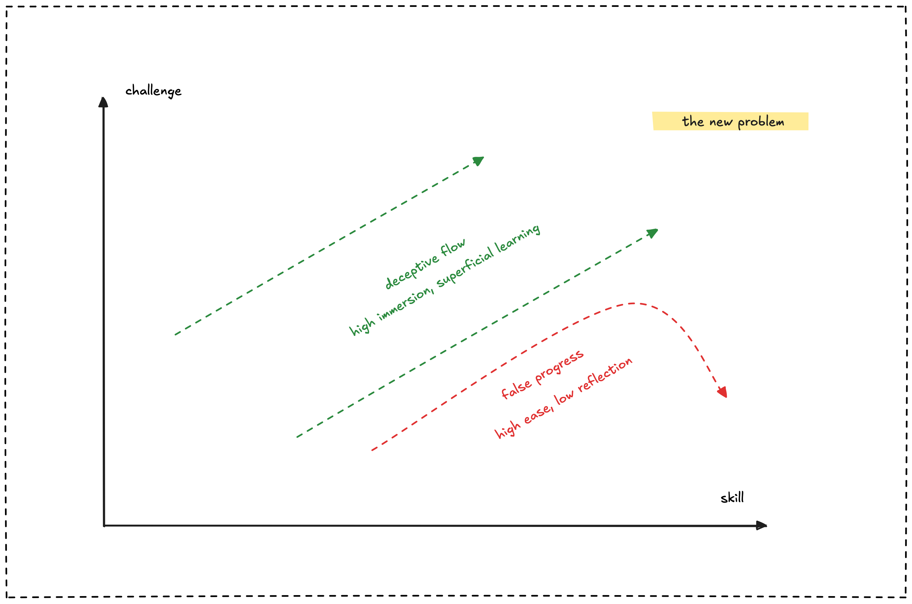

**AI handles the technical complexity, humans focus on the vibe.** This division of labor represents a fundamental shift in how we approach creative work, but also signals growing reliance on AI systems for basic functionality.

## What vibe culture looks like

Vibe culture prioritizes emotional resonance over traditional structured approaches. The process starts with AI handling technical foundations, then creators layer on feelings and aesthetics. Developers describe apps that "feel futuristic," designers create projects with "lo-fi aesthetics," marketers craft "cozy, authentic vibes."

AI tools like Cursor, Figma, and ChatGPT first generate the functional scaffolding. Users then refine and customize based on desired emotional outcomes rather than technical specifications. This delegation allows non-technical creators to produce professional results while focusing energy on creative decisions.

However, this convenience creates dependency. Creators increasingly rely on AI for tasks they might have learned themselves, from basic coding to design principles. The ease of AI assistance can discourage deeper technical understanding.

## Why this approach emerged

AI's technical capabilities created space for human creativity to flourish. When machines handle coding, design systems, and content generation, humans can concentrate on strategic and emotional aspects. The approach offers immediate gratification through rapid prototyping while preserving creative control.

Social platforms reward emotional engagement over technical precision, reinforcing this division of labor. Each AI-generated foundation provides a starting point for creative exploration, creating positive feedback cycles that make the process feel effortless and enjoyable.

This reliance also reflects changing skill expectations. As AI handles technical execution, human value shifts toward curation, direction, and emotional intelligence. The market increasingly rewards those who can guide AI effectively rather than execute tasks manually.

## How to leverage AI-enabled creativity

Effective vibe culture treats AI as infrastructure rather than replacement. Let AI handle technical heavy lifting, then apply human judgment for emotional resonance, user needs, and strategic alignment. This approach maximizes both efficiency and creative quality.

Use AI to generate initial concepts, code frameworks, or design systems. Then focus human effort on refining user experience, brand alignment, and meaningful problem-solving. The key is maintaining core competencies while leveraging AI efficiency.

Consider the long-term implications of AI reliance. Develop understanding of underlying principles even when delegating execution. This ensures you can evaluate AI outputs critically and maintain creative control when AI tools fail or change.

*Source: Insights from [Ian Batterbee's UX Design article](https://uxdesign.cc/everythings-a-vibe-is-it-progress-or-just-an-illusion-fcd32b2844bb).*
