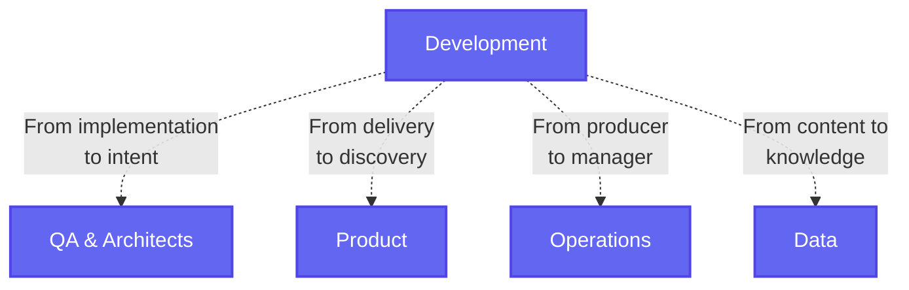
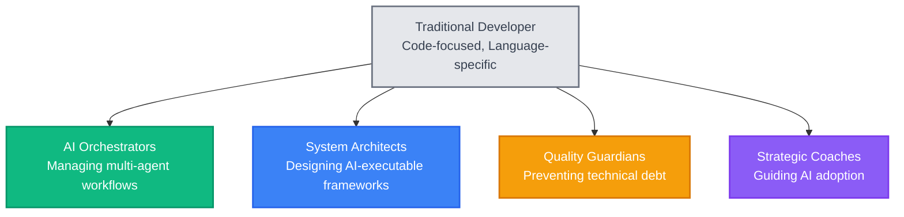

After studying how developers are navigating the AI transformation, one finding stands out: **developer identity is fundamentally changing, and those who quickly embrace their new role are thriving**.

The traditional "developer" identity - focused purely on writing code - is becoming obsolete. This isn't about coding skills anymore. It's about identity transformation speed.

## What the data shows

The numbers paint a clear picture:

- 50% of developers now report that over half their code is AI-generated
- Entry-level hiring dropped 24% in 2024 due to AI adoption
- Amazon saved "4,500 developer-years" with AI coding tools

But here's the reality check: We're past the "AI assistance" phase. Developers using Claude Code and similar tools report AI is now doing 100% of the coding work - not helping, not assisting, just doing it.

The cost barrier has evaporated. What felt expensive at $40/month six months ago now seems trivial. Developers are happily paying $200-500/month for AI tools that deliver what previously took teams months to build.

## The language barrier has collapsed

The most immediate impact: language-specific developer roles are becoming obsolete.

As one developer put it: "The idea of a 'Python dev' or 'React dev' is outdated. I won't be hiring for languages anymore, I'll hire devs who can solve problems, no matter the stack. The language barrier is completely gone."

This shift happened in months, not years. The real skill became system design, architecture, DevOps, cloud - the expertise that separated juniors from seniors.

## The identity transformation pattern

Successful developers are shifting their identity across four key dimensions:

- **From implementation to intent** - Moving from writing code to defining what should be built
- **From delivery to discovery** - Shifting from shipping features to uncovering user needs  
- **From producer to manager** - Evolving from creating outputs to orchestrating AI systems
- **From content to knowledge** - Transitioning from generating code to curating understanding

The critical insight: AI amplifies existing expertise - it's a force multiplier, not a replacement for deep knowledge. But only if you have the foundational understanding to guide and review its output.

## Fast vs slow adapters

**Fast adapters:**

- Experimented with AI tools immediately, pushing them to 100% automation
- Focused on system-level thinking rather than competing with AI on implementation
- Built capabilities in guiding, reviewing, and correcting AI-generated work
- Positioned themselves publicly as AI-augmented problem solvers

**Slow adapters:**

- Spent months debating whether AI was "real" or temporary
- Tried maintaining traditional coding practices alongside AI
- Remained attached to language-specific specializations

The productivity gap is staggering. Fast adapters report building production-grade applications in weeks that previously took months. One developer shared: "I built a full production-grade desktop app in 1 week. Clean code, better UX than market leaders."

## The technical debt reality

Here's what fast adapters learned: AI productivity comes with hidden costs. While AI can rapidly accelerate development, it often produces code that lacks maintainability unless overseen by experienced professionals.

The winning approach: Teams that invested in architecture, review automation, and clear specifications consistently outperformed those that didn't. The ability to communicate requirements and maintain architectural vision became a superpower.

## The new developer archetypes

Successful transformations cluster around specific new identities:

- **AI orchestrators** - Managing complex multi-agent workflows and AI tool chains
- **System architects** - Designing frameworks that AI systems can execute reliably
- **Quality guardians** - Ensuring AI-generated code meets standards and avoiding technical debt
- **Strategic coaches** - Guiding teams through AI adoption and architectural decisions

These roles all require system-level thinking and the ability to own the architecture and process, not just "vibe code" with AI assistance.

## Why speed matters more than skill

Technical excellence alone doesn't predict adaptation success. Some of the most skilled traditional developers are struggling because they're emotionally attached to manual coding. Meanwhile, developers with moderate technical skills but high adaptability are securing leadership positions.

The market rewards speed of adaptation over depth of traditional skills. But there's a caveat: AI tools work best for those who already know what they're doing. The sweet spot is combining domain knowledge with AI-driven productivity.

## The practical takeaway

The developers thriving right now:

1. Accepted identity change immediately (weeks, not months)
2. Started pushing AI tools to 100% automation capacity
3. Invested in foundational knowledge to effectively guide AI output
4. Reframed their value around system design and architectural thinking
5. Developed capabilities in reviewing and improving AI-generated work

For developers, the window for easy adaptation is closing. The ones who moved fast have captured the premium positions and are seeing massive productivity gains. Those still debating language specializations will find themselves playing catch-up.

**The bottom line: The developer identity is fundamentally shifting from language-specific coding to system-level problem solving. Speed of embracing this new identity beats technical perfectionism every time**.

Don't just learn to use AI tools - learn to become indispensable at guiding and reviewing their output. Own the architecture, own the process, and own the transformation.

*Sources: Insights from [Dev jobs are about to get a hard reset](https://www.reddit.com/r/ClaudeAI/comments/1lhgdbd/dev_jobs_are_about_to_get_a_hard_reset_and/).*
