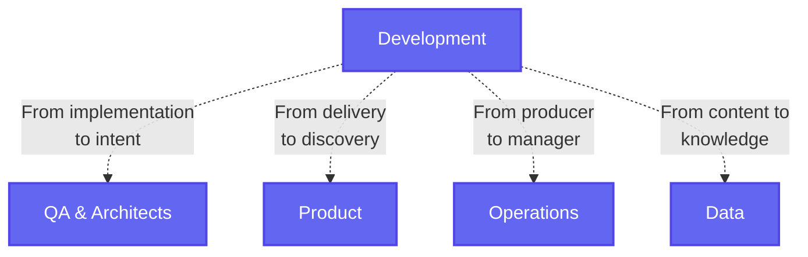
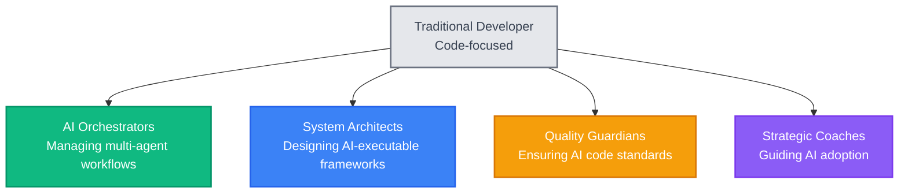

After studying how developers are navigating the AI transformation, one finding stands out: **developer identity is fundamentally changing, and those who quickly embrace their new role are thriving**.

The traditional "developer" identity - focused purely on writing code - is becoming obsolete. Successful developers are rapidly shifting their identity across multiple dimensions: from implementation to intent, from delivery to discovery, from producer to manager, from content to knowledge.

This isn't about coding skills anymore. It's about identity transformation speed.

## What the data shows

The numbers paint a clear picture:

- 50% of developers now report that over half their code is AI-generated
- Entry-level hiring dropped 24% in 2024 due to AI adoption
- Amazon saved "4,500 developer-years" with AI coding tools
- 75% of developers encounter AI "hallucinations" requiring human oversight

But here's what's interesting: the developers adapting fastest aren't necessarily the most skilled coders. They're the ones who embraced identity change immediately.

## The identity transformation pattern

Successful developers are shifting their identity across four key dimensions:

- **From implementation to intent** - Moving from writing code to defining what should be built
- **From delivery to discovery** - Shifting from shipping features to uncovering user needs  
- **From producer to manager** - Evolving from creating outputs to orchestrating systems
- **From content to knowledge** - Transitioning from generating code to curating understanding

The key insight: Developers who embrace these identity shifts in weeks, not months, are now in premium positions.

## Fast vs slow adapters

Fast adapters:

- Experimented with AI tools immediately
- Focused on what AI can't do rather than competing with what it can
- Reframed their value around orchestration and quality control
- Shared their learning publicly, positioning as early experts

Slow adapters:

- Spent months debating whether AI was "real" or temporary
- Tried maintaining traditional coding practices alongside AI
- Waited for formal training or company initiatives
- Focused on AI limitations rather than opportunities

## Why speed matters more than skill

Here's what surprised me most: technical excellence alone doesn't predict adaptation success.

Some of the most skilled traditional developers are struggling because they're emotionally attached to manual coding. Meanwhile, developers with moderate technical skills but high adaptability are securing leadership positions in AI-native teams.

The explanation: Companies need people who can navigate uncertainty and guide AI implementation, not just people who can write perfect code. The market rewards speed of adaptation over depth of traditional skills.

## The new developer archetypes

Successful transformations cluster around specific new identities:

- AI orchestrators - Managing complex multi-agent workflows
- System architects - Designing frameworks that AI systems execute
- Quality guardians - Ensuring AI-generated code meets standards
- Strategic coaches - Guiding teams through AI adoption

## The practical takeaway

From my research, the clearest predictor of developer success in the AI era isn't technical skill - it's adaptation speed.

The developers thriving right now:

1. Accepted identity change immediately (weeks, not months)
2. Started experimenting with AI tools daily
3. Reframed their value around human+AI collaboration
4. Positioned themselves publicly as AI-augmented developers

The finding: In rapid technology shifts, your ability to quickly reshape professional identity matters more than your mastery of legacy skills.

For developers, the window for easy adaptation is closing. The ones who moved fast have captured the premium positions. Those still debating will find themselves playing catch-up.

**The bottom line: The developer identity is fundamentally shifting across multiple dimensions. Speed of embracing this new identity beats technical perfectionism every time**.
