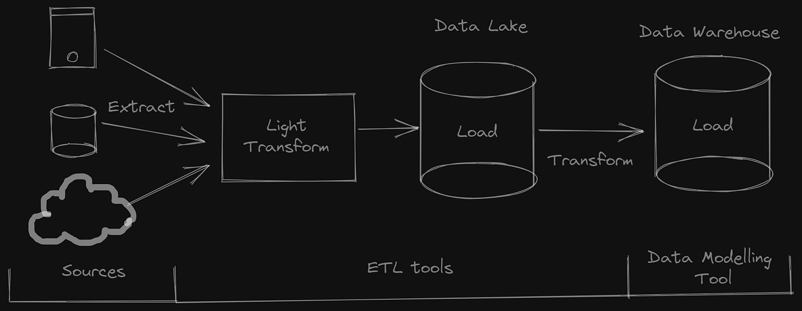

## Fundamental data system concepts
- [Cap theorem](cap-theorem.md) - Core theoretical limits of distributed data systems
- [¶ Local-first software](local-first-software.md) - Paradigm enabling collaboration without centralized servers
- [Introduction to CRDT](introduction-to-crdt.md)
- [Bloom filter](bloom-filter.md)
- [Data pipeline design framework](data-pipeline-design-framework.md)

## Data storage technologies
- [Hadoop distributed file system (HDFS)](hadoop-distributed-file-system-hdfs.md)
- Vector database fundamentals
  - [Quick learning vector database](quick-learning-vector-database.md)
- Relational database Concepts
  - [Database locking](database-locking.md)
  - [Multi-column index in DB](202301191192-multi-column-index-in-db.md)
  - [SQL and how it Relates to disk reads and writes](sql-and-how-it-relates-to-disk-reads-and-writes.md)
  - [Evolutionary database design](evolutionary-database-design.md)

## Big data processing frameworks
- [¶ MapReduce](mapreduce.md) - Programming model for distributed computing
  - [MapReduce components](mapreduce-components.md)
- Apache Hive ecosystem
  - [Introduction to Apache Hive](introduction-to-apache-hive.md)
  - [Behind a Hive table](behind-a-hive-table.md)
  - [Partitions on Apache Hive](partitions-on-apache-hive.md)
  - [Buckets on Apache Hive](buckets-on-apache-hive.md)
  - [Hive window and analytic functions](hive-window-and-analytic-functions.md)
  - [Managed table vs external table](managed-table-vs-external-table.md)
  - [Order By vs. Sort By vs. Distribute By vs. Cluster By](order-by-vs-sort-by-vs-distribute-by-vs-cluster-by.md)
- [Introduction to Apache Pig](introduction-to-apache-pig.md)
- Google cloud data solutions
  - [Google Dataproc](google-dataproc.md)
  - [Google Data Fusion](google-data-fusion.md)

## Data transformation & analysis
- [DBT - the good solution to accelerate data transformation](dbt-the-good-solution-to-accelerate-data-transformation.md)
- [Statistics in data analysis](statistics-in-data-analysis.md)
- [Data vault modelling](data-vault-modelling.md)
- [Overview of BI tools](overview-of-bi-tools.md)
- Data analysis techniques
  - [SQL practices: ORM vs Plain SQL](sql-practices-orm-vs-plain-sql.md)
  - [SQL sargable queries and their impact on database performance](sql-sargable-queries-and-their-impact-on-database-performance.md)
  - [DuckDB demo and showcase](duckdb-demo-and-showcase.md)

## Specialized data applications
- [Full-text search with PostgreSQL](full-text-search-with-postgresql.md)
- [Creating a fully local search engine on Memo](creating-a-fully-local-search-engine-on-memo.md)
- [Data analyst in retail trading](data-analyst-in-retail-trading.md)
- [Redis leaderboard](redis-leaderboard.md)
- [Utilizing cached table for Binance Kline API data processing](utilizing-cached-table-for-binance-kline-api-data-processing.md)
- [How Discord stores messages - part 1: from MongoDB to Cassandra](how-discord-stores-messages-part-1-from-mongodb-to-cassandra.md)
- [Self-balanced BSTs - AVL trees](self-balanced-bsts-avl-trees.md)
