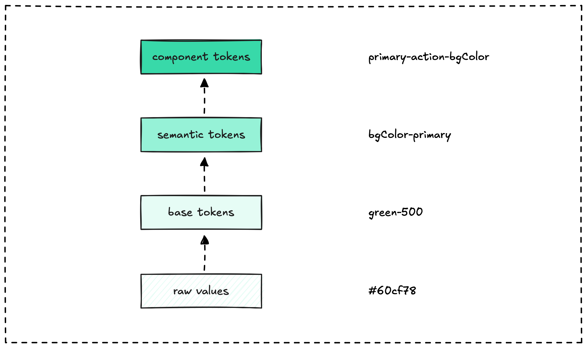

**Design tokens are the shared language between designers and developers.** These platform-agnostic variables store visual attributes like colors, typography, and spacing, ensuring consistency across web, mobile, and other platforms. AI tools now automate much of the heavy lifting in token creation and management.

## What design tokens accomplish

Design tokens fall into two categories: global tokens (`blue.default` for a color) and semantic tokens (`button-primary` for context-specific use). They centralize design decisions in JSON files or similar formats, eliminating hard-coded values throughout codebases.

This approach enables rapid updates across platforms. Change one token value and every instance updates automatically. Teams can implement theming systems, like light and dark modes, by swapping token sets. The result is fewer errors, faster development, and unified visual consistency.

## Why AI transforms token workflows

AI tools analyze design files from Figma or Sketch, automatically generating tokens for colors, fonts, and spacing. This eliminates hours of manual extraction work. AI suggests semantic token names based on usage patterns, creating intuitive labels like `text-secondary` for gray caption text.

Modern AI systems also handle distribution. An AI agent can detect token changes in design files, update code repositories, and trigger deployment pipelines automatically. This ensures real-time consistency across all platforms without manual coordination.

## How to implement AI-powered tokens

Start with tools like Style Dictionary for token management or Figma plugins with AI integrations. These platforms streamline initial setup and ongoing maintenance. For non-designers, AI-powered natural language interfaces allow updates through simple commands like "make buttons darker."

However, maintain human oversight. AI can suggest accessibility improvements for WCAG compliance or generate dynamic themes, but teams should validate outputs against brand guidelines and user needs. The goal is leveraging AI efficiency while preserving creative control and design quality.

AI makes design tokens more accessible, but the fundamental value remains human-centered design decisions executed consistently at scale.
