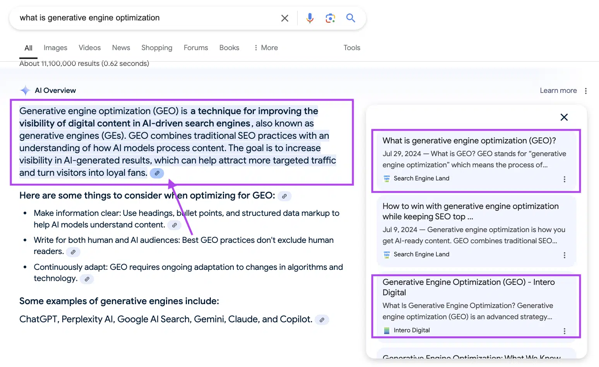
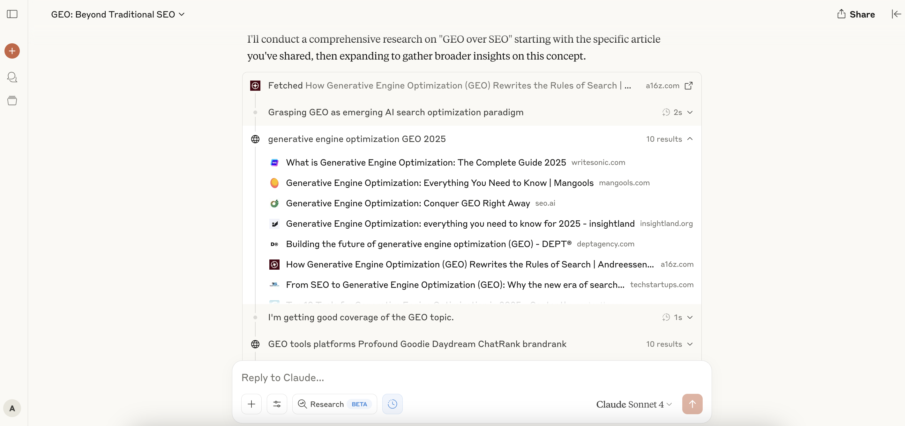

## Snapshot view

**Core mechanism:** LLMs do not crawl like search engines; they generate answers from their “memory” (model parameters). GEO optimizes content to be **semantically rich**, **contextually relevant**, and **easy for LLMs to parse**, so it gets **quoted inside AI answers**, not just listed on a results page.

## TL;DR

- **Visibility = reference rate**: Track how often ChatGPT, Gemini, Claude cite you, not where you rank.
- **Semantic richness & granularity**: Treat each paragraph as a standalone answer. Use summaries, bullet points, “In summary” hooks.
- **E-E-A-T matters**: Demonstrate Expertise, Experience, Authoritativeness and Trustworthiness with bylines, case studies, data.
- **Rapid iteration**: Major model updates can change extraction patterns overnight. Review weekly.
- **Platform-specific seeding**: Reddit, YouTube, Quora dominate AI citations. Plant content where LLMs fish for answers.

## What is generative engine optimization?

- **Search is shifting from links to language models**
    
    Traditional SEO optimized for keyword-driven, link-based rankings. GEO optimizes for being cited inside AI answers, your content becomes part of the model’s “response,” not just an entry on a results page.
    
- **Visibility = reference rate, not page rank**
    
    Instead of chasing high positions, GEO measures how often an LLM (ChatGPT/Gemini/Claude) references your content. In an AI-first world, will the model remember you?
    
- **Longer, conversational queries**
    
    Users ask 20–30 word prompts; sessions span multiple turns and context carries over. Your content must be structured and semantically clear so the AI can lift it out as a standalone answer.
    
- **E-E-A-T & trustworthiness matter**
    
    Models favor content demonstrating Expertise, Experience, Authoritativeness and Trustworthiness. Back up your points with author credentials, case studies or real-world data.
    (E.g: Showcase Dwarves Foundation’s expertise by highlighting author credentials)
- **Business-model shift: Influence over impressions**
   
   Unlike ad-driven search engines, subscription-based LLMs only surface third-party content when it truly adds value. GEO becomes a game of influencing the model’s memory, not just earning clicks.
- **Emerging GEO platforms & API-driven workflows**
   
   A new ecosystem (Profound, Goodie, Daydream, Semrush AI Toolkit) centralizes prompt testing, citation tracking, and dashboards integrate these via APIs to automate your deep-search experiments.
- **How GEO differs from traditional SEO:**
    
   | **SEO (Traditional)** | **GEO (Generative)** |
  | --- | --- |
   | Ranking within a list of organic search results | Having AI models incorporate your brand/content into their final answer | 
   | Focus on keywords, backlinks, page rank, click-throughs | Focus on language, content structure, semantic clarity, and reference rates |
   | Users click to visit websites | Users get answers directly, may not visit sites |
  | Keyword-based optimization | Language and context-based optimization |

## Core GEO signals & metrics

**Reference rate**

- % of representative AI queries that cite memo.d.foundation.

**Structured content density**

- Well-organized pages (headings, bullet lists, tables) packed with concise facts.

**Outbound click volume**

- When the AI answer links back, measuring those clicks shows real engagement beyond the model bubble.

## What should we do?

### For content writers

1. **Restructure every page**
    - Write a clear **“What you’ll learn”** 2–3 sentence summary at the top.
    - Break each topic into focused **bullet points** or **Q&A blocks,** treat each as its own answer.
    - Label key sections with headings like **Key takeaways, hot take** or **in summary.**
2. **Use semantic markup**
- Ensure every tutorial or FAQ section is flagged for AI:
    - Wrap your steps in a “HowTo” block.
    - Wrap Q&A pairs in an “FAQ” block.

### For engineers / Technical team

1. **Build a deep-search pipeline**
    - **Query simulator**: Automate sending real-world prompts to LLM APIs (ChatGPT, Gemini, etc.) and record which pages or paragraphs are cited.
    - **Dashboard & alerts**: Feed those results into a monitoring dashboard (e.g., Grafana). Set alerts if a page’s reference rate falls below 10%.
2. **Enforce CI/CD guardrails**
    - **GEO linting checks**: In your build pipeline, run automated checks (e.g., GitHub Actions) to ensure every new page includes summaries, takeaways, and FAQ sections before it goes live.
    - **LLM preview tests**: On each content merge, trigger a quick API call with a standard prompt to confirm the new page surfaces correctly in the model response.
3. **Prompt engineering & fine-tuning**
    - **Prompt templates**: Provide a shared library of example prompts (e.g., “According to memo.d.foundation…”) for your LLM integration.
    - **Light fine-tuning**: If you run an internal LLM, periodically retrain it on your memo content so it more reliably surfaces your branding and phrasing.
4. **Optional edge-Lvel geo-targeting**
    - Deploy a small edge function (e.g., Cloudflare Worker) that reads visitor locale and injects localized snippets (“In Vietnam, best practice is…”) on memo pages to boost regional relevance.

## Why this matters

- **AI-first discovery**: As LLMs become the primary research interface, being in the answer wins direct mindshare, no click required.
- **Competitive moat**: Brands encoded into the AI layer gain lasting recall and preference. Raw impressions alone will not suffice.
- **Inbound engine**: High reference rates drive organic traffic, community growth, and lead generation without relying on Google rankings.
- **Business-model shift**: In subscription-driven LLM ecosystems, content surfaces only when it adds real value. GEO is about influencing model memory, not chasing clicks.
- **Emerging GEO tooling**: Platforms like Profou, Goodie, Daydream, and Semrush AI Toolkit centralize prompt testing, citation tracking, and dashboards. Integrate them via APIs to automate deep-search experiments.

*Source insight from: https://a16z.com/geo-over-seo/*