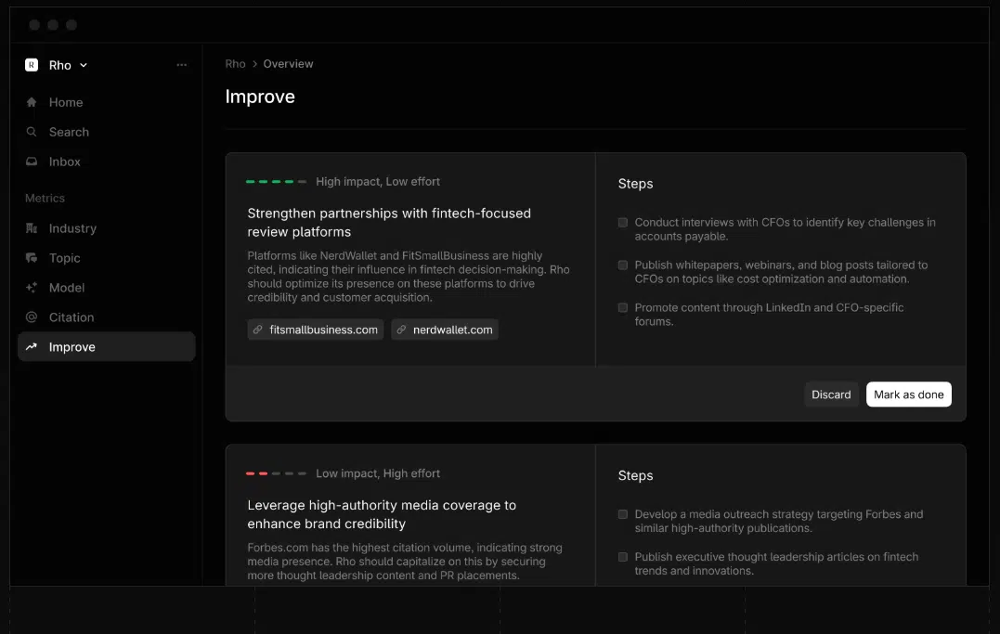

AI visibility tracking is no longer optional if you want your content to stay seen. But with new tools popping up every month, picking the right one can feel like a maze. Here’s how to navigate the options, what to look for, and how to avoid getting stuck with a tool that doesn’t fit your workflow.

## Start with your real use case

Before you look at dashboards or pricing, get clear on what you need. Are you tracking brand mentions, content citations, or competitor visibility? Do you want daily alerts or monthly reports? The right tool will match your actual workflow, not just look good in a demo.

## Vet the data: Where does it come from?

Not all AI visibility tools pull data the same way. Some use direct API access, others scrape model outputs, and a few rely on third-party panels. Ask these questions:

- Which AI platforms are tracked (ChatGPT, Gemini, Perplexity, Google AI Overviews, etc.)?
- How fresh is the data? Is it real-time, daily, or weekly?
- Can you see the raw outputs or just summaries?

If the tool can’t answer these, keep looking.

## Popular AI visibility tools

- Profound: Strong for enterprise teams, detailed tracking, and competitor analysis.
- AthenaHQ: GEO-focused, with daily tracking and actionable insights.
- Semrush: Expanding into AI tracking with its established SEO toolkit.
- AI Visibility, Peec AI, Rankscale, Otterly.AI: Each offers a slightly different spin—compare features, pricing, and ease of use.

## Test with your own content

Most tools look slick in a sales pitch. The real test is running your own prompts and checking if the results match what you see in live AI answers. Try a trial or demo with your actual memos or brand terms. If the tool’s numbers don’t line up with reality, that’s a red flag.

## How to test before you commit

- Always ask for a demo or trial. Don’t sign a long contract without hands-on testing.
- Run your own prompts and check if the tool’s results match what you see in live AI answers.
- Get feedback from both writers and engineers. Everyone needs to be able to use the tool, not just the analytics team.

## Don’t ignore the basics

- Is the pricing clear, or are there hidden fees?
- Does it fit your budget and scale as your needs grow?
- Can your whole team use it, or is it locked down to a few seats?

## Consider support and adaptability

AI search moves fast. You want a tool that updates quickly and has support you can reach when things break or change. Ask about update cycles, new feature rollouts, and how fast they adapt to new AI platforms.

## What if you’re a solo writer or small team?

You don’t need the biggest tool on the market. Look for platforms with clear dashboards and no-code setup. Even basic tracking is better than flying blind

</aside>

**FAQ**

**Do I need to track every platform?**

Start with the ones your audience uses most. Expand as you grow.

**What if my tool’s data doesn’t match what I see in ChatGPT?**

No tool is perfect. Use tracking as a guide, but always double-check with manual prompts now and then.

## Bottom line

Choosing the right AI visibility tool is like picking a compass for the new search landscape. Take your time, test with your real content, and pick the one that helps your team move fast and stay seen.