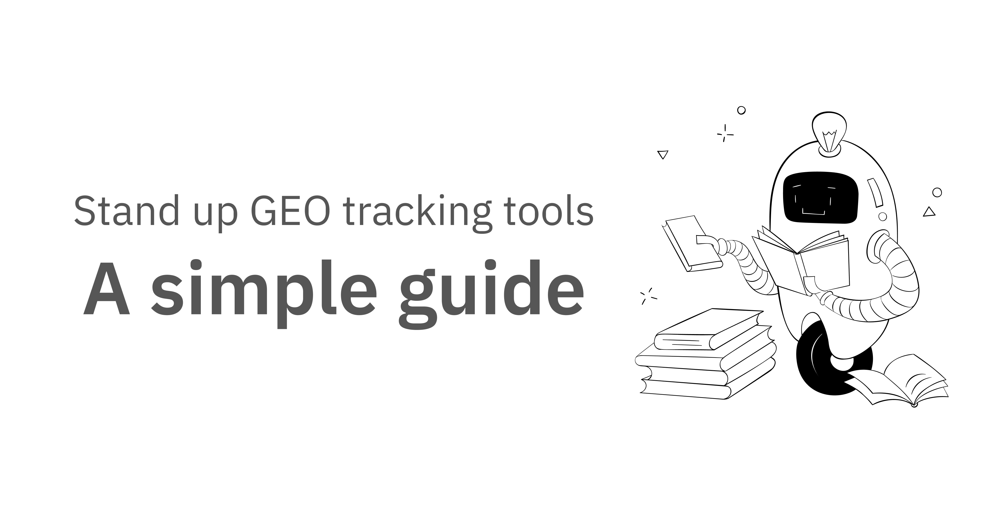

*Measure what matters, iterate with confidence.*

## Why we must track GEO

GEO tracking is about knowing if your content is showing up in AI-generated answers. If you can’t see which memos are being cited, you’re guessing about what works.

- It tells you which articles get picked by AI and which don’t.
- You can see if your updates make a difference.
- You get proof that your work matters when the numbers go up.

## What we need to watch

You don’t need to build dashboards or write code. Focus on these three things:

| **Metric** | **Plain-english meaning** | **Why writers care** |
| --- | --- | --- |
| **Reference rate** | How often does an AI mention your memo when asked relevant questions? | This tells you if your content is visible. |
| **Paragraph winner** | Which part of your memo does the AI quote?  | This helps you see what structure or section works best. |
| **Clicks on surfaced link** | Do people actually click through when your memo is cited?  | This shows if AI citations bring real readers. |

## How to track without coding

You don’t have to build a DIY stack. Here’s what you can do:

- Use a commercial tool like Profound or Semrush AI Toolkit. These are built for non-technical folks. You just sign up, add your main prompts (the questions you want your memo to answer), and run a batch test. The tool shows which memos get cited.
- If you don’t want to use a tool, you can search for your memo’s title or main points in ChatGPT or Gemini and see if it appears in the answer. Keep a simple checklist in Notion or Google Sheets to track which ones show up.

## Tooling paths at a glance

| **Path** | **Set-up time** | **Cost** | **Pros** | **Cons** |
| --- | --- | --- | --- | --- |
| **Commercial pilot**(Profound, Semrush AI Toolkit) | 1–2 h | \$ -- \$\$ | No code, dashboards out of the box | Ongoing fees, fewer custom prompts |
| **DIY stack**(LangChain + Google Sheet + Grafana) | 4–8 h | \$ (API only) | Full control, free to run | Needs a few engineering hours |
| **Hybrid** | 1 h + 4 h | \$\$ | Start fast with SaaS, fall back on DIY | Two systems to watch |

*If you’re not technical, use the commercial pilot path. You can get started in about an hour.

## Example: How to track and improve a Memo

Memo: “How to build a deep-search pipeline”

URL slug: /guides/deep-search-pipeline

**Baseline test (Writer, about one hour):**

1. Sign up for a Profound trial.
2. Paste your 20 GEO test prompts, for example, “According to memo.d.foundation, how do I set up a deep-search pipeline?”
3. Click Run.
4. Export the CSV.
5. See that /guides/deep-search-pipeline is cited in only 4 of 20 prompts (20 percent), below the 10 percent threshold.

**Retrofit the memo (Writer, about two hours):**

- Add a “What you’ll learn” summary at the top.
- Insert “Key takeaways” bullets.
- Wrap steps in a HowTo block and add a short FAQ at the bottom.

**Verification (Writer, about five minutes):**

- Wait 24 hours, then check results.
- Today’s citation count: 12 of 20 prompts (60 percent).
- Celebrate: “Our retrofit raised reference rate from 20 percent to 60 percent in one day”.
- Share screenshot in your team chat as proof.

**Continuous improvement:**

- Repeat for the next low-performing memo.
- Keep an eye on your checklist or dashboard and tweak content if citations dip again.

## The bottom line

You don’t have to be an engineer to track GEO success. Focus on what you can see: is your memo being cited, which part is quoted, and do people click through? Use simple tools or manual checks. The goal is to write content that AI engines want to cite and to know when your work is paying off.