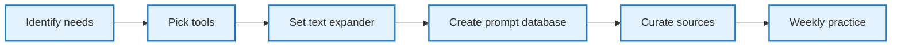

## You're not behind, you're overwhelmed

**The real AI challenge isn't technical skill, it's decision paralysis.** Most people think they're falling behind in AI adoption, but the actual problem is simpler: **there's no clear roadmap** for building sustainable AI workflows. The flood of new tools, endless prompts, and constant updates creates overwhelm, not progress.

Three specific obstacles prevent most people from becoming AI-native:

- tool paralysis from too many options,
- prompt fatigue from repetitive typing,
- and update overload from information excess.



## Build your minimum viable AI toolkit

**Stop chasing every new AI tool and focus on solving your recurring problems.** Identify your actual work patterns first. What tasks do you do repeatedly? Research, writing, analysis, communication?

**Test systematically, adopt selectively.** For each recurring need, test 2-3 tools maximum. Choose the one that integrates most smoothly into your existing workflow. Master your chosen tool until it becomes second nature before adding anything new.

The goal isn't to have the latest tools, it's to have tools that fade into the background while amplifying your capabilities.

## Eliminate prompt friction with smart systems

**Typing prompts repeatedly kills AI adoption faster than any technical limitation.** Text expanders transform AI prompting from tedious typing to instant activation.

**Choose your text expander:**

- **Mac users:** [Alfred](https://www.alfredapp.com/) or [Raycast](https://www.raycast.com/)
- **Windows users:** [Beeftext](https://beeftext.org/) or [PhraseExpress](https://www.phraseexpress.com/)  
- **Cross-platform:** [Espanso](https://espanso.org/) or [TextExpander](https://textexpander.com/)

**Set up effective shortcuts:**

- `;research` → "Analyze this topic and provide 5 key insights with sources."
- `;review` → "Review this document for clarity and actionable recommendations."
- `;meeting` → "Create a structured agenda with key discussion points."

### Centralized prompt database

**Store all prompts in one place that works with your existing habits.** Choose a system you already use regularly:

- **[Notion](https://www.notion.so/):** Best for teams needing collaboration
- **[GitHub](https://github.com/):** Perfect for developers using markdown files
- **[Obsidian](https://obsidian.md/):** Ideal for networked thinking
- **Apple Notes/[Google Keep](https://keep.google.com/):** Simple options for quick access
- **Your existing docs:** Whatever system you check daily

**Organization structure:**

```
prompts/
├── research/
├── writing/
├── analysis/
└── communication/
```

**Embed prompts where you work:** Add templates to calendar events, project descriptions, or create bookmarklets with pre-filled AI tool URLs.

## Tame the information flood

**Information overload kills more AI initiatives than tool complexity.** Follow the one-source rule: choose one trusted curator for AI updates and unsubscribe from everything else.

**Implement the weekly experiment habit.** Block 30 minutes weekly to try one new thing you learned. Not three things, not everything that seemed interesting. One focused experiment beats scattered attention every time.

## Building sustainable habits

**Systems beat motivation every time.** Start with your strongest existing habit. If you always check email first, add an AI prompt to that routine. Attach new AI practices to established patterns.

**Measure consistency, not complexity.** Track how often you use your core AI tools, not how many tools you have. Success is using three tools regularly, not discovering thirty tools occasionally.

The path to AI-native work isn't about having the most advanced setup. It's about having a focused, frictionless system that consistently amplifies your most important work.
