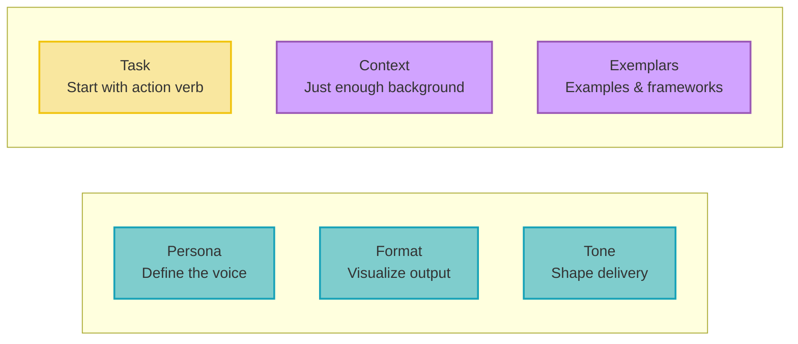

## The anatomy of prompts that actually work

**Most people treat AI prompting like casual conversation, then wonder why the results disappoint.** The difference between mediocre and exceptional AI output isn't the model you're using, it's how precisely you communicate your needs. A structured approach transforms vague requests into clear instructions that consistently deliver useful results.

The six-part prompt formula provides a systematic framework for crafting effective prompts: task, context, exemplars, persona, format, and tone. Not every prompt needs all six components, but understanding each one gives you the tools to get exactly what you need from any AI system.

## The six essential components

### Task: start with action

**Every effective prompt begins with a clear action verb.** Generate, write, analyze, summarize, create, review. The task component tells the AI exactly what to do, not just what you're thinking about.

Instead of "I need help with my resume," use "Review my resume and suggest three specific improvements for a software engineer role." The action verb makes your request unambiguous and actionable.

### Context: provide just enough background

**Context shapes the AI's understanding without overwhelming it.** Use three guiding questions to structure your context:

- What is the user's background?
- What does success look like?
- What environment are they in?

Too much context creates noise; too little leaves the AI guessing. Focus on details that constrain the possibilities and guide the response toward your specific situation.

### Exemplars: show don't just tell

**Examples and frameworks dramatically improve output quality.** Instead of hoping the AI understands your vision, provide concrete examples or reference established frameworks.

You can use actual samples ("Write an email similar to this one") or methodological frameworks ("Structure your response using the STAR method"). Both approaches give the AI a clear template to follow.

### Persona: define the voice

**Specify who you want the AI to embody.** This could be a professional role ("act as a senior product manager"), a famous person ("respond like Seth Godin"), or even a fictional character for creative tasks.

Persona shapes both the expertise level and communication style of the response. A recruiter persona will focus on different aspects than a technical lead persona, even for the same underlying question.

### Format: visualize the output

**Close your eyes and picture your ideal response, then describe it.** Do you want bullet points, a table, an email draft, markdown formatting, or something else entirely?

Specifying format makes the output immediately usable and saves you formatting time. Instead of receiving a wall of text, you get structured information that fits your workflow.

### Tone: shape the delivery

**Tone determines how your message lands.** Friendly, confident, witty, formal, authoritative. Each creates a different impression and serves different contexts.

If you're unsure about tone, ask the AI to suggest appropriate tone keywords for your specific situation. This meta-approach often reveals options you hadn't considered.

## Practical implementation strategies

**Use the formula as a mental checklist, not a rigid template.** Start with task and context as your foundation, then add other components based on your specific needs.

**Prioritize components by impact:** Task is mandatory. Context and exemplars provide the highest value. Persona, format, and tone are valuable additions but not always necessary.

**Test the difference:** Compare outputs from a simple prompt versus one using multiple components. The improvement in relevance and usability will convince you to adopt the structured approach.

**Build reusable templates:** For recurring tasks, create prompt templates with your preferred persona, format, and tone already specified. This speeds up future requests while maintaining consistency.

## Advanced techniques

**Reference existing documents for consistency.** When you need something to match an existing style, tell the AI to "follow the format and tone of this document" rather than trying to describe the style yourself.

**Use frameworks as exemplars.** Instead of providing full examples, reference established frameworks like STAR for interview responses, AIDA for marketing copy, or 5W1H for analysis. The AI understands these structures and can apply them effectively.

**Make edits visible for review tasks.** When asking for proofreading or editing, request that the AI bold all changes. This lets you quickly scan modifications without reading the entire document.

**Combine personas for unique perspectives.** Ask the AI to respond "as a product manager with a background in user research" to get more nuanced expertise than a single role would provide.

The six-part formula transforms prompting from guesswork into systematic communication. Master these components, and you'll consistently get AI outputs that are relevant, actionable, and immediately useful for your specific needs.
